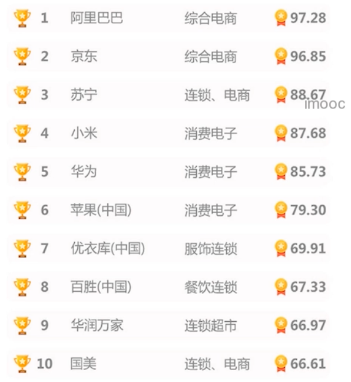
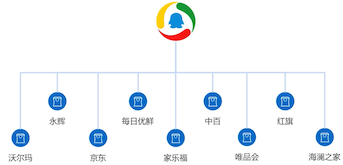

# 开门见山
课程内容等介绍

## 为什么要学习这门课？

上图是排名前十的新零售，并且阿里收购了多家线下零售，并且率先试水无人超市。

腾讯也投资了很多线下零售企业，也开始搞新零售

苏宁小店、京东便利店等线下零售店已经开了很多家了。新零售垂直领域势头很猛，势必会创造一大批工作岗位。

那么来学习新零售数据是怎么设计的就很有必要了。

## 适合的人群

- 程序员：看看良好的数据库是怎么设计的
- 大学生：在校期间设计的数据库比较简单
- 进阶生：适合学完 MySQL 基础的人。

## 不是学习创建数据表

本课不是教你创建数据表，开发过实际项目的人应该知道，设计一个良好的数据库很难，本课程参考数据易购新零售平台设计一套完整的数据库。**强化开发人员将业务转化成数据库设计的能力**

不局限于数据库领域，而是从研发的角度来考虑怎么去设计数据库，以及程序数据库之间是怎么结合的。

下面是思维导图，详细介绍了我们要学习的知识

## 学习的收获

笔者也是需要了解学习这门可能能收获到那些，这些还是有必要知道，否则你就是在浪费时间。

- 开发经验很难得：相当于参与了真实项目的数据库设计
- 设计思想要跟上：具备设计完整数据平台的能力
- 特别牛的技术：你可以驾驭新零售数据库混合式集群

## 技术储备

学习本课程需要有的基础知识

- 数据库基础

- 一门编程语言：

  不会涉及到 web 框架的部分，只会有何数据库交互的部分。也就是说，这里不讲解开发，还是扣题为主，围绕新零售数据库设计来，要了解怎么设计数据库，就需要了解新新零售的相关业务和需求

