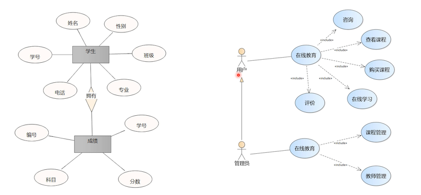
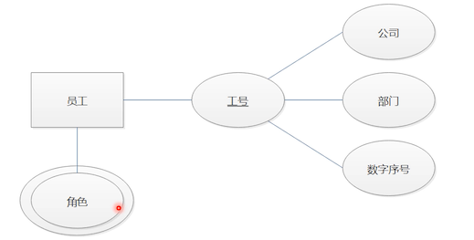
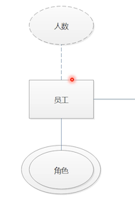

# 如何看懂 ER 图

谈论到 ER 图，需要知道在什么情况下回用到，那么先了解，业务数据库设计流程的三个阶段。

## 业务数据库设计流程

- 需求分析：根据用户的需求，分析出需要记录的数据

- 概要设计：根据分析出的数据，设计 ER 图

  er 图是比较抽象的，图里面只说明了每个实体具有什么属性。比如用户名，但是它的数据类型、有无约束都不会在 er 图上出现。

- 详细设计：将 er 图转换成数据库模型图和数据表

## 瀑布模型还是螺旋模型？

上面讲解的「业务数据库设计流程」有点像瀑布模型。

### 什么是瀑布模型？

从图上看，是一次性的，没有迭代回溯的。比如说，做完需求分析之后，不会再回到该阶段了。直接进入下一阶段了。因此，如果中途修改需求的话，那么很有可能会推到从来，代价非常大。

适合瀑布模型的前提是：

1. 有非常明确的需求
2. 用户不会在中途修改需求

但是现在的一些企业，都没有一个明确的需求，什么火做什么。面对这种不确定的需求，不应该使用瀑布模型。适合使用螺旋模型

### 什么是螺旋模型？

上图有 4 个象限。这里是数据库设计，所以写了 3 个象限。象限从中间点开始经历 4 个象限，每一次都会经历这 4 个象限。所以说螺旋模型是属于有回溯的开发模型。

使用第一次迭代，来开发项目核心。当将来项目有新的需求时，再做下一次迭代开发，这种小步快跑的开发模式就是螺旋模型了。

就算这一次开发失败了，我们只需要推翻这一次迭代的项目。

举个例子：你老板在别的地方看到一个非常不错的系统，让你模仿一个管理系统，由于老板并不清楚所有的业务模块划分，反正就是叫你模仿。

这个时候，你应该使用螺旋模型，先提炼出它最想要的核心功能，你的团队花费两周时间的迭代开发，然后拿着这个成果去跟老板确认，如果是老板想要的，就继续下一个功能的迭代开发。就算老板不满意，这成本也不是很高。

如果你使用的瀑布模型，花费半年时间搞出来的，结果老板不是很想要，这成本就很大了。

### 结论

数据库设计采用瀑布模型还是螺旋模型？

结论是：瀑布模型

因为数据库设计的修改，产生的连带性是很大的。比如，我们修改了一个字段名，那么后端 java 项目需要修改相关的代码，前端项目要同样要修改。这种连带性就很大。

因此数据库设计适合使用瀑布模型。提前设计好完整健壮的数据库。

笔者疑问：上面讲解软件开发使用螺旋模型，但是数据库设计不就是软件系统中的一环吗？这个咋理解

## 什么是 ER 图？

ER 也称 **实体关系图**（Entity Relationship Diagram），提供了表示实体类型、属性和关系的方法，用来描述现实世界的概念模型。

如上图，含义如下：

- 矩形：表示实体
- 椭圆形：表示字段
- 主键：在字段上使用下划线
- 菱形：外键约束

## ER 图与用例图对比

左侧是 ER 图，有过多个实体，实体之间还有关系。

右侧是用例图，表现的是 **用户和功能之间的关系**。

例如上图，普通用户的在线教育可以操作各种功能，另外还派生出一种管理员用户，它从普通用户继承了很多功能，它单独具有的功能是普通用户没有的。

## 绘制 ER 图的软件

- Office Visio、Office Word：专业庞大
- 亿图图示（Edraw）：小巧好用
- Enterprise Architect（EA）：老牌软件，中文本地化不好，不适合小白使用

## ER 图属性语法

- 复合属性：是多个属性的组合

  

  工号是由多个属性组合而成的。

- 多值属性：是某个属性可以有多多个不同的取值；用双线椭圆表示

  

  比如一个员工拥有多个角色，这个角色就是多值属性，使用双椭圆表示。再比如，一个员工有多个联系电话号码等类似的属性

  在设计数据库字段时，最简单的是定义为 varchar，用逗号分隔数据存储。也或则说用 MySQL 新的数据类型 JSON 来存储。

- 派生属性：是不保存在实体中的属性；用虚线的椭圆表示

  简单说，派生属性是运算的结果。比如分页中的总数，是计算出来的。如下图中的人数

  

- 可选属性：是允许没有值的属性；在字段下使用`(0)` 表示

  

  比如备注属性。