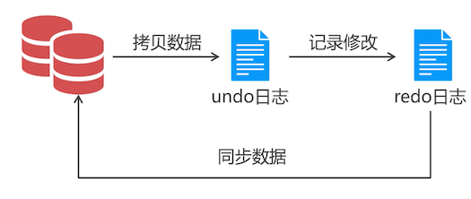
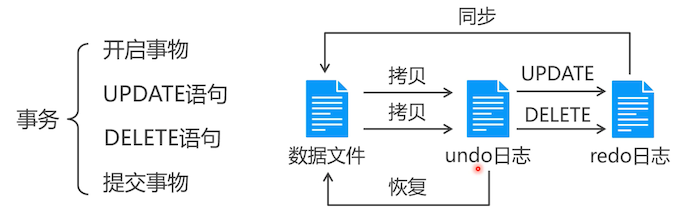
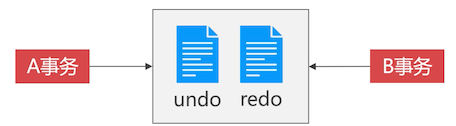

# 事务机制

为什么数据库需要事务机制?

平时我们修改文件，一般会先备份一下，再修改。数据库也一样，如果数据的写入直接操作数据文件是非常危险的事情。

比如我们 update 语句给员工涨工资，这个时候系统重启了，我们就弄不清那些修改成功了，哪些修改失败了。因为没有原始数据对比，数据发生混乱之后，就特别不好维护。

如果想要数据库不直接修改 SQL 文件，就需要引入事务机制了。

## 利用日志来实现间接写入

MySQL 共有 5 种日志，其中只有 **redo** 日志和 **undo** 日志与事务有关。

会将数据复制到 undo 日志中，修改成功后，记录在 redo 日志中，操作没有问题，则把 redo 日志中的数据同步到数据库中。就算系统重启，还有 redo 日志，所以数据一般不会丢失。

**事务就是利用 undo 和 redo 建立起来的一种操作数据的机制**

## 事务机制（Transaction）

事务是一个或者多个 SQL 语句组成的整体，要么全部执行成功，要么全都执行失败。

## 事务案例

把 10 部门中 `MANGER 职位` 的员工调往 20 部门，其他岗位的员工调往 30 部门，然后删除 10 部门。

MySQL 默认是把每一条 SQL 语句当成一个事务。执行完成后，就让 redo 与数据库同步。

这个需求，需要两个语句，就需要我们手工管理事务了。当  2 条操作都完成后，再同步 redo 数据到数据库中。如果其中一条操作事变了。则从 undo 日志中恢复数据（恢复数据是指：给 undo 和 redo 中的临时数据做一个标识，就不会往数据库中同步数据了）

## 事务的 ACID 属性

### 原子性

一个事务中的所有操作要么全都成功，要么全都失败。事务执行后不允许停留在某个状态。

事务的实现机制：上面讲到过，先拷贝数据（拷贝的是什么数据？）到 undo 中，执行成功后，写入 redo 中，提交事务，把 redo 中的数据同步到数据库中。如果要回滚，则把 undo 与 redo 中的数据标记，则不会同步到数据库中。

### 事务的一致性

与用户的并发执行有关系。

不管在任何给定的时间、并发事务又多少，事务必须保证运行结果的一致性。

比如：这个 4 个人的总资产是 2000 元，无论他们怎么转账，同一时间点，他们的总资产始终都满足只有 2000 元。

是如何实现一致性的呢？就是防止读取临时数据，比如：

1. A 有 500 元，转账 10 元给 B，事务还未提交
2. 同时，有人给 A 转账 100 元，并提交了事务，A 的余额为 490 + 100 = 590；
3. 这个时候，第一步的事务回滚了，不会同步日志数据到数据库中。这个时候 A 的余额就出现问题了

保存在日志中的数据，都是由归属的，每个事务之间是隔离的。

### 隔离性

隔离性要求事务不受其他并发事务的影响，默认情况下 A 事务，只能看到日志中该事务的相关数据。

从机制上看，体现了事务的隔离性，从结果上看体现了一致性

### 持久性

事务一旦提交（redo 日志同步），结果便是永久性的。即便发生宕机，仍然可以依靠事务日志完成数据的持久化。

## 思考题

单节点的 MySQL 事务依靠的是 undo 和 redo 日志。那么在数据库集群中，在 A 节点中修改了数据，在 B 节点中添加了新的数据，那么怎么能让这两个节点的事务联合成一个分布式的事务呢？