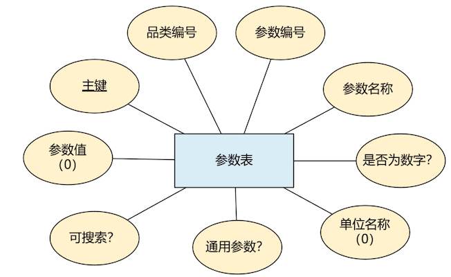

# 设计品类表和参数表

先创建一个逻辑数据库，也就是 schemas

```sql
create schema neti;  -- neti 是新零售的一个不严格的缩写 new retail
```

在 MySQL 8+ 中，不写字符集的话，默认是 `utf8mb4`

## 品类表 

### 品类表 ER 图


spg_id: 品类编号

**有主键 ID 了，为什么还需要这个编号？**

因为仅凭主键 ID 我们无法推断出是什么品类，比如给品类编号划分一个区域：

- 1~1000： 医疗设备
- 1200~1300：是服装类

这样就能很快的推断出是什么大类的。

### 品类表结构图


```sql
create table t_spec_group
(
    id     int unsigned primary key auto_increment comment '主键',
    spg_id int unsigned not null comment '品类编号',
    `name` varchar(200) not null comment '品类名称',
    unique index unq_spg_id (spg_id),
    unique index unq_name (`name`),
    index idx_spg_id (spg_id)
) comment ='品类表';
```
再插入几条数据

```sql
INSERT INTO neti.t_spec_group (id, spg_id, name) VALUES (1, 10001, '手机');
INSERT INTO neti.t_spec_group (id, spg_id, name) VALUES (2, 10002, '手机线');
INSERT INTO neti.t_spec_group (id, spg_id, name) VALUES (3, 10003, '手机电池');
INSERT INTO neti.t_spec_group (id, spg_id, name) VALUES (4, 11001, '液晶电视');
INSERT INTO neti.t_spec_group (id, spg_id, name) VALUES (5, 11002, '投影电视');
```

## 参数表

### 参数表 ER 图



- 品类编号：用来关联品类表的

- 参数编号：在某一个品类下的排名计数器

  比如：

  - 手机的品类编号是 2000，那么 CPU 的参数编号为 1，内存参数编号为 2
  - 打印的品类编号是 3000，那么颜色参数编号为 1

  只是用来排序的

- 是否为数字？

  有的参数值是数字的，有些是文字的。比如无线路由器 150M

- 单位名称：参数单位，`(0)` 可以有空值

  比如上面说的无线路由器 150M 中的 「M」

- 是否通用参数？

  表示该参数在页面上是否要显示在主要位置

- 是否可搜索？

  比如在京东上搜索电视，下面还会显示一些细分的搜索选项，比如尺寸、颜色等

- 参数值：可选范畴

  比如：手机系统这个参数，目前常见的是 IOS、安卓等，不能让用户乱选

### 参数表结构图


```sql
create table t_spec_param
(
    id        int unsigned primary key auto_increment comment '主键',
    spg_id    int unsigned not null comment '品类编号',
    spp_id    int unsigned not null comment '参数编号',
    `name`    varchar(200) not null comment '参数名称',
    `numeric` tinyint(1)   not null comment '是否为数字参数',
    unit      varchar(200) comment '单位（量词语）',
    generic   tinyint(1)   not null comment '是否为通用参数',
    searching boolean      not null comment '是否用于通用搜素',
    segements varchar(500) comment '参数值',
    index idx_spg_id (spg_id),
    index idx_spp_id (spp_id)
) comment ='参数表';
```

boolean 在 mysql 就是 `tinyint(1)` 

```sql
INSERT INTO neti.t_spec_param (id, spg_id, spp_id, name, `numeric`, unit, generic, searching, segements) VALUES (1, 10001, 1, 'CPU', 0, null, 1, 0, null);
INSERT INTO neti.t_spec_param (id, spg_id, spp_id, name, `numeric`, unit, generic, searching, segements) VALUES (2, 10001, 2, '运存', 1, 'GB', 1, 1, null);
INSERT INTO neti.t_spec_param (id, spg_id, spp_id, name, `numeric`, unit, generic, searching, segements) VALUES (3, 10001, 3, '内存', 1, 'GB', 1, 1, null);
INSERT INTO neti.t_spec_param (id, spg_id, spp_id, name, `numeric`, unit, generic, searching, segements) VALUES (4, 10001, 4, '屏幕尺寸', 1, '英寸', 1, 1, null);
INSERT INTO neti.t_spec_param (id, spg_id, spp_id, name, `numeric`, unit, generic, searching, segements) VALUES (5, 10001, 5, '电池', 1, '毫安时', 1, 0, null);
INSERT INTO neti.t_spec_param (id, spg_id, spp_id, name, `numeric`, unit, generic, searching, segements) VALUES (6, 11001, 1, '屏幕尺寸', 1, '英寸', 1, 1, null);
INSERT INTO neti.t_spec_param (id, spg_id, spp_id, name, `numeric`, unit, generic, searching, segements) VALUES (7, 11001, 2, '长度', 1, '厘米', 1, 0, null);
INSERT INTO neti.t_spec_param (id, spg_id, spp_id, name, `numeric`, unit, generic, searching, segements) VALUES (8, 11001, 3, '高度', 1, '厘米', 1, 0, null);
INSERT INTO neti.t_spec_param (id, spg_id, spp_id, name, `numeric`, unit, generic, searching, segements) VALUES (9, 11001, 4, '宽度', 1, '厘米', 1, 0, null);
INSERT INTO neti.t_spec_param (id, spg_id, spp_id, name, `numeric`, unit, generic, searching, segements) VALUES (10, 11001, 5, '分辨率', 0, '像素', 1, 1, '720P\\1080P\\4K\\8K');
```

| id | spg\_id | spp\_id | name | numeric | unit | generic | searching | segements |
| :--- | :--- | :--- | :--- | :--- | :--- | :--- | :--- | :--- |
| 1 | 10001 | 1 | CPU | 0 | NULL | 1 | 0 | NULL |
| 2 | 10001 | 2 | 运存 | 1 | GB | 1 | 1 | NULL |
| 3 | 10001 | 3 | 内存 | 1 | GB | 1 | 1 | NULL |
| 4 | 10001 | 4 | 屏幕尺寸 | 1 | 英寸 | 1 | 1 | NULL |
| 5 | 10001 | 5 | 电池 | 1 | 毫安时 | 1 | 0 | NULL |
| 6 | 11001 | 1 | 屏幕尺寸 | 1 | 英寸 | 1 | 1 | NULL |
| 7 | 11001 | 2 | 长度 | 1 | 厘米 | 1 | 0 | NULL |
| 8 | 11001 | 3 | 高度 | 1 | 厘米 | 1 | 0 | NULL |
| 9 | 11001 | 4 | 宽度 | 1 | 厘米 | 1 | 0 | NULL |
| 10 | 11001 | 5 | 分辨率 | 0 | 像素 | 1 | 1 | 720P\\1080P\\4K\\8K |

看数据的各种含义：

- 第一条：CPU

  - numeric：是否是数值

    CPU 型号比如是「骁龙855」，他们不是数字

  - generic：是否是通用参数（这里通用难道是比较关心的？）

    大家比较关心 CPU 这个型号，所以是一个主要的参数

  - searching：是否可搜索

    CPU 型号太多了，所以在界面里面不提供具体的型号条件

- 第 6 条：屏幕尺寸

  - spg_id：在这里 11001，我们再品类表中定义为液晶电视，所以这个参数是属于液晶电视的了

- 第 10 条：分辨率

  -  segements：

    这里限制了 4 个值，也就是说，只要创建一个 SKU 的液晶电视记录，那么分辨率这个参数就只能是这 4 个中的一个

    