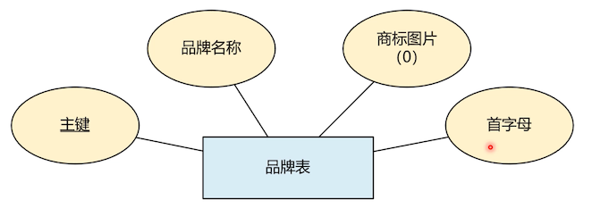
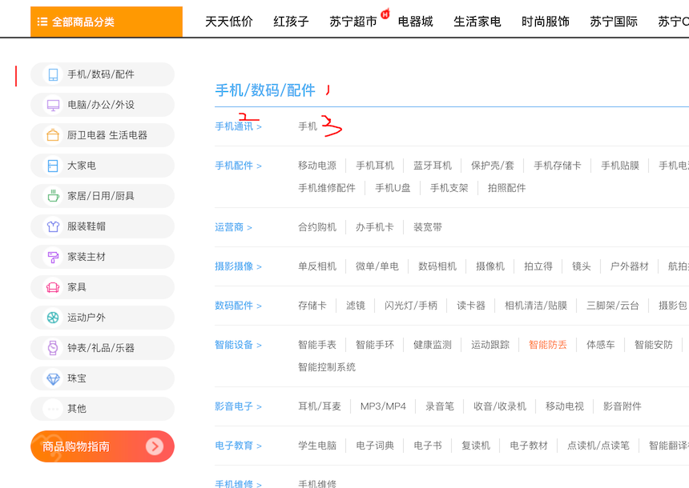
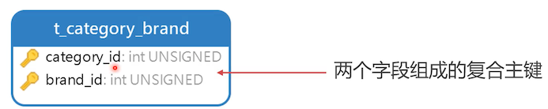

# 设计品牌和分类关系表

产品是有所属分类和品牌的，先设计这两张表

## 品牌表

### 品牌表 ER 图



- 商标图片：存地址

- 首字母：

  在搜索的时候，列出的品牌，可以按这个首字母顺序排列。

可见，设计数据库的人，要懂业务、也要懂前端

### 品牌表结构图


```sql
create table t_brand
(
    id     int unsigned primary key auto_increment comment '主键',
    `name` varchar(200) not null comment '名称',
    image  varchar(500) comment '图片网址',
    letter char(1)      not null comment '单位（量词语）',
    unique unq_name (`name`),
    index idx_letter (letter)
) comment ='品牌表';

```

- name ：品牌名唯一

- letter：首字母

  由于需要按首字母搜索品牌，所以给一个索引

## 分类表

[苏宁易购全部分类页](https://list.suning.com/?safp=d488778a.homepage1.99345513004.1&safpn=10001)



可以看到，它的分类有三个层级。分类这种类似与链表结构。有父节点的标识

### 商品分类表 ER 图


- 分类名称：可重复
- 父节点：顶级节点没有父
- 是否为父节点：如果有子，则为 false
- 排名指数：相当于搜索的权重

### 商品分类表结构图


```sql
create table t_category
(
    id        int unsigned primary key auto_increment comment '主键',
    `name`    varchar(200) not null comment '分类名称',
    parent_id int unsigned comment '上级分类ID',
    if_parent tinyint(1)   not null comment '是否包含下级分类',
    sort      int unsigned not null comment '排名指数',
    index idx_parent_id (parent_id),
    index idx_sort (sort)
) comment ='商品分类表';
```

对于索引的创建，是考虑到后续使用者，经常用到的。后续业务做调整了再来增加索引也可以。

## 分类与品牌关联表

一个品牌可以有多个分类，一个分类可以分给多个品牌。多对多关系




```sql
create table t_category_brand
(
    category_id int unsigned comment '分类 ID',
    brand_id    int unsigned comment '品牌 ID',
    primary key (category_id, brand_id)
) comment ='分类与品牌关联表';
```

比如：手机分类关联小米、苹果、华为、联想。笔记本关联苹果、华为。

看明白了吗，一个分类下，有哪些品牌在卖此类的东西。

## 三张表的初始数据

```sql
INSERT INTO neti.t_brand (id, name, image, letter) VALUES (1, '联想', null, 'L');
INSERT INTO neti.t_brand (id, name, image, letter) VALUES (2, '华为', null, 'H');
INSERT INTO neti.t_brand (id, name, image, letter) VALUES (3, '小米', null, 'A');
INSERT INTO neti.t_brand (id, name, image, letter) VALUES (4, '苹果', null, 'A');
INSERT INTO neti.t_brand (id, name, image, letter) VALUES (5, 'OPPO', null, 'O');
INSERT INTO neti.t_brand (id, name, image, letter) VALUES (6, '三星', null, 'S');
INSERT INTO neti.t_brand (id, name, image, letter) VALUES (7, 'LG', null, 'L');
INSERT INTO neti.t_brand (id, name, image, letter) VALUES (8, 'vivo', null, 'V');
INSERT INTO neti.t_brand (id, name, image, letter) VALUES (9, '飞利浦', null, 'F');
INSERT INTO neti.t_brand (id, name, image, letter) VALUES (10, '红米', null, 'H');
INSERT INTO neti.t_brand (id, name, image, letter) VALUES (11, 'IMB', null, 'I');
INSERT INTO neti.t_brand (id, name, image, letter) VALUES (12, '戴尔', null, 'D');

INSERT INTO neti.t_category (id, name, parent_id, if_parent, sort) VALUES (1, '手机/数码/配件', null, 1, 1);
INSERT INTO neti.t_category (id, name, parent_id, if_parent, sort) VALUES (2, '手机通讯', 1, 1, 1);
INSERT INTO neti.t_category (id, name, parent_id, if_parent, sort) VALUES (3, '手机', 2, 0, 1);
INSERT INTO neti.t_category (id, name, parent_id, if_parent, sort) VALUES (4, '手机配件', 1, 1, 2);
INSERT INTO neti.t_category (id, name, parent_id, if_parent, sort) VALUES (5, '移动电源', 4, 0, 5);
INSERT INTO neti.t_category (id, name, parent_id, if_parent, sort) VALUES (6, '蓝牙耳机', 4, 0, 2);
INSERT INTO neti.t_category (id, name, parent_id, if_parent, sort) VALUES (7, '保护壳', 4, 0, 3);
INSERT INTO neti.t_category (id, name, parent_id, if_parent, sort) VALUES (8, '数码配件', 1, 1, 10);
INSERT INTO neti.t_category (id, name, parent_id, if_parent, sort) VALUES (9, '存储卡', 8, 0, 10);
INSERT INTO neti.t_category (id, name, parent_id, if_parent, sort) VALUES (10, '读卡器', 8, 0, 1);
INSERT INTO neti.t_category (id, name, parent_id, if_parent, sort) VALUES (11, '电脑/办公/外设', null, 1, 1);
INSERT INTO neti.t_category (id, name, parent_id, if_parent, sort) VALUES (12, '电脑整机', 11, 1, 1);
INSERT INTO neti.t_category (id, name, parent_id, if_parent, sort) VALUES (13, '笔记本', 12, 0, 1);
INSERT INTO neti.t_category (id, name, parent_id, if_parent, sort) VALUES (14, '台式电脑', 12, 0, 1);
INSERT INTO neti.t_category (id, name, parent_id, if_parent, sort) VALUES (15, '平板电脑', 12, 0, 1);

INSERT INTO neti.t_category_brand (category_id, brand_id) VALUES (3, 1);
INSERT INTO neti.t_category_brand (category_id, brand_id) VALUES (3, 2);
INSERT INTO neti.t_category_brand (category_id, brand_id) VALUES (3, 3);
INSERT INTO neti.t_category_brand (category_id, brand_id) VALUES (3, 4);
INSERT INTO neti.t_category_brand (category_id, brand_id) VALUES (3, 5);
INSERT INTO neti.t_category_brand (category_id, brand_id) VALUES (3, 6);
INSERT INTO neti.t_category_brand (category_id, brand_id) VALUES (3, 8);
INSERT INTO neti.t_category_brand (category_id, brand_id) VALUES (3, 10);
INSERT INTO neti.t_category_brand (category_id, brand_id) VALUES (13, 1);
INSERT INTO neti.t_category_brand (category_id, brand_id) VALUES (13, 2);
INSERT INTO neti.t_category_brand (category_id, brand_id) VALUES (13, 12);
```

