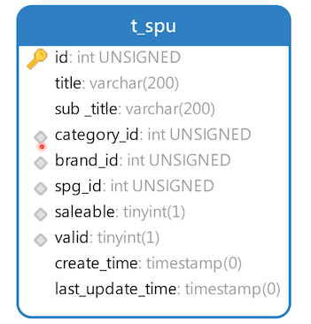
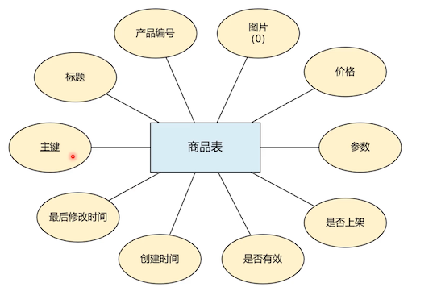

# 设计产品表和商品表

## 产品表 

### 产品表 ER 图


- 品牌编号：可以为空，没有品牌

  一些散装的可能没有品牌，比如花生之类的

- 是否上架

  这个暂时没啥好说的

- 是否有效：逻辑删除

  比如，去年有一件风衣卖得很火，今年不太行了。商家不打算卖了，就删除该产品。但是还关联了那么多的订单，我们不能物理删除，就使用它逻辑删除。

- 创建时间

  不能有空，当前时间为默认值

- 最后修改时间

  不能有空，取系统时间为默认值

### 产品表结构图



上图中字段前面有 **菱形** 标记的表示添加了 **索引**

- 标题和副标题：我们一般不会给他们创建索引，查询太慢。对他们进行中文分词技术。MySQL 自带的分词技术对中文分词不好，一般不使用。

- 添加索引的基本都是用来做检索条件的

```sql
create table t_spu
(
    id               int unsigned primary key auto_increment comment '主键',
    title            varchar(200) not null comment '标题',
    sub_title        varchar(200) comment '副标题',
    category_id      int unsigned not null comment '分类ID',
    brand_id         int unsigned comment '品牌ID',
    spg_id           int unsigned comment '品类ID',
    saleable         boolean      not null comment '是否上架',
    valid            boolean      not null comment '是否有效',
    create_time      timestamp    not null default now() comment '添加时间',
    last_update_time timestamp    not null default now() comment '最后修改时间',
    index idx_category_id (category_id),
    index idx_brand_id (brand_id),
    index idx_spg_id (spg_id),
    index idx_saleable (saleable),
    index idx_valid (valid)

) comment ='产品表';
```

测试数据

```sql
INSERT INTO neti.t_spu (id, title, sub_title, category_id, brand_id, spg_id, saleable, valid, create_time, last_update_time) VALUES (1, '小米9', null, 3, 3, 10001, 1, 1, '2020-05-19 18:53:41', '2020-05-19 18:53:41');
```


## 商品表

### 商品表 ER 图



- 图片地址：可以为空；有些商品没有图片

- 参数：

  之前在参数表里面声明了，每一个品类关联哪些参数，那么每个参数的值，就是在这里定义。

  该参数字段类型比较特殊，后面看结构的时候再说明

### 商品表结构图


- title：不加索引，会使用中文分词来做

- images：图片使用 json 类型

  MySQL 5.7+ 就引入了 json 类型，介绍图片保存路径到 json 里

- price：价格，decimal 无符号类型

  需要说明的是，当促销时，会有促销价格，需要再多一个额外的价格字段吗？

  这个要看业务场景，比如我们做的新零售系统，以会员制，每个会员等级享受折扣不同，就不适合都定义在商品表中，另外在客户部中定义「会员等级」字段。客户浏览商品的时候看到的价格就是该客户端的会员等级价格。

  如果你的不是零售值，就可以再定义一个促销价格

- param：商品参数也以 json 的形式保存

```sql
create table t_sku
(
    id               int unsigned primary key auto_increment comment '主键',
    spu_id           int unsigned            not null comment '产品ID',
    title            varchar(200)            not null comment '标题',
    images           json comment '商品图片',
    price            decimal(10, 2) unsigned not null comment '价格',
    param            json                    not null comment '参数',
    saleable         boolean                 not null comment '是否上架',
    valid            boolean                 not null comment '是否有效',
    create_time      timestamp               not null default now() comment '添加时间',
    last_update_time timestamp               not null default now() comment '最后修改时间',
    index idx_spu_id (spu_id),
    index idx_saleable (saleable),
    index idx_valid (valid)
) comment ='商品表';
```

测试数据

```sql
INSERT INTO neti.t_sku (id, spu_id, title, images, price, param, saleable, valid, create_time, last_update_time) VALUES (1, 1, 'Xiaomi/小米 小米9 8GB+128GB 全息幻彩紫 移动联通电信全网通4G手机', '{"desc": ["http://127.0.0.1/1.jpg", "http://127.0.0.1/2.jpg"], "facade": ["http://127.0.0.1/3.jpg", "http://127.0.0.1/4.jpg"]}', 3299.00, '{"CPU": "骁龙855", "内存": "128", "电池": 4000, "运存": 8, "屏幕尺寸": 6.39}', 1, 1, '2020-05-19 19:17:16', '2020-05-19 19:17:16');
INSERT INTO neti.t_sku (id, spu_id, title, images, price, param, saleable, valid, create_time, last_update_time) VALUES (2, 1, 'Xiaomi/小米 小米9 8GB+128GB 全息幻彩蓝 移动联通电信全网通4G手机', '{"desc": ["http://127.0.0.1/1.jpg", "http://127.0.0.1/2.jpg"], "facade": ["http://127.0.0.1/3.jpg", "http://127.0.0.1/4.jpg"]}', 3299.00, '{"CPU": "骁龙855", "内存": "128", "电池": 4000, "运存": 8, "屏幕尺寸": 6.39}', 1, 1, '2020-05-19 19:17:16', '2020-05-19 19:17:16');
INSERT INTO neti.t_sku (id, spu_id, title, images, price, param, saleable, valid, create_time, last_update_time) VALUES (3, 1, 'Xiaomi/小米 小米9 6GB+128GB 全息幻彩蓝 移动联通电信全网通4G手机', '{"desc": ["http://127.0.0.1/1.jpg", "http://127.0.0.1/2.jpg"], "facade": ["http://127.0.0.1/3.jpg", "http://127.0.0.1/4.jpg"]}', 2999.00, '{"CPU": "骁龙855", "内存": "128", "电池": 4000, "运存": 6, "屏幕尺寸": 6.39}', 1, 1, '2020-05-19 19:17:16', '2020-05-19 19:17:16');
INSERT INTO neti.t_sku (id, spu_id, title, images, price, param, saleable, valid, create_time, last_update_time) VALUES (4, 1, 'Xiaomi/小米 小米9 6GB+128GB 深空灰 移动联通电信全网通4G手机', '{"desc": ["http://127.0.0.1/1.jpg", "http://127.0.0.1/2.jpg"], "facade": ["http://127.0.0.1/3.jpg", "http://127.0.0.1/4.jpg"]}', 2999.00, '{"CPU": "骁龙855", "内存": "128", "电池": 4000, "运存": 6, "屏幕尺寸": 6.39}', 1, 1, '2020-05-19 19:17:16', '2020-05-19 19:17:16');
```

由于该表数据比较复杂，展示几条方便查看

| id | spu\_id | title | images | price | param | saleable | valid | create\_time | last\_update\_time |
| :--- | :--- | :--- | :--- | :--- | :--- | :--- | :--- | :--- | :--- |
| 1 | 1 | Xiaomi/小米 小米9 8GB+128GB 全息幻彩紫 移动联通电信全网通4G手机 | `{"desc": \["http://127.0.0.1/1.jpg", "http://127.0.0.1/2.jpg"\], "facade": \["http://127.0.0.1/3.jpg", "http://127.0.0.1/4.jpg"\]}` | 3299.00 | `{"CPU": "骁龙855", "内存": "128", "电池": 4000, "运存": 8, "屏幕尺寸": 6.39}` | 1 | 1 | 2020-05-19 19:17:16 | 2020-05-19 19:17:16 |
| 3 | 1 | Xiaomi/小米 小米9 6GB+128GB 全息幻彩蓝 移动联通电信全网通4G手机 | `{"desc": \["http://127.0.0.1/1.jpg", "http://127.0.0.1/2.jpg"\], "facade": \["http://127.0.0.1/3.jpg", "http://127.0.0.1/4.jpg"\]}` | 2999.00 | `{"CPU": "骁龙855", "内存": "128", "电池": 4000, "运存": 6, "屏幕尺寸": 6.39}` | 1 | 1 | 2020-05-19 19:17:16 | 2020-05-19 19:17:16 |

- images：
  - desc: 商品描述图
  - facade：商品展示图

  这里展示的 JSON 数据有哪些，图片这里是随意伪造的

- param

  里面的参数 key，就是参数表里面该品类定义的。

  笔者疑问：为啥不用参数 ID？怎么关联呢？