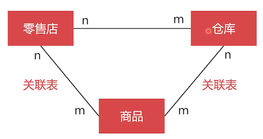
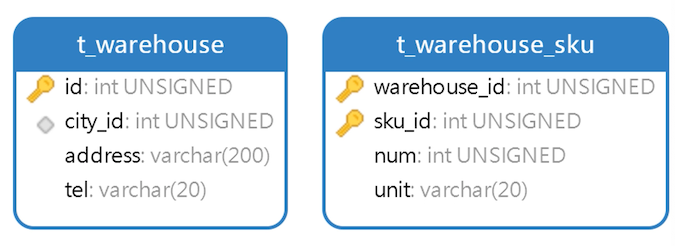
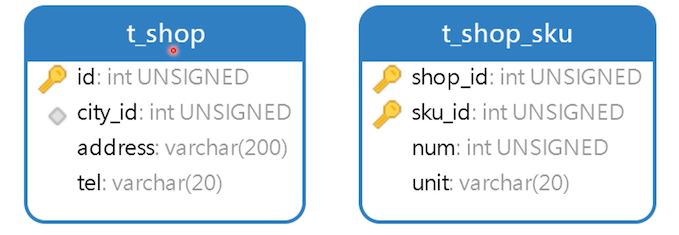

# 如何设计商品的库存？

如果新零售系统没有分店，那么可以吧库存定义到商品表


苏宁易购的稍微更复杂一点，在全国创建了很多仓库，每个仓库对应每个零售店的库存。

## 零售店与仓库的对应关系


多对多关系，在这样一个场景中，不适合用关联表：当一个商品在 A 仓库卖光了，它可以去其他仓库配货。所以不能使用关联表之间关联上。

零售店存放少量商品，大量商品是存放在仓库里的，那么面临的问题是：**零售店和仓库的库存怎么定义？**

## 零售店、仓库与商品的关系



- 商品与仓库关联：这件商品在哪些仓库中有多少库存
- 零售店与商品：难道这个是商品在该店里面的一个库存？
- 零售店与仓库：这个是啥意思？

因为零售店表和仓库表都有省份和城市，所以先创建这两张表，不能直接在这两张表上存字符串，顾客下订单之后，需要 **计算从哪个仓库发货离收货地址较近，运费是多少**，在这一系列的复杂运算中，通过字符串去检索，在高并发的电商中速度是很慢的

## 省份和城市表


- province：不是要创建索引，是唯一性约束

  该表中的数据很少，用不着去创建索引。

- city：

  在不同的省份中，有可能城市名是一样的。

```sql
create table t_province
(
    id       int unsigned primary key auto_increment comment '主键',
    province varchar(200) not null comment '省份',
    unique unq_province (province)
) comment '省份表';

create table t_city
(
    id          int unsigned primary key auto_increment comment '主键',
    cite        varchar(200) not null comment '城市',
    province_id int unsigned not null comment '省份ID'
);
```

插入一点测试数据

```sql
INSERT INTO neti.t_province (id, province) VALUES (2, '上海');
INSERT INTO neti.t_province (id, province) VALUES (1, '北京');
INSERT INTO neti.t_province (id, province) VALUES (6, '吉林');
INSERT INTO neti.t_province (id, province) VALUES (3, '天津');
INSERT INTO neti.t_province (id, province) VALUES (8, '山东');
INSERT INTO neti.t_province (id, province) VALUES (9, '江苏');
INSERT INTO neti.t_province (id, province) VALUES (10, '浙江');
INSERT INTO neti.t_province (id, province) VALUES (5, '辽宁');
INSERT INTO neti.t_province (id, province) VALUES (4, '重庆');
INSERT INTO neti.t_province (id, province) VALUES (7, '黑龙江');

INSERT INTO neti.t_city (id, cite, province_id) VALUES (1, '沈阳', 5);
INSERT INTO neti.t_city (id, cite, province_id) VALUES (2, '大连', 5);
INSERT INTO neti.t_city (id, cite, province_id) VALUES (3, '鞍山', 5);
INSERT INTO neti.t_city (id, cite, province_id) VALUES (4, '长春', 6);
INSERT INTO neti.t_city (id, cite, province_id) VALUES (5, '吉林', 6);
INSERT INTO neti.t_city (id, cite, province_id) VALUES (6, '哈尔滨', 7);
INSERT INTO neti.t_city (id, cite, province_id) VALUES (7, '齐齐哈尔', 7);
INSERT INTO neti.t_city (id, cite, province_id) VALUES (8, '牡丹江', 7);
```

## 仓库表与关联表



仓库表：

- city_id: 城市编号；仓库在哪个城市

  有索引，提高查询速度。

- address：仓库地址

- tel：联系电话

仓库与商品关联表：

- warehouse_id 与 sku_id：符合主键

  杜绝一种商品在一个仓库中出现两次。

- num：库存数量

- unit：库存的单位

  比如 200 台、200 箱

```sql
create table t_warehouse
(
    id      int unsigned primary key auto_increment comment '主键',
    city_id int unsigned not null comment '城市ID',
    address varchar(200) not null comment '地址',
    tel     varchar(20)  not null comment '电话',
    index idx_city_id (city_id)
) comment '仓库表';

create table t_warehouse_sku
(
    warehouse_id int unsigned comment '主键',
    sku_id       int unsigned comment '商品ID',
    num          int unsigned not null comment '库存数量',
    unit         varchar(20)  not null comment '库存单位',
    primary key (warehouse_id, sku_id)
) comment '仓库商品库存表';
```

插入一些测试数据

```sql
INSERT INTO neti.t_warehouse (id, city_id, address, tel) VALUES (1, 1, '辽宁省沈阳市沈河区青年大街100号', '024-12345678');
INSERT INTO neti.t_warehouse (id, city_id, address, tel) VALUES (2, 1, '辽宁省沈阳市皇姑区崇山路41号', '024-22331234');
INSERT INTO neti.t_warehouse (id, city_id, address, tel) VALUES (3, 2, '辽宁省沈阳市西岗区五四路38号', '0411-12345678');
INSERT INTO neti.t_warehouse (id, city_id, address, tel) VALUES (4, 2, '辽宁省沈阳市沙河口兴云街1号', '0411-98213210');

INSERT INTO neti.t_warehouse_sku (warehouse_id, sku_id, num, unit) VALUES (1, 1, 20, '部');
INSERT INTO neti.t_warehouse_sku (warehouse_id, sku_id, num, unit) VALUES (1, 2, 15, '部');
INSERT INTO neti.t_warehouse_sku (warehouse_id, sku_id, num, unit) VALUES (1, 3, 40, '部');
INSERT INTO neti.t_warehouse_sku (warehouse_id, sku_id, num, unit) VALUES (1, 4, 0, '部');
INSERT INTO neti.t_warehouse_sku (warehouse_id, sku_id, num, unit) VALUES (2, 1, 70, '部');
INSERT INTO neti.t_warehouse_sku (warehouse_id, sku_id, num, unit) VALUES (2, 2, 0, '部');
INSERT INTO neti.t_warehouse_sku (warehouse_id, sku_id, num, unit) VALUES (2, 3, 5, '部');
INSERT INTO neti.t_warehouse_sku (warehouse_id, sku_id, num, unit) VALUES (2, 4, 19, '部');
```


## 零售店与库存



```sql
create table t_shop
(
    id      int unsigned primary key auto_increment comment '主键',
    city_id int unsigned not null comment '城市ID',
    address varchar(200) not null comment '地址',
    tel     varchar(20)  not null comment '电话',
    index idx_city_id (city_id)
) comment '零售店';

create table t_shop_sku
(
    shop_id int unsigned comment '主键',
    sku_id  int unsigned comment '商品ID',
    num     int unsigned not null comment '库存数量',
    unit    varchar(20)  not null comment '库存单位',
    primary key (shop_id, sku_id)
) comment '零售店与库存关联表';
```

插入一些测试数据

```sql
INSERT INTO neti.t_shop (id, city_id, address, tel) VALUES (1, 1, '辽宁省沈阳市黄河北大街12号', '024-12345678');
INSERT INTO neti.t_shop (id, city_id, address, tel) VALUES (2, 1, '辽宁省沈阳市皇姑区长江街40号', '024-22331234');
INSERT INTO neti.t_shop (id, city_id, address, tel) VALUES (3, 2, '辽宁省沈阳市西区卫工街19号', '0411-12345678');
INSERT INTO neti.t_shop (id, city_id, address, tel) VALUES (4, 2, '大连市西岗区五四路38号', '0411-98213210');
INSERT INTO neti.t_shop (id, city_id, address, tel) VALUES (5, 2, '大连市沙河口兴云街1号', '0411-98213210');

INSERT INTO neti.t_shop_sku (shop_id, sku_id, num, unit) VALUES (1, 1, 3, '部');
INSERT INTO neti.t_shop_sku (shop_id, sku_id, num, unit) VALUES (1, 2, 3, '部');
INSERT INTO neti.t_shop_sku (shop_id, sku_id, num, unit) VALUES (1, 3, 1, '部');
INSERT INTO neti.t_shop_sku (shop_id, sku_id, num, unit) VALUES (1, 4, 0, '部');
INSERT INTO neti.t_shop_sku (shop_id, sku_id, num, unit) VALUES (2, 1, 3, '部');
INSERT INTO neti.t_shop_sku (shop_id, sku_id, num, unit) VALUES (2, 2, 0, '部');
INSERT INTO neti.t_shop_sku (shop_id, sku_id, num, unit) VALUES (2, 3, 0, '部');
INSERT INTO neti.t_shop_sku (shop_id, sku_id, num, unit) VALUES (2, 4, 1, '部');
```

