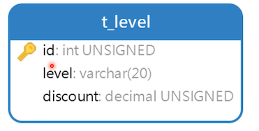
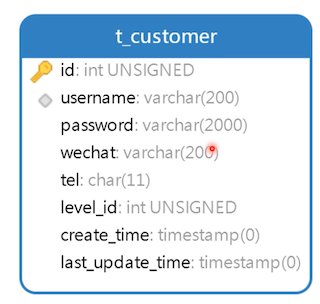
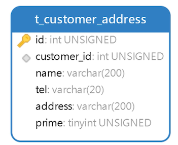

# 设计客户表

在下单之前，要有客户。很多电商平台都在搞会员，比如京东的「plus 会员」，淘宝的「88会员」等，包括去理发店理发都有会员制，可以说是深入各行各业。

## 创建会员等级表



- level：等级名称；如金牌、银牌
- discount：折扣，享受的折扣

```sql
create table t_level
(
    id       int unsigned primary key auto_increment comment '主键',
    level    varchar(200)            not null comment '等级',
    discount decimal(10, 2) unsigned not null comment '折扣'
) comment '会员等级表';

```

插入一些测试数据

```sql
INSERT INTO neti.t_level (id, level, discount) VALUES (1, '铜牌会员', 0.99);
INSERT INTO neti.t_level (id, level, discount) VALUES (2, '银牌会员', 0.98);
INSERT INTO neti.t_level (id, level, discount) VALUES (3, '金牌会员', 0.97);
INSERT INTO neti.t_level (id, level, discount) VALUES (4, '白金会员', 0.95);
INSERT INTO neti.t_level (id, level, discount) VALUES (5, '砖石会员', 0.92);
```


## 创建客户表



- username：用户名

- password：用户密码，采用 AES 算法加密

  AES 对称加密算法，可用来加密和解密。想提高破解难度的话，可以将每个用户名前 6 位字符作为密钥，对密码加密解密，每个客户的密码加密解密都不一样了。提高了破解难度

  MD5，只能加密，不能解密。比如在找回密码场景中，可以把密码解密回来，然后发送给客户，就完成了密码找回功能

- wechat：微信号

- tel：手机号，都是 11 位

- level_id：会员等级ID，有些客户不是会员

```sql
create table t_customer
(
    id               int unsigned primary key auto_increment comment '主键',
    username         varchar(200)  not null comment '用户名',
    password         varchar(2000) not null comment '密码(AES加密)',
    wechat           varchar(200) comment '微信号',
    tel              char(11) comment '手机号',
    level_id         int unsigned comment '会员等级ID',
    create_time      timestamp     not null default now() comment '添加时间',
    last_update_time timestamp     not null default now() comment '最后修改时间',
    index idx_username (username),
    unique unq_username (username)
) comment '客户表';
```

插入一些测试数据

```sql
INSERT INTO neti.t_customer (id, username, password, wechat, tel, level_id, create_time, last_update_time) VALUES (1, 'scott123', '896349E30ED6B4CF0E4354716CA997D9', '', null, 1, '2020-05-19 21:00:33', '2020-05-19 21:00:33');
```

密码加密解密在 mysql 中已经有函数支持了，如下

```sql
-- aes_encrypt(密码,密钥)，输出的是二进制数据
-- hex 将二进制数据转成 16 进制数据
select hex(aes_encrypt('123456', left('scott123', 7)))

-- 下面这个是解密
select aes_decrypt(unhex('896349E30ED6B4CF0E4354716CA997D9'),left('scott123', 7));
```

对称加密算法：从上面可以看出来，加密解密都用同一个密钥;

下面写一个插入语句

```sql
insert into t_customer(username, password, wechat, tel)
values ('jack123',
        hex(aes_encrypt('123456', left('jack123', 7))),
        'jack123',
        '12345678');
```


因为在下单前，需要填写邮寄地址，所以还需要创建客户收货地址表

## 创建客户收货地址表



- customer_id：客户ID

  需要创建索引，根据客户 ID 查找地址很普遍

- prime：是否用作缺省收货地址

```sql
create table t_customer_address
(
    id          int unsigned primary key auto_increment comment '主键',
    customer_id int unsigned not null comment '客户ID',
    name        varchar(200) not null comment '收货人姓名',
    tel         char(11) comment '收货人手机号',
    address     varchar(200) not null comment '收货地址',
    prime       boolean      not null comment '是否用当前地址记录作为默认收货地址',
    index idx_customer_id (customer_id)
) comment '客户表收货地址表';
```

插入一些测试数据

```sql
INSERT INTO neti.t_customer_address (id, customer_id, name, tel, address, prime) VALUES (1, 1, '陈浩', '12345678901', '辽宁省大连市高兴区6号9#11-1', 1);
INSERT INTO neti.t_customer_address (id, customer_id, name, tel, address, prime) VALUES (2, 2, '李娜', '12345678902', '辽宁省大连市沙盒口区星月街17号2#1-3', 0);
```

