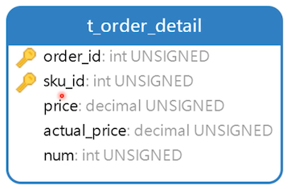

# 设计订单表

一张订单中可以包含多个商品记录，可不可以用 JSON 存储这些商品信息？不适合

因为 ：MySQL 5.7+ 引入的 JSON 字段适合存储数据，**不适合检索数据**。这里存储的数据只是用来页面展示，而 **不用来做搜索条件**，在前面设计的表中，很少对字符串的字段做索引。也是如此。

所以需要两张表来保存订单数据

## 创建订单表


- code：订单流水号；规则可自定义

  流水号尾部以字母 A 结尾表示液体，B 结尾表示易碎品，等。还可以包含订单的日期、和时间，消费小票打印出来后，阅读流水号可以知道是哪一类的商品、什么时候生成的订单、是否加急发货等。这些规则由业务人员去制定。

- type：订单类型

  如为 1：表示线下销售商品，为 2 为线上销售的商品

- shop_id：店铺ID

  如果线上卖出的，可以为空

- customer_id：客户ID

  主要用来关联会员等级等。如果用户在线下购买的商品，不是会员可以为空

- amount：订单的总价格

- payment_type：订单的支付类型

  比如是借记卡付款、信用卡、微信支付、现今支付等等

- status：订单状态

  如：未付款、已付款、已发货、已签收等

- postage：邮费

- weight：订单总重量，单位为 克

  比如京东超过多少重量加收运费，数据库这里不用管这个逻辑，这个是程序的问题。这里只需要留出字段

- voucher_id：购物卷ID

  通常情况下，一个订单只能使用一张购物卷。

- create_time：订单创建的时间

字段前面有菱形标识的，这里是需要创建索引的。

```sql
create table t_order
(
    id           int unsigned primary key auto_increment comment '主键',
    `code`       varchar(200)            not null comment '流水号',
    type         tinyint unsigned        not null comment '订单类型：1实体销售，2网络销售',
    shop_id      int unsigned comment '零售店ID',
    customer_id  int unsigned comment '会员ID',
    amount       decimal(10, 2) unsigned not null comment '总金额',
    payment_type tinyint unsigned        not null comment '支付方式：1借记卡、2信用卡、3微信、4支付宝、5现金',
    `status`     tinyint unsigned        not null comment '状态：1未付款、2已付款、3已发货、4已签收',
    postage      decimal(10, 2) unsigned comment '邮费',
    weight       int unsigned comment '重量：单位克',
    voucher_id   int unsigned comment '购物券ID',
    create_time  timestamp               not null default now(),
    index idx_code (`code`),
    index idx_customer_id (customer_id),
    index idx_status (`status`),
    index idx_create_time (create_time),
    index idx_type (type),
    index idx_shop_id (shop_id),
    unique unq_code (`code`)
) comment '订单表';
```

插入一些测试数据

```sql
INSERT INTO neti.t_order (id, code, type, shop_id, customer_id, amount, payment_type, status, postage, weight, voucher_id, create_time) VALUES (1, 'CX0000000120160522', 1, 3, 1, 2999.00, 5, 2, null, null, null, '2020-05-19 23:14:10');
```

流水号按你的实际业务，这里不是强制的

## 订单详情表



此表将订单与商品关联在一起的关联表。

- order_id 和 sku_id ：复合主键

  一个订单中不会出现两个相同的商品，可以用数量去记录多件

- price：商品原价

- actual_price：购买商品的实际价格

- num：购买商品的实际数量

```sql
create table t_order_detail
(
    order_id     int unsigned            not null comment '订单ID',
    sku_id       int unsigned            not null comment '商品ID',
    price        decimal(10, 2) unsigned not null comment '原价格',
    actual_price decimal(10, 2) unsigned not null comment '实际购买价格',
    num          int unsigned            not null comment '购买数量',
    primary key (order_id, sku_id)
) comment '订单详情表'
```

插入一点测试数据

```sql
INSERT INTO neti.t_order_detail (order_id, sku_id, price, actual_price, num) VALUES (1, 3, 2999.00, 2999.00, 1);
```

