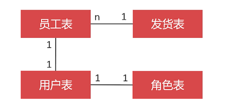

# 设计员工与用户表

因为新零售系统具有 **进销存** 属性，所以需要先设计出员工表、用户表、和角色表。比如，给客户快递商品：谁做的质检、谁发的快递都要有记录、还有仓库进货时，哪个员工验的货、还有当客户退货的时候，哪个员工处理的退货，等等的场景都需要员工参与



- 一个发货表对应多个员工

  这一单有多个阶段流程，可能由多个不同的员工参与

- 员工表与用户表

  用户表，是使用新零售管理系统的用户，因为并不是所有的员工都有权限使用新零售系统。比如：保洁、保安等员工是不使用新零售系统的。

- 用户表与角色表

  零售店员与仓库管理员，是两个不同的角色，他们看到的数据与能操作的也是不同的。

  最简单的方式是一个用户对应一个角色；如果对应多个角色就需要使用关联表

搞懂这几张表作用之后，还有与员工相关的表示部门、职位

## 部门、职位与员工


- dept：部门表

  - dname：部门名称；唯一约束

- job：职位表

  - job：职位名称；唯一约束

- emp：员工表

  - wid：work_id 的意思，员工工号

    每个公司的员工编号规则不一致，按场景需求来定义

  - ename：员工姓名

  - sex：性别

  - married：婚否

  - education：学历

  - tel、email、address：联系方式

  - job_id

  - dept_id

  - mgr_id：员工上司的编号

  - hiredate：入职日期

  - termdate：离职日期；为空则表示未离职

  - status：员工的状态；比如休假、离职等等

```sql
create table t_dept
(
    id    int unsigned primary key auto_increment not null comment '主键',
    dname varchar(200)             not null comment '部门名称',
    unique unq_dname (dname)
) comment '部门表';

create table t_job
(
    id  int unsigned primary key auto_increment not null comment '主键',
    job varchar(200)             not null comment '职位名称',
    unique unq_job (job)
) comment '职位表';

create table t_emp
(
    id        int unsigned primary key auto_increment comment '主键',
    wid       varchar(20)  not null comment '流水号',
    ename     varchar(20)  not null comment '员工姓名',
    sex       char(1)      not null comment '性别',
    married   boolean      not null comment '婚否',
    education tinyint      not null comment '学历：1大专、2本科、3研究生、4博士、5其他',
    tel       char(11) comment '电话号码',
    email     varchar(200) comment '邮箱',
    address   varchar(200) comment '员工住址',
    job_id    int unsigned not null comment '职位ID',
    dept_id   int unsigned not null comment '部门ID',
    mgr_id    int unsigned comment '员工上司ID',
    hiredate  date         not null comment '入职日期',
    termdate  date comment '离职日期',
    `status`  tinyint comment '员工状态：1在职、2休假、3离职、4死亡',
    index idx_job_id (job_id),
    index idx_dept_id (dept_id),
    index idx_status (`status`),
    index idx_mgr_id (mgr_id),
    unique unq_wid (wid)
) comment '员工表';
```

插入一些测试数据

```sql
INSERT INTO neti.t_dept (id, dname) VALUES (6, '售后部');
INSERT INTO neti.t_dept (id, dname) VALUES (2, '总裁办');
INSERT INTO neti.t_dept (id, dname) VALUES (5, '技术部');
INSERT INTO neti.t_dept (id, dname) VALUES (4, '网商部');
INSERT INTO neti.t_dept (id, dname) VALUES (1, '董事会');
INSERT INTO neti.t_dept (id, dname) VALUES (3, '零售部');

INSERT INTO neti.t_job (id, job) VALUES (4, '主管');
INSERT INTO neti.t_job (id, job) VALUES (7, '保安');
INSERT INTO neti.t_job (id, job) VALUES (8, '保管员');
INSERT INTO neti.t_job (id, job) VALUES (6, '售货员');
INSERT INTO neti.t_job (id, job) VALUES (5, '店长');
INSERT INTO neti.t_job (id, job) VALUES (2, '总经理');
INSERT INTO neti.t_job (id, job) VALUES (1, '董事长');
INSERT INTO neti.t_job (id, job) VALUES (3, '部门经理');

-- 忽略了董事长的数据，为了演示 mgr_id 为空，这里直接用一个普通员工设置了空
INSERT INTO neti.t_emp (id, wid, ename, sex, married, education, tel, email, address, job_id, dept_id, mgr_id, hiredate, termdate, status) VALUES (1, 'S10010E', '李娜', '女', 1, 2, '18912345678', null, null, 5, 3, null, '2019-06-06', null, 1);
INSERT INTO neti.t_emp (id, wid, ename, sex, married, education, tel, email, address, job_id, dept_id, mgr_id, hiredate, termdate, status) VALUES (2, 'S10014A', '流畅', '女', 1, 2, '18912345677', null, null, 6, 3, 1, '2020-06-06', null, 1);
```

## 设计用户表

能使用该表的是员工表中的  员工


角色表：

- role：角色名称，唯一性约束

用户表：

- username：用户名，唯一性约束
- password：aes 加密
- emp_id：员工ID
- role_id：角色ID
- status：状态

```sql
create table t_role
(
    id   int unsigned primary key auto_increment not null comment '主键',
    role varchar(20)              not null comment '角色名称',
    unique unq_role(role)
) comment ='角色表';
-- 在字段声明中使用 unique，mysql 会自动创建 unique 的索引，不过名称则是字段名，
-- 所以一般还是我们自己手动定义名称

create table t_user
(
    id               int unsigned primary key auto_increment not null comment '主键',
    username         varchar(200)                            not null comment '用户名',
    `password`       varchar(200)                            not null comment '密码（AES加密）',
    emp_id           int unsigned                            not null comment '员工ID',
    role_id          int unsigned                            not null comment '角色ID',
    `status`         tinyint unsigned                        not null comment '状态：1可用、2禁用',
    create_time      timestamp                               not null default now() comment '添加时间',
    last_update_time timestamp                               not null default now() comment '最后修改时间',
    unique unq_username (username),
    index idx_username (username),
    index idx_emp_id (emp_id),
    index idx_role_id (role_id),
    index idx_status (`status`)
) comment ='用户表';
```

插入一些测试数据

```sql
INSERT INTO neti.t_role (id, role) VALUES (6, '保管员');
INSERT INTO neti.t_role (id, role) VALUES (5, '克服');
INSERT INTO neti.t_role (id, role) VALUES (3, '售货员');
INSERT INTO neti.t_role (id, role) VALUES (2, '管理员');
INSERT INTO neti.t_role (id, role) VALUES (7, '质检员');
INSERT INTO neti.t_role (id, role) VALUES (1, '超级管理员');
INSERT INTO neti.t_role (id, role) VALUES (4, '零售店长');

INSERT INTO neti.t_user (id, username, password, emp_id, role_id, status, create_time, last_update_time) VALUES (1, 'scott123', '896349E30ED6B4CF0E4354716CA997D9', 1, 4, 1, '2020-05-20 07:11:49', '2020-05-20 07:11:49');
```

