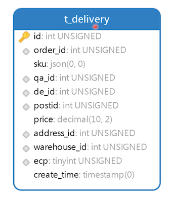
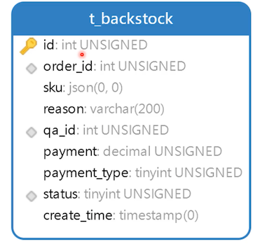

---
tags:
  - alter table
---

# 设计快递表和退货表

## 创建快递表



- order_id：订单编号

  一个商品可以拆分多个包裹，但是 sku 是不同的

- sku：这一个包裹发出了哪些商品

- qa_id：质检员工的ID

- de_id：打包快递的员工ID

- postid：快递单号；快递公司的快递单号

- price：邮费

  订单里面记录的是总的快递邮费，这里是每一个包裹的邮费

- address_id：用户的收获地址ID

- warehouse_id：发快递的仓库编号

- ecp：快递公司的编号

```sql
create table t_delivery
(
    id           int unsigned primary key auto_increment not null comment '主键',
    order_id     int unsigned                            not null comment '订单ID',
    sku          json                                    not null comment '商品',
    qa_id        int unsigned                            not null comment '质检员ID',
    de_id        int unsigned                            not null comment '发货员ID',
    postid       int unsigned                            not null comment '快递单号',
    price        decimal(10, 2) unsigned                 not null comment '快递费',
    address_id   int unsigned                            not null comment '收货地址ID',
    warehouse_id int unsigned                            not null comment '发货仓库ID',
    ecp          tinyint unsigned                        not null comment '快递公司编号',
    create_time  timestamp                               not null default now() comment '添加时间',
    index idx_order_id (order_id),
    index idx_qa_id (qa_id),
    index idx_de_id (de_id),
    index idx_postid (postid),
    index idx_address_id (address_id),
    index idx_warehouse_id (warehouse_id),
    index idx_ecp (ecp)
) comment ='快递表';
```

插入一些测试数据

```sql
INSERT INTO neti.t_delivery (id, order_id, sku, qa_id, de_id, postid, price, address_id, warehouse_id, ecp, create_time) VALUES (1, 2, '[3, 3]', 15, 17, 12333334, 60.00, 1, 1, 1, '2020-05-20 07:38:10');
```

`sku:[3,3]` ，这里视频中解释，笔者感觉有歧义；首先订单 ID=2 只购买了一个商品，另外一个 sku=3 的是订单 id=1 里面的，这里 **很明显视频中讲解错了**，因为这里不同发货表中只有一个订单 ID，显然现在这个表结构是不支持拼单发货的；

还有一个，之前在插入测试数据的时候，视频中也是值插入了一条订单的测试数据，这里讲解的时候，多出来了一条。

这里把 postid 修改为 varchar 类型比较方便。

```sql
alter table t_delivery modify postid varchar(20) not null comment '快递单号'
```


## 创建退货表



- order_id：订单ID；只设置索引，没有唯一约束

  买了 10 件商品，退了其中一件，这会产生一条退货数据。后来再退货一件，又会产生一条

- sku：这次退货有哪些商品，用数组保存退货的商品编号就可以了

- reason：退货的原因

- qa_id：退货质检员的工号

-  payment：退款金额未必是全额

  退货时，商品包装没有了，这就需要扣掉一部分钱。这里具体退多少，是质检员判定的

- payment_type

  退款的渠道，现金、微信等

- status：退货记录状态

```sql
create table t_backstock
(
    id           int unsigned primary key auto_increment not null comment '主键',
    order_id     int unsigned                            not null comment '订单ID',
    sku          json                                    not null comment '退货商品',
    reason       varchar(200)                            not null comment '退货原因',
    qa_id        int unsigned                            not null comment '质检员ID',
    payment      decimal(10, 2) unsigned                 not null comment '退款金额',
    payment_type tinyint unsigned                        not null comment '退款范式：1借记卡、2信用卡、3微信、4支付宝、5现金',
    `status`     tinyint unsigned                        not null comment '状态：1退货成功、2无法退货',
    create_time  timestamp                               not null default now() comment '添加时间',
    index idx_order_id (order_id),
    index idx_qa_id (qa_id),
    index idx_status (`status`)
) comment ='退货表';
```

插入一些测试数据

```sql
INSERT INTO neti.t_backstock (id, order_id, sku, reason, qa_id, payment, payment_type, status, create_time) VALUES (1, 2, '[3]', '质量问题', 15, 2999.00, 5, 1, '2020-05-20 07:49:37');
```

