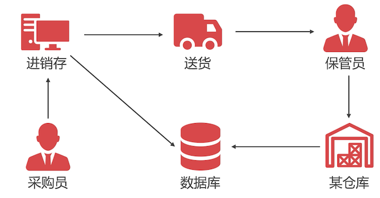
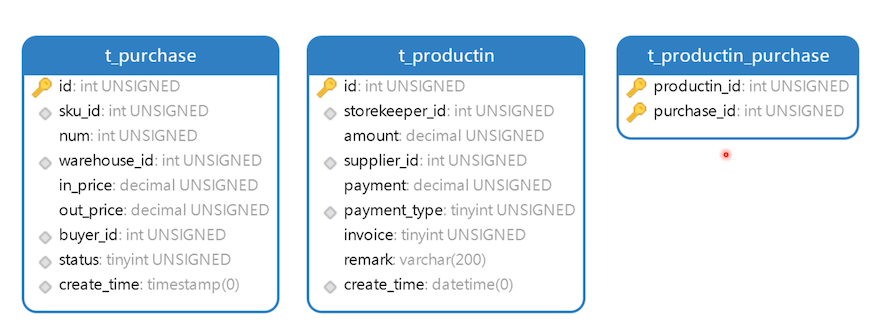

# 设计采购与入库数据表

## 商品采购与入库流程



1. 挑选商品：采购员，通过进销存模块选好供货商、商品。数据库中记录下采购的数据
2. 通知供货商：系统通过邮件或微信的方式通知供货商
3. 供货商送货：供货商接到通知后，进行送货
4. 验货：保管员检验货物之后进行入库处理
5. 入库：并填写入库单，存储在数据库中

## 表设计



- purchase：采购表

  - sku_id：采购商品ID
  - num：采购的数量
  - warehouse_id：为哪一个仓库采购商品
  - in_price：采购商品价格
  - out_price：该商品零售价建议多少钱
  - buyer_id：员工表ID，谁采购的
  - status：状态
  - create_time：创建时间

- productin：入库表

  - storekeeper_id：仓库保管员的员工ID

  - amount：这批货物的总金额

  - supplier_id：供货商 ID

  - payment：这批货物的实际支付金额

    有可能是缺失的，实际付款的金额与总金额可能不一致

  - payment_type：支付方式；银行卡、现金等

  - invoice：是否开票

  - remark：备注

  - create_time：

- purchase_productin：采购与入库关联表


```sql
create table t_purchase
(
    id           int unsigned primary key auto_increment not null comment '主键',
    sku_id       int unsigned                            not null comment '商品ID',
    num          int unsigned                            not null comment '数量',
    warehouse_id int unsigned                            not null comment '仓库ID',
    in_price     decimal(10, 2) unsigned                 not null comment '采购价格',
    out_price    decimal(10, 2) unsigned comment '建议零售价',
    buyer_id     int unsigned                            not null comment '采购员员工ID',
    `status`     tinyint unsigned                        not null comment '状态：1未完成、2已完成',
    create_time  timestamp default now()                 not null comment '添加时间',

    index idx_sku_id (sku_id),
    index idx_warehouse_id (warehouse_id),
    index idx_buyer_id (buyer_id),
    index idx_status (`status`),
    index idx_create_time (create_time)
) comment ='采购表';

create table t_productin
(
    id             int unsigned primary key auto_increment not null comment '主键',
    storekeeper_id int unsigned                            not null comment '保管员员工ID',
    amount         decimal(15, 2) unsigned                 not null comment '总金额',
    supplier_id    int unsigned                            not null comment '供应商ID',
    payment        decimal(15, 2) unsigned                 not null comment '实付金额',
    payment_type   tinyint unsigned                        not null comment '支付方式',
    invoice        boolean                                 not null comment '是否开票',
    remark         varchar(200) comment '备注',
    create_time    timestamp default now()                 not null comment '添加时间',
    index idx_storekeeper_id (storekeeper_id),
    index idx_supplier_id (supplier_id),
    index idx_payment_type (payment_type),
    index idx_create_time (create_time)
) comment ='入库信息表';

create table t_purchase_productin
(
    purchase_id  int unsigned not null comment '采购ID',
    productin_id int unsigned not null comment '入库ID',
    primary key (purchase_id, productin_id)
) comment ='入库商品表';
```

插入一些测试数据

```sql
INSERT INTO neti.t_purchase (id, sku_id, num, warehouse_id, in_price, out_price, buyer_id, status, create_time) VALUES (1, 1, 50, 1, 3000.00, 3299.00, 20, 1, '2020-05-20 09:47:05');

INSERT INTO neti.t_productin (id, storekeeper_id, amount, supplier_id, payment, payment_type, invoice, remark, create_time) VALUES (1, 42, 1500000.00, 1, 150000.00, 1, 1, null, '2020-05-20 09:48:14');

INSERT INTO neti.t_purchase_productin (purchase_id, productin_id) VALUES (1, 1);
```

