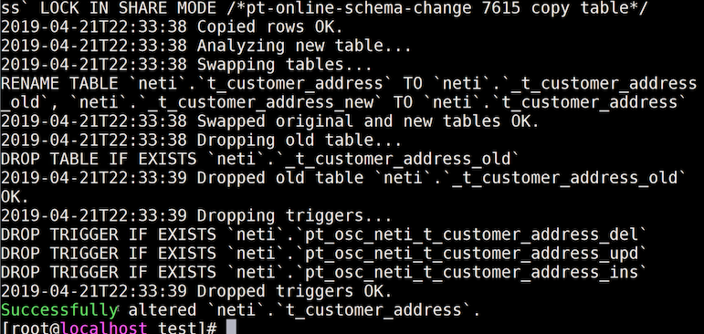

# 在线修改表结构

场景：对一个正在运营的电商网站修改表结构

## 在线修改表结构必须慎重

- 在业务系统 **运行** 过程中随意删改字段，会 **造成重大事故**。

- 常规的做法是：**业务停机**，再 **维护表结构**

  比如：12306 凌晨 0 点到早上 7 点是停机维护

- 如果是不影响正常业务的表结构是允许在线修改的。

  比如：int 类型不够用了，要缓存 bigint、有唯一性约束，要去掉。这不会影响线上的正在执行的数据

## alter table 修改表结构的弊端

- 表级锁

  修改表结构会锁表，因此在修改表结构时，影响表的写入操作；

  数据越多，锁表时间越长。

- 修改失败，还原表结构，耗时长

  如果修改表结果失败，必须还原表结构，所以耗时更长；

  比如：添加一个唯一性约束，结果发现很多数据有控制，无法添加进来了，这个时候就只能还原表结构

- 大数据表记录多，修改表结构锁表时间很久

## 使用 PerconaTookit 工具

由于 alter table 线上修改表结构有诸多弊端，但是 PerconaTookit 提供了一个开源的线上修改表结构的工具。

其中一个名为 **pt-online-schema-change** 的工具可以完成在线修改表结构。

## 在线修改表结构的原理

 **pt-online-schema-change** 是如何做到不锁表修改表结构的？

我要修改 order 表的结构， **pt-online-schema-change** 会这样做：

1. 复制一份 order 表结构

2. 在这个新表的修改表结构

3. 同步执行数据拷贝

   修改完成之后，会在原来表上增加触发器，新的操作数据增删改查都会同步到新的表中，

   同时会把原来表的数据拷贝到新表中。

   当数据拷贝完之后，且 **原表没有新的数据写入时**，把原表删除，把新表名称修改为原表名称

笔者其实很疑惑的是：它这个表数据同步原理，这里说得不够清楚，说得很模糊。在同步时修改了原来表的数据怎么办？原表的数据都还没有同步完成。

## 安装 PerconaTookit 依赖包

该依赖包与 MySQL 8 有冲突？不要安装在同一台上面？

安装第三方依赖包

```bash
yum install -y perl-DBI
yum install -y perl-DBD-mysql
yum install -y perl-IO-Socket-SSL
yum install -y perl-Digest-MD5
yum install -y perl-TermReadKey
```

安装 PerconaTookit 工具

```sql
rpm -ivh percona-toolkit-3.0.13-1.el7.x86_64.rpm
rpm -ivh percona-toolkit-debuginfo-3.0.13-1.el7.x86_64.rpm
```

## **pt-online-schema-change** 用法

```bash
pt-online-schema-change OPTIONS DSN

参数有：

--host: 地址
--user: 用户名
--password：密码
--port：端口号
D：逻辑库
t：数据表
--alter：修改语句
--execute：执行修改
--dry-run：测试执行
--print：打印过程
```

实践

在执行前还需要修改下密码认证方式，因为该工具不支持 MySQL8 新的默认认证方式，将认证方式改成低版本的方式

```sql
alter user 'root'@'%' identified by 'password' password expire never;
alter user 'root'@'%' identified with mysql_native_password by '123456';
```

```sql
-- 把客户收货地址表中的 name 字段改成  varchar(20)

pt-online-schema-change --host=192.168.56.101 --port=3306 --user=root --password=123456 --alter "modify name varchar(20) not null comment '收货人'" D=neti,t=t_customer_address --print --execute

-- 笔者这里执行完成之后，报错了
There is an error in MySQL that makes the server to die when trying to rename a table with FKs. See https://bugs.mysql.com/bug.php?id=96145
Since pt-online-schema change needs to rename the old <-> new tables as the final step, and the requested table has FKs, it cannot be executed under the current MySQL version

难道死是 MySQL 版本的问题？还是工具版本的问题？ 这个就不清楚了。 
```

下面是执行成功的截图



也可以看到的确是有一些触发器的操作。

