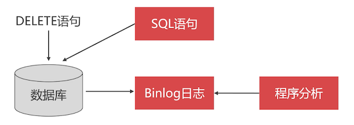

# 逻辑删除还是物理删除

一般情况下，公司会要求只能逻辑删除不能物理删除。那么这是为什么呢？

## 物理删除

使用 delete、truncate、drop 语句删除数据。就是把数据从硬盘中删除，可释放存储空间，缩小数据表的体积。

### 代价：恢复数据困难

那么物理删除是有代价的（如果想要恢复数据的话）：

- 恢复数据难度大
- 还要停掉数据库，对业务系统影响巨大

第一种恢复数据的方法：利用 binlog 日志

大概的恢复流程如下：



1. 程序分析 binlog 日志，找出误删除的日志，踢出掉该语句
2. 然后把日志里的数据重新执行一遍

更多的细节视频中也没有说清楚，要使用这个方法，需要你对 binlog 日志比较熟悉。

第二种恢复数据的方法：给数据库做一个颜时同步节点

- 给数据库配置一个同步数据的数据库
- 同步时间，要延时：比如 1 小时同步一次
- 当出现问题的时候，只要在这个延时时间内，都还可以恢复出一定的数据

### 代价：主键不连续

物理删除会造成主键的不连续，导致分页查询变慢；

```sql
select ... from ... limit 1000,20;
```

从 1000 条记录开始往后取 20 条数据。它需要计数跳过的行，越往后计数越多，就越慢。需要一个方法来加快查询。

于是就想到了如下方法：通过主键字段分页的方式

```sql
select ... from ... where id>1000 and id <= 1020;
```

主键是带索引的，条件过滤可以快速的过滤掉很多数据。（这方面要去了解 b-tree 索引的原理，你才能明白）。

如果采用 **物理删除**，那么将导致数据不连续了，无法通过这种方式跳过 N 条数据。

在后续的课程中会讲解分页的优化。

## 什么数据不适合物理删除？

**核心业务表 **的数据不建议做物理删除**，只做状态变更**。比如订单作废、账户禁用、优惠卷作废等等。

这种做法其实就是 **逻辑删除**

当数据量大的时候，想要缩小数据表的体积，可以将逻辑删除的数据转移到历史表。

**注意：** 这里说的转移记录，和前面的分页方案无关了，不要考虑前面那个分页场景了。

## 逻辑删除

可以给数据添加一个字段，如 `is_deleted` ，用该字段标记该数据已经逻辑删除，查询的时候跳过这些数据。

对于迁移历史记录表，也是有必要添加该 `is_deleted` 字段的，例如：我们可以在系统负载较少的时候（如后半夜访问较少的时候），通过定时任务将逻辑删除的数据，迁移到历史表。

## 改造我们的核心业务表

之前创建的数据表，我们都没有设置这个逻辑删除的字段。这里要去改造一下。由于表众多，这里演示其中一个表的「逻辑删除」和「历史表」的制作

```sql
-- 克隆表结构：创建历史表
crete table t_user_history like t_user;

-- 添加删除字段：历史表中不加该字段，因为都是删除的数据
alter table t_user
    add column is_deleted boolean not null default 0 comment '逻辑删除';
```

