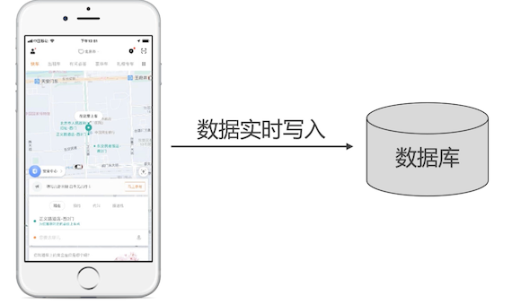
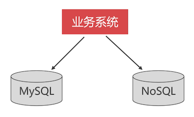
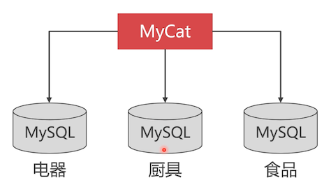

# 读多写少和读多写多

本节没有什么动手操作，介绍一些业务场景下，如何更好的使用 MySQL 数据库。

## 读多写少

普遍来说，绝大多数的系统都是读多写少的，比如：

- 电商系统：

  如：购买商品，大部分的时间都是在浏览商品，只有在下订单的时候才产生写操作。

- 新闻系统

- 论坛系统

- 在线教育系统

这种场景中，使用普通的关系型数据库就可以实现，并发大的话，还可以使用数据库集群。

## 写多读少

比如滴滴打车：下单之后，会将行程信息轨迹不断上传到服务器，进行写入，很少会查询这次行程的所有信息。

还比如：大学食堂系统，大量的刷卡信息被写入，这些信息却很少被查询

那么写多读少的场景使用普通关系型数据库可以吗？

## 写多读少的解决方案

- 如果是低价值的数据，可以采用 NoSQL 数据库来存储这些数据

  比如行程坐标，数据量大，但是每一条数据的价值不是很大，采用事务型数据库，由于事务机制，写入就很慢；

  

  传统数据使用 MySQL，低价值数据使用 NoSQL

- 如果是高价值的数据，可以用 TokuDB 来保存

  由于 NoSQL 大部分都不支持事物，所以需要使用事务型的数据库来写入。

  TokuDB 的写入速度是 InnoDB 的 9~20 倍。

  

  传统数据使用 MySQL，高价值写入多使用 TokuDB 来写入。

## 写多读多

这种场景并不多见，非常特殊。

比如微信、QQ都有离线留言的功能。这两个的软件用户很多，有很多离线消息需要存储，用户上线之后，需要获取离线消息。所以在数据库这里看，就是读多写多的。

传统关系型数据库是没有办法承载这种场景的。可以使用 NoSQL 来存储

## 数据库集群方案缺点

数据库集群的 **读写速度低于单节点数据库实例**

例如：MyCat 通过路由插入到集群上某一个节点上。因为需要做一些额外的操作，因此相比慢。

我们使用他是看中了它的优点

## 数据库集群方案优点

数据库集群能支持 **更大规模的并发访问**，并且 **存放更多的数据**

