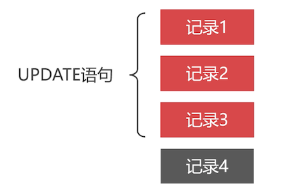

# 删改数据如何避免锁表？

## 什么是锁机制？

平时 MySQL 执行语句的时候，会自动给数据加锁。

InnoDB 采用的是行级锁，删改数据的时候，MySQL 会锁住记录。



比如：上图更新 3 条语句，只会锁住这三条记录。被锁住的记录有什么表现？这需要根据它使用的锁来说明

## 共享锁和排它锁

行级锁分为：

- 共享锁（S 锁）
- 排它锁（X 锁）

共享锁和排它锁，**都不允许 **其他事务 **执行写操作**，但是可以读数据。

排他锁不允许对数据再加另外的锁。

## 共享锁

只有 serializable 事务隔离级别，才会给数据添加共享锁。也可以手动添加共享锁

```sql
select ... from ... lock in share mode;
```

事务不提交，该共享锁不会被释放，其他事务只能读取数据，而不能写数据。

如下面的测试

```sql
-- 会话 1
-- 开启事物，并查询前 10 条记录
BEGIN;
SELECT
		* 
	FROM
		t_test 
WHERE
	id <= 10 LOCK IN SHARE MODE;
	
-- 先不提交事务，去 会话 2，执行更新操作
COMMIT;


-- 会话 2
-- 开启事物，并执行更新语句
BEGIN;
UPDATE t_test 
	SET `name` = 'abc' 
WHERE
	id <= 10;
-- 会发现更新语句被阻塞了，要等待会话 1 释放共享锁

-- 可以回滚该事务，不让修改生效
ROLLBACK;
```

## 排他锁

MySQL 会 **默认** 给添加、修改和删除记录，设置排他锁。

手动添加排他锁的语法为

```sql
select ... from ... for update;
```

可以对该数据进行查询，但是不能对加了排它锁的数据进行修改。（同时也不能对该数据加排他锁了）

## 如何减少并发操作的锁冲突？

把复杂的 SQL 语句，拆分成多条简单的 SQL 语句。

复杂 SQL 语句执行时间长，锁时间长，拆分成简单的语句，每次锁定数据少，锁时间短