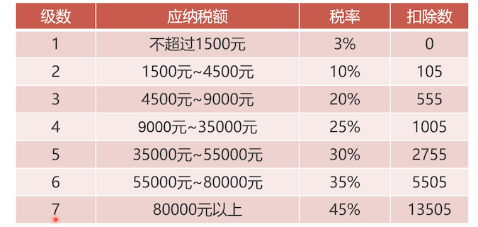

# 什么是函数？

之前用过数据库定义好的函数，我们自己也可以自定义函数；

函数只能返回一个结果（或则不返回），不能是多条；

编写计算个个税函数，2017 的计算公式为：`个税 =（收入- 3500）x税率-扣除数`



```sql
create
		-- 定义类型变成了 function
		-- 入参中，没有类 in
		-- 返回值使用 returns 声明，并声明了返回的数据类型
    definer = CURRENT_USER function p3(salary decimal(10, 2)) returns decimal(10, 2)
    READS SQL DATA   -- 这两个不知道是啥意思，反正就这样写
    DETERMINISTIC
begin
    declare temp decimal;
    declare tax decimal; -- 个税
    set temp = salary - 3500;

    case
        when temp <= 0 then
            set tax = 0;
        when temp > 0 and temp <= 1500 then
            set tax = temp * 0.03 - 0;
        when temp > 1500 and temp <= 4500 then
            set tax = temp * 0.1 - 105;
        when temp > 4500 and temp <= 9000 then
            set tax = temp * 0.2 - 555;
        when temp > 9000 and temp <= 35000 then
            set tax = temp * 0.25 - 1005;
        when temp > 35000 and temp <= 55000 then
            set tax = temp * 0.3 - 2755;
        when temp > 55000 and temp <= 80000 then
            set tax = temp * 0.35 - 5505;
        when temp > 80000 then
            set tax = temp * 0.45 - 13505;
        end case;
    return tax;
end;

-- 调用
select p3(4000);
select p3(5000);
select p3(20000);
select p3(1000000);
```

