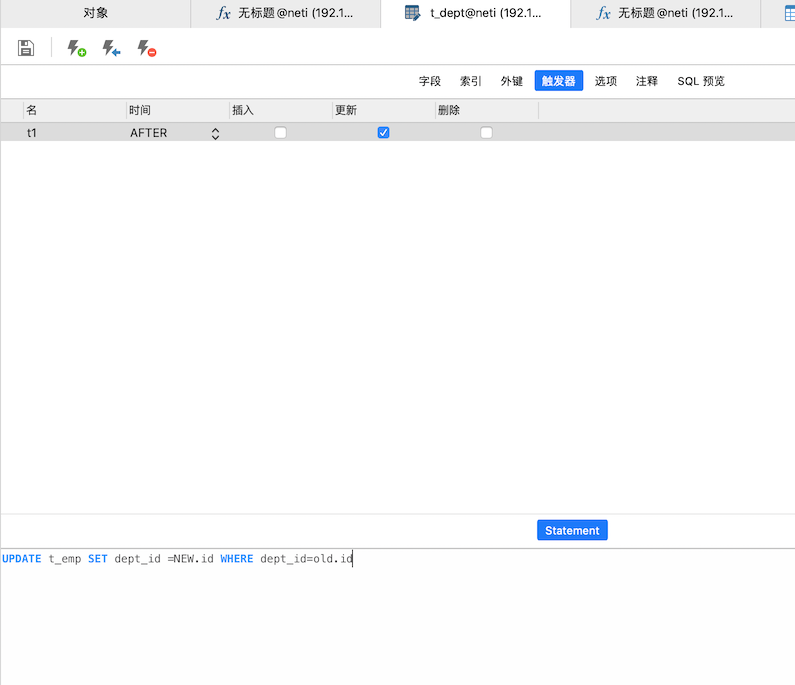

# 什么是触发器

一种特殊的存储过程；**不需要调用**，写好触发条件，会自动触发

编写触发器：修改部门编号，同步更新该部门员工的 dept_id 字段。

上图在部门表 t_dept 上定义了一个触发器，在部门数据更新之后（AFTER），去执行下面的 update 语句，里面有两个固定的变量：new.id  其中的 new 是当前部门表被更新的这一行数据，old，则是部门表更新之前的数据。

作用就是：当部门这条数据的 ID 变更了，那么久同步变更关联这条数据的 ID 为新的数据。