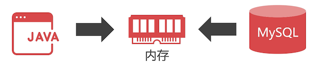
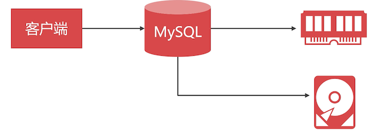
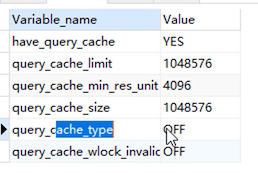

# 数据库/程序 缓存如何选？

## 为什么要缓存数据？

数据库中的数据是存放在硬盘上的，从数据库中读取肯定比内存慢。

放内存中，一般会给数据一个过期时间，不常用的就会自动清理掉。

## 数据库性能

经过优化的 MySQL 每秒可以处理 5000 次读取，或则 3000 次写入，负载不高的时候，响应时间通常在 10ms 以内，但是在 1 万并发的时候，要保证 10ms  以内的响应速度，任何数据库都做不到。

这个时候就可以用内存来缓存数据了。但是问题来了，这个数据是由谁来缓存？



由程序还是数据库？

## 数据库缓存

程序和数据库都有自己独立的一套缓存方案。

MySQL 缓存是 KV 结构的，Key 是执行过的 SQL 语句，Value 是查询的结果。如果执行添加、修改、删除，或则修改表结构，都会造成缓存清空。

## 数据查询过程

执行 SQL 语句，MySQL 先查询缓存。命中数据，就从缓存中提取数据；没有命中，就从数据库中查询数据，同时会缓存到内存中。



## 数据库缓存注意事项

默认是关闭的，要使用需要先开启。但是 MySQL 8+ 后，去掉了查询缓存这个功能。

- 所有对数据加锁的事务中，不会使用查询缓存
  - 比如：一个事务中，update 后，使用 select 就不会使用缓存
- 查询语句必须一模一样，才有机会命中缓存

## 该不该使用数据库缓存？

MySQL8+ 去掉了查询缓存，Oracle 官方也不推荐使用查询缓存。

查询下 MySQL8.0 的查询缓存是否支持：

```sql
show variables  like '%query_cache';
-- 查询结果是
have_query_cache,NO
```

下图是 mysql 5.7 的查询结果



可以看到是支持，但是查询缓存没有开启。

**数据库缓存的根本问题是**：不能细粒度设置哪些表需要缓存，当 MySQL 缓存了很多结果的时候，一条更新语句就会让缓存全部作废，这严重的加重了内存管理的负担。

哪些数据适合缓存？很少修改的数据，并且经常使用的数据，才值得去缓存，在 MySQL 中，我们无法细粒度的来选择。

## 程序缓存的优势

Redis、Memcached 这些缓存产品，都可以在程序中细粒度的设置哪些查询需要缓存，哪些不需要。

对于 java 来说，spring 框架提供了缓存技术的支持。

## SpringCache 技术

```java
@Cacheable("Cache1")
public User get(Long id){
  // 执行查询
  // 返回的结果会被缓存
  return User对象；
}
```

建议：单表查询结果可以缓存，表连接查询不建议缓存。因为你不太确定哪张表是经常修改的。

```java
// 让缓存失效的注解
@CacheEvict(value="Cache1")
public void delete(Long id){
	// 执行删除操作
}
```

