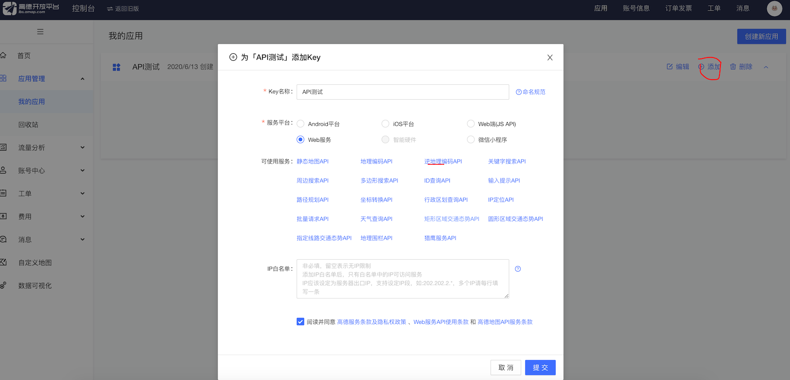

# 智能拆分订单

新零售系统的智能拆分订单，因为我们的业务中有自建仓库，那么实际使用中，用户下单就面临一个问题，当用户所在地没有仓库，或则说购买的商品，在本地仓库没有，需要从外地仓库发货，还需要计算哪个仓库距离用户最近；

电商系统是一个很复杂的系统，包含了很多子系统：交易、订单、仓库、物流、售后子系统等等，如果都部署在一台机器上，在大型电商上场景中，根本就撑不住。最常见的方式就是搞分布式架构，微服务。

## 就进发货的难题

我们实现一个体验较好的购买流程：

1. 用户下单

   用户只需要关注商品是否有库存，不需要关心商品从哪个仓库发货的，

2. 智能拆分订单

   系统接收到订单通知后，系统判断哪些商品在本地有货，哪些在需要从其他仓库发货，并且计算哪家仓库距离收货地址是最近的。

要计算收货地址最近，需要知道用户收货地址的地里坐标。

## 注册高的地图开发者

通过高的地图的 API 来获取到地址的地理坐标，需要

1. [先注册开发者账户](https://lbs.amap.com/dev/id/choose) 

2. 创建一个 [应用](https://console.amap.com/dev/key/app)

3. 为这个应用添加 Key 

   


拿到这个 key 后，就可以使用这个 [地理/逆地理编码](https://lbs.amap.com/api/webservice/guide/api/georegeo) API，如下的一个测试返回数据


响应中的 location 就是地址位置坐标了。API 调用数据都有了，在程序中来发送 HTTP 请求，这里推荐一个工具包

## hutool 

[Hutool](https://github.com/looly/hutool) 是 Java 里一个工具集合的依赖包，可以使用它的网络类，发送请求。

相对于 httpClient 来说更加简单；笔者也看了下官网说明，涵盖了相当多的工具，还不错。

```
    compile 'cn.hutool:hutool-all:5.3.7'
    compile 'mysql:mysql-connector-java:8.0.16'
```

拿到举例收货地址的地址位置信息之后，还要计算哪一个仓库离收货地址最近，所以把 MySQL 驱动也引入;

```java
@Test
public void geocodeGet() {
  HashMap<String, Object> params = new HashMap<>();
  params.put("key", "xxx");
  params.put("address", "营口市盼盼工业园");
  String resp = HttpUtil.get("https://restapi.amap.com/v3/geocode/geo", params);
  JSON json = JSONUtil.parse(resp);
  String location = json.getByPath("geocodes[0].location", String.class);
  String[] lngItems = location.split(",");
  Double lng = Double.valueOf(lngItems[0]); // 经度
  Double lat = Double.valueOf(lngItems[1]); // 维度
  System.out.println(lng);  // 122.268278
  System.out.println(lat);	// 40.731062
}
```

把 t_warehouse 仓库表新增地里位置字段

```sql
alter table t_warehouse
	add lng decimal(12,6) null comment '经度';

alter table t_warehouse
	add lat decimal(12,6) null comment '纬度';
```

## 利用 MySQL 计算两点之间的距离

`st_distance` 函数可以计算两个坐标之间相差的度数

```
select st_distance(
               point(116.414042, 39.92556),   -- 北京市
               point(121.486864, 31.232965)		-- 上海市
           ) * 111195;
-- 10.06452834849746
-- 计算出来的是度数，要 * 111195，还原成距离，单位是米
```

对于仓库的地里位置，上面接口也可以获取到，还可以通过 [坐标拾取器](https://lbs.amap.com/console/show/picker) 在高德地图提供的 web 界面中去获取到

我们找几个沈阳市和大连市的几个坐标点，用来当做我们测试的仓库地址，并增加到仓库表中

```sql
INSERT INTO neti.t_warehouse (id, city_id, address, tel, lng, lat) VALUES (5, 1, '大连市五一广场', '0411-98213210', 121.603687, 38.917862);
INSERT INTO neti.t_warehouse (id, city_id, address, tel, lng, lat) VALUES (6, 1, '大连市五四广场', '0411-98213210', 121.589590, 38.913605);
INSERT INTO neti.t_warehouse (id, city_id, address, tel, lng, lat) VALUES (7, 1, '沈阳市政府', '0411-98213210', 123.465009, 41.677287);
```

```sql
select id,
       address,
       st_distance(
               point(122.268278, 40.731062), -- 营口市盼盼工业园
               point(lng, lat)
           ) * 111195 / 1000 as sistance
from t_warehouse
where lng is not null
```

查询结果为

| id | address | sistance |
| :--- | :--- | :--- |
| 5 | 大连市五一广场 | 214.73523519655598 |
| 6 | 大连市五四广场 | 215.72309589574027 |
| 7 | 沈阳市政府 | 169.6409679674254 |

可以看到沈阳市政府，距离营口市盼盼工业园距离更近一点，只有 169 公里；

那么改造 SQL 返回一个最近的仓库

```sql
select id,
       address,
       st_distance(
               point(122.268278, 40.731062), -- 营口市盼盼工业园
               point(lng, lat)
           ) * 111195 / 1000 as dsistance
from t_warehouse
where lng is not null
order by dsistance
limit 1
```

拿到了最近的仓库，还需要计算这个商品是否在这个仓库中有库存;

```sql
select t.id
from (select id,
             address,
             st_distance(
                     point(122.268278, 40.731062), -- 营口市盼盼工业园
                     point(lng, lat)
                 ) * 111195 / 1000 as dsistance
      from t_warehouse
      where lng is not null
      order by dsistance
      limit 1) t
         join t_warehouse_sku ws on ws.warehouse_id = t.id
    and ws.sku_id = 1		-- 购买的商品 id
    and ws.num >= 1;		-- 购买的数量
```

使用 Java 代码来简单实现下

```java
    public String geocodeGet(String address) {
        HashMap<String, Object> params = new HashMap<>();
        params.put("key", "xx");
        params.put("address", address);
        String resp = HttpUtil.get("https://restapi.amap.com/v3/geocode/geo", params);
        JSON json = JSONUtil.parse(resp);
        String location = json.getByPath("geocodes[0].location", String.class);
        return location;
    }

   // 运行这个测试
    @Test
    public void test2() throws SQLException {
        String location = geocodeGet("营口市盼盼工业园");
        String[] lngItems = location.split(",");
        String lng = lngItems[0]; // 经度
        String lat = lngItems[1]; // 维度

        DriverManager.registerDriver(new Driver());
        // 说是 8.0 不加 serverTimezone 链接会有问题
        String url = "jdbc:mysql://192.168.56.101:3306/neti?serverTimezone=GMT%2B8";
        String username = "root";
        String password = "123456";

        Connection connection = DriverManager.getConnection(url, username, password);
        String sql = "select t.id\n" +
                "from (select id,\n" +
                "             address,\n" +
                "             st_distance(\n" +
                "                     point(?, ?),\n" +
                "                     point(lng, lat)\n" +
                "                 ) * 111195 / 1000 as dsistance\n" +
                "      from t_warehouse\n" +
                "      where lng is not null\n" +
                "      order by dsistance\n" +
                "      limit 1) t\n" +
                "         join t_warehouse_sku ws on ws.warehouse_id = t.id\n" +
                "    and ws.sku_id = ? and ws.num >= ?;";
        PreparedStatement pst = connection.prepareStatement(sql);
        pst.setObject(1, lng);
        pst.setObject(2, lat);
        pst.setObject(3, 4);  // 商品 sku_id
        pst.setObject(4, 1);  // 购买数量

        ResultSet resultSet = pst.executeQuery();
        while (resultSet.next()) {
            int id = resultSet.getInt("id");
            System.out.println(id);
        }
    }
```

上面的 SQL 没有考虑是否有库存的，改写下 SQL，完成：最近且满足库存条件的

```sql
select id
from (
         select w.id,
                w.address,
                st_distance(
                        point(122.268278, 40.731062), -- 营口市盼盼工业园
                        point(w.lng, w.lat)
                    ) * 111195 / 1000 as dsistance
         from t_warehouse w
                  join t_warehouse_sku ws on ws.warehouse_id = w.id
             and ws.sku_id = 4 and ws.num >= 1
         where lng is not null
         order by dsistance
         limit 1) temp
```

