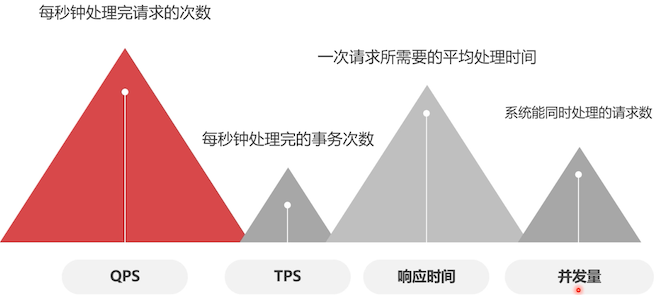

# MySQL 压力测试

由于我们练习使用的是虚拟机，无法测试 MySQL 的实际性能；但是把测试的方法学到了，就可以在任意的平台上去测试数据库的性能。

## 什么是压力测试

压力测试是针对系统的一种性能测试，但是测试数据 **与业务逻辑无关**，更加 **简单直接的测试读写性能**。

## 压力测试的指标



## 压力测试工具

- Mysqlslap：官方自带

  需要对数据库进行长时间高并发测试，这个工具不就太合适了

- Sysbench

  长时间进行高并发测试

- Jmeter

  在数据库方面的测试功能较弱。不推荐

## Sysbench 简介

可以测试如下：

- 线程测试

  `stench --test=threads --num-threads=64 --thread-yields=100 --thread-locks=2 run `

- CPU 测试

  `sysbench --test=cpu --cpu-max-prime=20000 run`

- 内存测试

  `sysbench --test=memory --memory-block-size=8k --memory-total-size=4G run`

- 数据库测试

  `sysbench --test=oltp --mysql-table-engine=myisam --oltp-table-size= 1000000`

- 磁盘测试

  `sysbench--test=fileio--num-threads=16--file-total-size=3G--file-test-mode=rndrw run`

### 安装 Sysbench

笔者之前 [也学过这个软件的测试](/mysql-tutorial/high-performance/02/05.md#sysbench)，可以参考下，说得更详细

使用 yum 安装，[设置国内的 yum 源](https://zq99299.github.io/linux-tutorial/tutorial-basis/22/03.html#%E5%9B%BD%E5%86%85%E9%95%9C%E5%83%8F%E7%AB%99%EF%BC%88%E4%BB%93%E5%BA%93%E6%BA%90%EF%BC%89)，简单说就是下载 repo 后缀的文件，放置到 `/etc/yum.repos.d` 目录中。然后执行以下命令

```bash
yum clean all
yum makecache

# 安装方式来自 https://github.com/akopytov/sysbench#installing-from-binary-packages
curl -s https://packagecloud.io/install/repositories/akopytov/sysbench/script.rpm.sh | sudo bash
sudo yum -y install sysbench
```

不要和 Mysql 8 安装在一台机器上，会有冲突

## Sysbench 基本语法

```bash
sysbench script [options] [command]

script: 官方自带了一些，足够我们使用了，在 sysbench /usr/share/sysbench/tests/include/ 下

options 链接信息参数
  `--mysql-host`：ip 地址
  `--mysql-port`：端口号
  `--mysql-user`：用户名
  `--mysql-password`：密码
  `--oltp-test-mode`：执行模式，simple、nontrx、complex
  	simple: 只测试查询语句
  	nontrx：无事务测试，MyISAM 引擎
  	complex：事务测试，可以用于测试 InnoDB 引擎
  `--oltp-tables-count`：测试表的数量
  `--oltp-table-size`：测试表的记录数
  	它可以生成测试数据，通过这个指定生成的测试记录数量
  `--threads`：并发线程数
  `--time`：测试执行时间（秒）
  `--report-interval`：生成报告单的间隔时间（秒）
command 命令参数
	prepare：准备测试数据
	run：执行测试
	cleanup：清楚测试数据
```

下面来实践一下

```sql
-- 运行之前，需要先手动创建一个数据库，数据库的名称是固定的：sbtest
-- 生成测试数据
[root@study ~]# sysbench /usr/share/sysbench/tests/include/oltp_legacy/oltp.lua --mysql-host=192.168.56.101 --mysql-port=3306 --mysql-user=root --mysql-password=123456 --oltp-tables-count=10 --oltp-table-size=100000 prepare

sysbench 1.0.20 (using bundled LuaJIT 2.1.0-beta2)

Creating table 'sbtest1'...
Inserting 100000 records into 'sbtest1'
Creating secondary indexes on 'sbtest1'...
Creating table 'sbtest2'...
Inserting 100000 records into 'sbtest2'
Creating secondary indexes on 'sbtest2'...
Creating table 'sbtest3'...
Inserting 100000 records into 'sbtest3'
Creating secondary indexes on 'sbtest3'...
...
-- 可以看到在创建一些表数据

-- 执行测试
-- 这里选择了：事务测试、10 个线程、执行 10 分钟、间隔 10 秒生成一次报告、把测试信息存储在 /home/report.log 中
[root@study ~]#  sysbench /usr/share/sysbench/tests/include/oltp_legacy/oltp.lua --mysql-host=192.168.56.101 --mysql-port=3306 --mysql-user=root --mysql-password=123456 --oltp-test-mode=complex --threads=10 --time=600 --report-interval=10 run >> /home/report.log

sysbench 1.0.20 (using bundled LuaJIT 2.1.0-beta2)

Running the test with following options:
Number of threads: 10
Report intermediate results every 10 second(s)
Initializing random number generator from current time


Initializing worker threads...

Threads started!

[ 10s ] thds: 10 tps: 145.46 qps: 2956.28 (r/w/o: 2077.72/584.44/294.12) lat (ms,95%): 97.55 err/s: 2.20 reconn/s: 0.00
....
[ 590s ] thds: 10 tps: 169.00 qps: 3408.96 (r/w/o: 2391.17/677.89/339.90) lat (ms,95%): 74.46 err/s: 1.90 reconn/s: 0.00
[ 600s ] thds: 10 tps: 170.00 qps: 3446.17 (r/w/o: 2419.98/683.59/342.60) lat (ms,95%): 75.82 err/s: 2.60 reconn/s: 0.00
SQL statistics:
    queries performed: # 执行查询次数
        read:                            1447810
        write:                           408935
        other:                           205172
        total:                           2061917	# 读写、其他总计
    transactions:                        101757 (169.57 per sec.)		# 事务，平均每秒钟执行 169 次
    queries:                             2061917 (3436.11 per sec.)	# 查询，每秒钟执行 3436 次
    ignored errors:                      1658   (2.76 per sec.)	# 错误：数据库节点在慢负荷运行时，新的请求进来，得不到处理，就超时了
    reconnects:                          0      (0.00 per sec.)

General statistics:
    total time:                          600.0713s
    total number of events:              101757

Latency (ms):
         min:                                   10.51
         avg:                                   58.97
         max:                                  233.36
         95th percentile:                       75.82
         sum:                              6000151.10

Threads fairness:
    events (avg/stddev):           10175.7000/100.18
    execution time (avg/stddev):   600.0151/0.02

```

