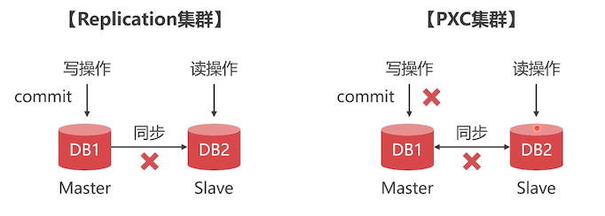

# 数据库集群能解决什么问题？

## 单节点和集群哪个读写更快？

- 低并发情况下，单节点 MySQL 读写速度快

- 高并发情况下，MySQL 集群的读写速度更快

  大量并发如果集中在一个 MySQL 节点上，先不说内存撑不撑得住，磁盘 IO 都撑不住。

数据库集群的思路：

- 读写分离方案
- 数据切分方案

## 单节点数据库的弊病

大型互联网程序用户群庞大，所以架构必须要特殊设计，比如：

- 微信注册用户超 10 亿
- 新浪微博用户超 3.3 亿
- 今日头条用户超 2.4 亿

单节点的数据库无法满足性能上的要求：单节点链接数量最大 16000 多，大量用户情况下，根本就应付不过来

单节点的数据库没有冗余设计，无法满足高可用：一个节点挂了，这个业务也就瘫痪了。

高并发下的数据库压力：2016 年除夕，微信共收发红包 **142 亿** 个，比上一年增长 75.7%，最高峰值每秒收发红包 **76 万** 个，支付峰值 **20.8 万** 次每秒，创下世界纪录。

## 常见 MySQL 集群方案

常见的 MySQL集群方案有：

- PXC ：同步传输

  适合保存少量高价值数据

- Replication：异步传输

  适合保存大量数据

## PXC 与 Replication 方案对比

- PXC 方案：事务是同步的

  执行一个事务，只有当数据同步到 slave 成功后，事务才能提交成功。

- Replication：事务是异步的

  在 master 上提交成功了，但是异步同步失败了，在 slave 中就无法查询到数据

他们不是竞争关系，而是互补关系