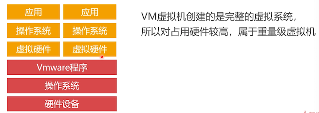
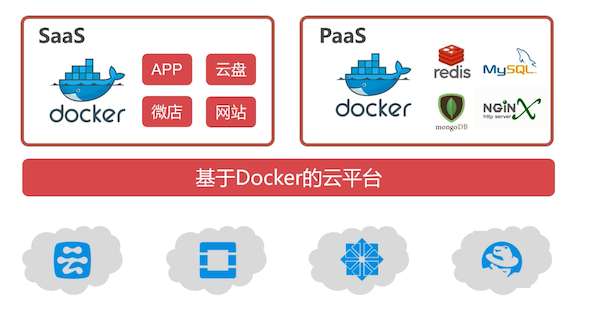
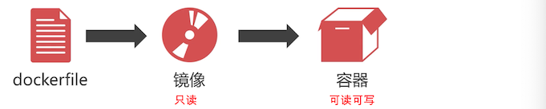

# 如何使用 Docker 虚拟机

## Docker 与 vm 虚拟机对比

Docker 是免费的虚拟机引擎，可以为任何应用创建一个轻量级的可移植的容器




总的来说，Docker 在批量集群方面，就是快、方便

## 可以不安装虚拟机吗？

Docker 是跨平台的轻量级虚拟机，Win10 和 MacOS 都可以安装 Docker，

但是我们需要用到虚拟 IP，这个只有 Linux 才支持。所以还是安装虚拟机把。

## 云计算中的 Docker 虚拟机



因为Docker 是轻量级的虚拟机，一台服务器可以跑几百上千个虚拟的实例，所以有很多厂商就出售这些实例，这就是 **云计算的虚拟云主机** ；

云又分为：

- Saas

  为客户提供完整的云端产品（如进销存、财务系统等），用户购买云主机时，挑选需要哪些产品，运营商就立即给你构建这套软件系统，对很多非技术性的中小企业是很有帮助的：不需要自己搭建环境，也不需要找人开发

- PaaS

  为客户提供服务，客户自己把这些服务整合成产品；

  比如事先把 redis、mysql、MongoDB 等部署到虚拟的实例上，再开发一套管理系统，如果客户需要使用云端数据库服务，那么就卖给你数据库服务

  PaaS 云适合中小型的技术企业，通过购买运营商提供的基础服务，完成自己的云端引用程序的开发

无论是哪一种云，都需要用到 Docker 虚拟机

## Docker 镜像

Docker 虚拟机的镜像是一个**只读层**，不能写入数据。

我们可以通过 dockerfile 文件，定义需要安装的程序（如 MySQL），然后创建出镜像文件。

在 Docker 仓库中已经存在了一些别人已经制作好的镜像，比如 java 环境。



由于镜像是只读的，想要存储一些数据，就需要创建容器。

## Docker 容器

Docker 容器是一个 **虚拟机的实例**，里面的内容可读可写。且容器是 **完全隔离** 的，我们不用担心部署程序会相互干扰。

一个镜像可以创建出多个容器。


## 安装 Docker 虚拟机

首先我们需要多搞几台 vm 的虚拟机出来，这些 vm 虚拟机的硬件配置可以稍微提高一点，因为一台 linux 服务器里面可以跑很多个 docker 虚拟机；

在 CentOS 上安装 Docker 虚拟机

```sql
yum install -y docker
service docker start
service docker stop
```

## Docker 虚拟机管理命令

下面是 docker 的一些常用命令


- build：从 DockerFile 构建一个镜像

- search：搜索 Docker 仓库有哪些可用的镜像

  如果不想自己 build 镜像，就可以查看有哪些别人制作好的

- pull：从远程把镜像，下载到本地

- push：将我们自己创建的镜像发布到仓库

- images：查看本地存放了哪些镜像

- rmi：删除一个镜像

  前提是，把与该镜像关联的容器都删除

- save：将本地的镜像导出成压缩文件

- load：将压缩文件导入到本地的 Docker 虚拟机

- run：创建容器，创建后就是运行状态的

  访问容器：可执行 exec/attach 命令

- pause/unpause：暂停或则恢复容器

- stop/start：停止容器或启动容器

- ps：查看 docker 中有多少个容器

- rm：删除容器

- commit：将容器转换成镜像

## 设置镜像加速器

Docker 仓库在海外，访问很慢，设置为国内的镜像仓库，加快下载速度；

这里使用 [dockerCloud 加速器](https://www.daocloud.io/mirror)

```bash
[root@study ~]# curl -sSL https://get.daocloud.io/daotools/set_mirror.sh | sh -s http://f1361db2.m.daocloud.io
docker version >= 1.12
{"registry-mirrors": ["http://f1361db2.m.daocloud.io"],}
Success.
You need to restart docker to take effect: sudo systemctl restart docker 
```

看见上面输出，多了一个逗号，需要手动编辑去掉这个逗号

```sql
vim /etc/docker/daemon.json
# 修改为下面这样，就是去掉了后面多余的逗号
{"registry-mirrors": ["http://f1361db2.m.daocloud.io"]}
```

笔者这里使用 dockerCloud 还是有超时现象，这里配置下阿里云的，先进入[容器镜像服务](https://cr.console.aliyun.com/)；侧边栏有一个镜像中心，找到镜像加速器；会给你一个专属的镜像加速器地址，上面文件中的地址替换掉这个，重启 docker 就可以了

## 演示

一开始笔者没有关闭 SELinux，会出现一些程序运行的权限问题，这里还是需要先关闭：[可参考这个文章](https://zq99299.github.io/linux-tutorial/tutorial-basis/16/05.html#selinux-%E4%B8%89%E7%A7%8D%E6%A8%A1%E5%BC%8F%E7%9A%84%E5%90%AF%E5%8A%A8%E3%80%81%E5%85%B3%E9%97%AD%E4%B8%8E%E8%A7%82%E5%AF%9F)

下载一个 java 镜像，创建出一个容器，部署 java 程序

```bash
# 搜索远程仓库有哪些可用的 java 镜像
[root@study ~]# docker search java
INDEX       NAME                                               DESCRIPTION                                     STARS     OFFICIAL   AUTOMATED
docker.io   docker.io/node                                     Node.js is a JavaScript-based platform for...   8925      [OK]       
docker.io   docker.io/tomcat                                   Apache Tomcat is an open source implementa...   2751      [OK]       
docker.io   docker.io/openjdk                                  OpenJDK is an open-source implementation o...   2289      [OK] 

# 上面看到了一个 openjdk
# 下载该镜像
[root@study ~]# docker pull docker.io/openjdk
Using default tag: latest
Trying to pull repository docker.io/library/openjdk ... 
latest: Pulling from docker.io/library/openjdk
fa926a7d213a: Pull complete 
22aed8993d2f: Pull complete 
6f92a6635435: Pull complete 
Digest: sha256:c56c42fb84c21ebeea1c715f323b78f4160872ac6c28c32292d9cd1d29982aaf
Status: Downloaded newer image for docker.io/openjdk:latest

# 查看 docker 环境里是否有下载下来的镜像
[root@study ~]# docker images
REPOSITORY          TAG                 IMAGE ID            CREATED             SIZE
docker.io/openjdk   latest              4fba8120f640        3 days ago          497 MB

# 创建容器 
# -it:  进入容器
# bash：进入容器使用哪一个命令行
[root@study ~]# docker run -it docker.io/openjdk bash
bash-4.2# 									# 可以看到就进入到容器中来了
# 可以看下当前是哪一个的 java 版本
bash-4.2# java --version
openjdk 14.0.1 2020-04-14
OpenJDK Runtime Environment (build 14.0.1+7)
OpenJDK 64-Bit Server VM (build 14.0.1+7, mixed mode, sharing)

# 部署程序到这个容器中，需要做一个目录映射，才能把文件传到容器中
# 退出容器，在容器中执行  exit

# 查看有哪些容器
[root@study ~]# docker ps -a
CONTAINER ID        IMAGE               COMMAND             CREATED             STATUS                      PORTS               NAMES
838eefc8ff2c        docker.io/openjdk   "bash"              3 minutes ago       Exited (0) 12 seconds ago                       adoring_meitner
# 可以看到，刚刚我们退出的容器，status 的确是 exited 了

# 删掉该容器,给的是容器ID
[root@study ~]# docker rm 838eefc8ff2c

# 创建一个有目录容器的映射
# 使用 -v 参数，有两个目录，左边的是宿主机的目录，右边的映射到容器中的目录
# 映射目录，需要该目录先存着，记得先创建它
# 1. 创建并进入该容器
[root@study ~]# docker run -it -v /root/java:/root/java  docker.io/openjdk bash
# 2. 在 宿主机的 /root/java 目录下创建一个  Hello.java 文件
#    文件内容就如下一个简单的打印
class Hello{
  public static void main(String[] args){
    System.out.println("Hello World");
  }
}
#  3. 在容器中进入该目录
#			发现提示权限不足，这里还是要听老师的，需要先把 SELinux 关闭; 关闭后需要重新启动机器
bash-4.2# ls /root/java/
ls: cannot open directory /root/java/: Permission denied
# 		处理完 SELinux 后，就发现能看到了
bash-4.2# ls /root/java/
Hello.java
bash-4.2# cd /root/java
bash-4.2# javac Hello.java 
bash-4.2# java Hello
Hello World
```


