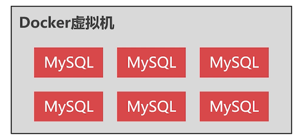

# 分布式 Docker 环境

## 集中部署的缺点

把数据库集群都部署在一个 Docker 上不是一个好办法，如果宿主机宕机了，那么每个 MySQL 节点都不能使用了



## 分布式部署

分布式部署，首先要解决的就是虚拟机组网的问题，**Docker Swarm** 技术可以 **自动把异地的 Docker 虚拟机组成一个局域网**


## 创建多个 VM 实例


比如创建 4 个实例，然后使用 Swarm 把这 4 台组成一个区域网

可以利用现有的虚拟机，克隆出来，在这之前，我们先删除之前的存在的容器实例后再克隆。

笔者使用的是 Oracle VM VirtualBox，克隆很简单了:

修改你要复制新的虚拟机名称


等待 2 分钟左右就可以使用了，**唯一需要修改就是：** 复制后的虚拟机启动后，网络 IP 被设置为了自动模式，需要手动修改成手动模式

## 创建 Swarm 集群

很简单，在某一个 docker 节点上执行 `docker swarm init` 命令，swarm 集群就创建出来了，并且当前的 docker 节点会自动加入到 swarm 集群，成为集群的管理节点

```bash
[root@study ~]# docker swarm init
Error response from daemon: could not choose an IP address to advertise since this system has multiple addresses on different interfaces (10.0.2.105 on enp0s3 and 192.168.56.105 on enp0s8) - specify one with --advertise-addr
# 由于笔者 mac 虚拟机上为了链接外网，使用了两张网卡的方式，这里需要指定网卡
# 这里我选择 enp0s8 这张网卡
[root@study ~]# docker swarm init --advertise-addr enp0s8
Swarm initialized: current node (dsm2a0zz66ckrrc9wkw7437lw) is now a manager.

To add a worker to this swarm, run the following command:

    docker swarm join \
    --token SWMTKN-1-1hwraveloheai9kbgrh2r7kwonxze24275ckpa5uxhxt905gbm-ec30fb3zbn4zho8e839bnfbeg \
    192.168.56.105:2377

To add a manager to this swarm, run 'docker swarm join-token manager' and follow the instructions.
```

swarm 集群创建成功，告诉我们当前 105 节点是管理节点，要将其他 docker 虚拟机加入到这个 swarm 集群中，只需要在每台要加入的 docker 虚拟机上，运行那一串 join 指令就可以了;

注意的是：还需要放开 2377 这个端口

```bash
firewall-cmd --zone=public --add-port=2377/tcp --permanent
firewall-cmd --reload
```

在其他机器上执行加入命令

```bash
[root@study ~]# docker swarm join     --token SWMTKN-1-1hwraveloheai9kbgrh2r7kwonxze24275ckpa5uxhxt905gbm-ec30fb3zbn4zho8e839bnfbeg     192.168.56.105:2377
This node joined a swarm as a worker.
```

在管理 Swarm 集群的时候，很多命令需要在管理节点上执行，在 worker 节点上执行不支持。

## 查看 Swarm 集群节点

```bash
docker node ls		# 查看集群节点
# 删除集群节点，
#  -f 是删除 AVAILABILITY 为 active 的节点；表示这台 docker 虚拟机正则运行中
docker node rm -f 节点ID		
```

```bash
# 查看集群中有哪些节点
[root@study ~]# docker node ls
ID                           HOSTNAME             STATUS  AVAILABILITY  MANAGER STATUS
1468rakoih5r6v6m1gwnn5ap7    study.centos.mrcode  Ready   Active
dsm2a0zz66ckrrc9wkw7437lw *  study.centos.mrcode  Ready   Active        Leader
tcq2sz5ey96yzdzheh5botfg1    study.centos.mrcode  Ready   Active
```

笔者只创建了三台，删除最后一个节点

```bash
# 删除集群节点
[root@study ~]# docker node rm -f tcq2sz5ey96yzdzheh5botfg1
tcq2sz5ey96yzdzheh5botfg1
# 注意：这里删除后，在对应的主机上需要使用  docker swarm leave 指令，让我们脱离之前的集群节点
# 脱离之后才算真正离开了这个集群节点
# 所以：被管理节点移除之后的 docker 虚拟机想要重新加入 swarm 集群，也是需要先离开之前的集群
```

现在要解散 Swarm 节点，需要先删除所有的 work 节点。最后再删除管理节点

```bash
# 确认 swarm 集群只剩下管理节点了
[root@study ~]# docker node ls
ID                           HOSTNAME             STATUS  AVAILABILITY  MANAGER STATUS
dsm2a0zz66ckrrc9wkw7437lw *  study.centos.mrcode  Ready   Active        Leader
# 管理节点不能删除自己，需要离开整个集群节点
[root@study ~]# docker swarm leave -f
Node left the swarm.
```

## 查看 Swarm 集群网络

前面说到，Swarm 集群会创建虚拟网络完成组网。

```bash
[root@study ~]# docker network ls
NETWORK ID          NAME                DRIVER              SCOPE
3a2808fe483f        bridge              bridge              local
b5e6c79365f6        docker_gwbridge     bridge              local
f0d3258b232e        host                host                local
i1g496sh0l2l        ingress             overlay             swarm
6292e2b9fa41        none                null                local
```

其中 SCOPE 为 swarm 的就是 swarm 创建出来的虚拟网络。该网络我们手动也可以创建

## 创建共享网络

```bash
docker network create -d overlay --attachable swarm_test集群名称
```

```bash
[root@study ~]# docker network create -d overlay --attachable swarm_test
zipwmke4qboj258qxdfpgwqy9
[root@study ~]# docker network ls
NETWORK ID          NAME                DRIVER              SCOPE
3a2808fe483f        bridge              bridge              local
b5e6c79365f6        docker_gwbridge     bridge              local
f0d3258b232e        host                host                local
i1g496sh0l2l        ingress             overlay             swarm
6292e2b9fa41        none                null                local
zipwmke4qboj        swarm_test          overlay             swarm  # 创建出来了
```

虚拟网络的意义：由于每一个 docker 虚拟机上都可以运行成千上万的容器，如果 swarm 集群中的所有容器都运行在同一个网络中，ip 就不够分配的。

所以可以创建多个不同的虚拟网络，把容器划分到不同的虚拟网络中。比如，需要搭建 mysql 集群，可以把这些 mysql 容器划分到这一个虚拟网络中

## 删除虚拟网络

```bash
docker network rm 网络名称
```

```bash
[root@study ~]# docker network rm swarm_test
swarm_test
```

## 创建分布式容器

如何在 swarm 集群中创建分布式容器，我们正常创建的容器还只是本地的容器，并没有加入到虚拟网络中。

```bash
docker run -it --net=swarm_test...
```

如上的语法，创建容器时，使用 `--net` 参数，将容器加入到指定的虚拟网络中；

后续讲解 MySQL 集群的时候，再做详细的讲解