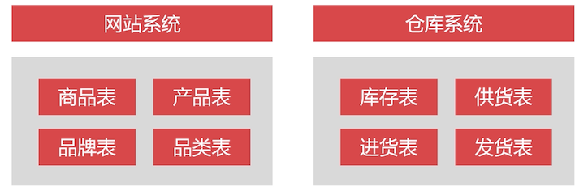
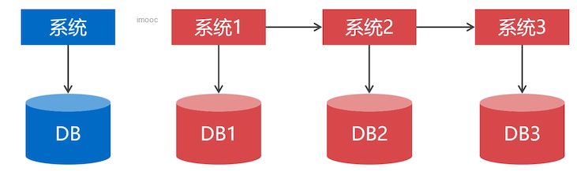
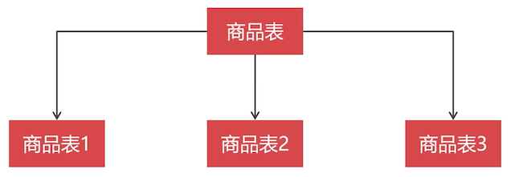
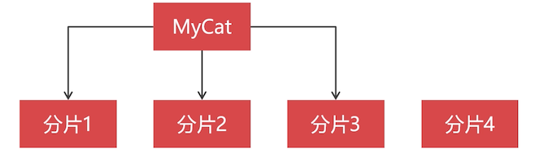
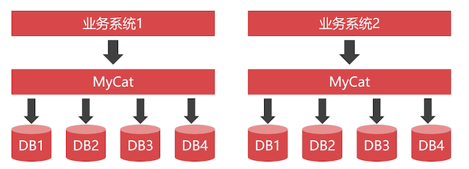

# 垂直切分与水平切分

## 什么是切分？

出于 **降低数据库负载** 和  **缩表** 的目的，通常要对单节点的 MySQL 数据库做切分。

对数据库切分的方案：

- 垂直切分：降低数据库负载
- 水平切分：缩表

## 垂直切分

垂直切分是 **按照业务** 对数据表分类，然后把一个数据库拆分成多个独立的数据库。

从上到下，将一个数据库拆分成多个数据库。也就是拆分成多个小系统。

### 垂直切分的作用

垂直切分可以把数据库的 **并发压力**，**分散** 到不同的数据库节点。

垂直切分并不能减少单表数据量。

### 垂直切分的缺点

- **不能跨 MySQL 节点做表连接查询**，只能通过接口方式解决。

- 跨 MySQL 节点的事务，需要用 **分布式事物机制** 来实现

  

## 水平切分

水平切分是 **按照某个字段的某种规则**，把数据切分到多张数据表

MySQL 有一种自带的分区技术，将一张表进行分区，按照一定的规则切分到 Linux 不同的目录下，我们给主机挂载多块硬盘，利用分区技术，就把一张表的数据存储在多块硬盘上了。

所以：水平切分的表，不一定必须在不同的数据库节点上。

### 水平切分的缺点

- 不同数据表的切分规则并不一致，要根据实际业务来确定

  所以需要选择切分规则丰富的中间件。推荐 MyCat

- 集群扩容麻烦，需要迁移大量的数据

  随着业务的增长，分片可能会有不够用的时候，但是增加一个分片，要迁移部分数据到新的分片，路由规则计算结果就变化了，所以需要把之前存在的数据都重新路由一下到新的分片中去。

  这对在线业务影响是巨大的，所以不到万不得已，不要增加分片

### 冷热数据分离

添加新的分片，**硬件成本和时间成本很大**，所以要慎重。

可以 **对分片数据做冷热数据分离**，把冷数据移除分片来缩表。

 

## 使用垂直还是水平切分？

讨论：修改数据库架构，先做垂直切分还是水平切分

情况不同，答案不同。

从小系统开始，用户越来越多时，先做水平切分，因为这个时候只是将数据库层面做了改动。

笔者大大疑问：水平拆分问题那么多，你确定只是在数据库层面改动了？但是相对来说，这种情况下，成本是最小的。

水平切分 + 冷热数据分离，再多的数据都能存得下。（笔者现在深有感触，存下了，用怎么办？还没有理解到核心思想）

当日活跃用户达到 50  万时，单体架构就支持不下来了。这个时候就需要将单体应用 **拆分为多个独立的子系统**

垂直拆分成多个独立的子系统后，子系统间的交互等方面有很多工作需要做。

所以一定要遵循：从单体项目做起，不断迭代，达到一定日活的时候，再来做垂直切分。

但是从一开始你的目标就很明确，至少要扛起日活几十万用户的需求，那么就可以从一开始就垂直切分设计成多个子系统。