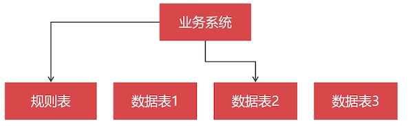

# 安装 MyCat

没有官方的 MyCat 镜像，第三方也没有比较出名的，所以我们自己在  Java 容器里面安装

没有数据库中间件的年代：通常把数据切分规则记录在数据表，然后通过查询数据表得知，查询的数据保存在什么 MySQL 节点。

比如什么类型的商品被切分存储在哪一个节点上。在查询的时候，需要先查询规则表，根据规则再去某一个节点上查找结果。



有了数据库中间件之后：中间件保存了水平切分的规则，直接可以切分和整合数据


当一个查询不带路由规则时，这个查询只能被路由到所有节点查询，然后把结果在中间件中汇聚起来返回，因为中间件不知道去哪台节点上找数据。

## 为什么选 MyCat？

MyCat 是给予 Java 语言的开源数据库中间件产品，相对于其他中间件产品，MyCat 的切分规则最多，功能最全。

数据库中间件产品并不会频繁更新升级，包括数据库的相关的产品也是一样，稳定胜于一切

## 下载 MyCat

[MyCat 官网](http://www.mycat.org.cn/)

1.6.6 已经撤版了，那么我们就选择 [1.6.7](http://dl.mycat.org.cn/1.6.7.1/) 是最接近 1.6.6 的，这里我们下载 [Mycat-server-1.6.7.1-release-20200209222254-linux.tar](http://dl.mycat.org.cn/1.6.7.1/Mycat-server-1.6.7.1-release-20200209222254-linux.tar.gz)

## 安装 OpenJDK 镜像

前面我们学习时下载的是最小的 OpenJDK 14 的，MyCat 是基于 JDK 1.8 ，所以需要安装 OpenJDK 1.8

```bash
docker pull adoptopenjdk/openjdk8
docker tag adoptopenjdk/openjdk8 openjdk8
docker rmi adoptopenjdk/openjdk8
```

该镜像不是官方版的。

## 创建 Java 容器

创建 Java 容器，在数据卷放入 MyCat

```bash
# 这里不加 -it 容器不久就会被退出
docker run -d -it --name mycat1
-v mycat1:/root/server --privileged
--net=host		# 这里使用的网络是宿主机的网络，不要写 swarm 网络，有可能会链接不上 mysql 节点
openjdk8
```

安装该容器

```
[root@study ~]# docker run -d -it --name mycat1 -v mycat1:/root/server --privileged --net=host openjdk8
5e16e59c7b29465eccdd570f92d84f61886bc03b14f1536d838064997715854a
```

MyCat 使用的端口有:

- 8066 ：数据处理，执行的 SQL 等操作
- 9066：获取 MyCat 状态信息

防火墙先放行

```bash
firewall-cmd --zone=public --add-port=8066/tcp --permanent
firewall-cmd --zone=public --add-port=9066/tcp --permanent
firewall-cmd --reload
systemctl restart docker
```

重启之后，需要注意的是，前面讲到过的 PCX 集群的启动，可以去参考前面的笔记，启动后之后再继续

进入数据卷，把 MyCat 放入数据卷中

```bash
[root@study _data]# docker volume inspect mycat1
[
    {
        "Driver": "local",
        "Labels": null,
        "Mountpoint": "/var/lib/docker/volumes/mycat1/_data",
        "Name": "mycat1",
        "Options": {},
        "Scope": "local"
    }
]
[root@study _data]# cd /var/lib/docker/volumes/mycat1/_data
# 这里上传看你用的是什么工具了，笔者这里用 rz 命令上传

[root@study _data]# tar -xvf Mycat.tar.gz
[root@study _data]# ls
mycat  Mycat.tar.gz

# 进入容器，查看是否能看到 mycat 解压目录了
[root@study _data]# docker exec -it mycat1 bash
root@study:/# cd /root/server/
root@study:~/server# ls
mycat  Mycat.tar.gz
```

