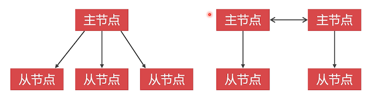

#  配置 MyCat

本章讲解如何在我们搭建好的两个集群分片上，如何配置到 Mycat 中，另外配置两个库用来练习。

## 高可用 MyCat


一个 MyCat 就够用了，另外一个用来做高可用，当一个挂掉之后，另一个可以接上工作。

## MyCat 部署方案

|  虚拟机  |    IP 地址     |   端口    |  容器  | 数据卷 |
| :------: | :------------: | :-------: | :----: | :----: |
| docker-1 | 192.168.56.105 | 8066/9066 | mycat1 | mycat1 |
| docker-2 | 192.168.56.107 | 8066/9066 | mycat2 | mycat2 |

## MyCat 主要配置文件

- server.xml

  配置虚拟账户、虚拟逻辑库、主键生成方式

- schema.xml

  数据库连接、数据表使用什么路由规则

- rule.xml

  可自己定制数据切分规则

## MyCat 到底是什么？

MyCat 是 MySQL 数据库中间件产品，运行的时候会把自己虚拟成 MySQL 数据库，包括虚拟的逻辑库和数据表。

- 虚拟逻辑库
- 虚拟数据表
- 虚拟账户

## 配置虚拟账户

seerver.xml 中配置虚拟账户

```xml
<mycat:server>
  <user name="admin">
  	<property name="password">123456</property>
    <property name="schemas">neti</property>
  </user>
</mycat:server>
```

- schemas：该虚拟账户能访问的虚拟数据库

## 什么是读写分离

数据库中间件把读写任务分别发送给不同节点执行，可以降低单一节点负载；

对于 PXC 集群来说，不需要设置读写分离，值做均衡负载即可。（因为 PXC 集群每一个节点都是相同地位）

对于 Replication 集群主从节点功能明确，需要做读写分离。写发送到 master，读发送到 Slave

## 配置 PXC 负载均衡

修改 seerver.xml 文件，加入 PXC 负载均衡内容

```xml
<dataHost name="pxc1" maxCon="1000" minCon="10" balance="0"
          writeType="0" dbType="mysql" dbDriver="native" switchType="1"  slaveThreshold="100">
  <heartbeat>select user()</heartbeat>
  <writeHost host="p1w1" url="192.168.56.105:9001" user="root"
             password="123456">
  </writeHost>
  <writeHost host="p1w2" url="192.168.56.107:9001" user="root"
             password="123456" />
  <writeHost host="p1w3" url="192.168.56.108:9001" user="root"
             password="123456" />
</dataHost>
```


- balance: 0：不使用读写分离，所有读写请求都放给写节点

- writeType：1：随机发送读写请求给节点；如果已宕机，就不会发该宕机的了

- switchType：1：根据自身心跳结果，判断哪个节点宕机了

- slaveThreshold：Replication 集群有关系

  当从库与主库的时间相差 100 秒，就会把该节点踢掉，不会从该从节点中读取数据

- heartbeat：心跳语句

- writeHost：写节点链接真实数据库配置

  host：给该节点的一个别名

  笔者这里有三个节点，都定义下来

下面是本此 PXC 集群配置的文件内容

```xml

<!-- pxc1 集群--->
<dataHost name="pxc1" maxCon="1000" minCon="10" balance="0"
          writeType="0" dbType="mysql" dbDriver="native" switchType="1"  slaveThreshold="100">
  <heartbeat>select user()</heartbeat>
  <writeHost host="p1w1" url="192.168.56.105:9001" user="root"
             password="123456">
  </writeHost>
  <writeHost host="p1w2" url="192.168.56.107:9001" user="root"
             password="123456" />
  <writeHost host="p1w3" url="192.168.56.108:9001" user="root"
             password="123456" />
</dataHost>
<!-- pxc2 集群--->
<dataHost name="pxc2" maxCon="1000" minCon="10" balance="0"
          writeType="0" dbType="mysql" dbDriver="native" switchType="1"  slaveThreshold="100">
  <heartbeat>select user()</heartbeat>
  <writeHost host="p2w1" url="192.168.56.105:9002" user="root"
             password="123456">
  </writeHost>
  <writeHost host="p2w2" url="192.168.56.107:9002" user="root"
             password="123456" />
  <writeHost host="p2w3" url="192.168.56.108:9002" user="root"
             password="123456" />
</dataHost>
```

## 配置 Replication 集群读写分离

确认我们的 Replication 方案：Replication 镜像不能配置双向主从同步，所以只能使用一写三读



上图是两个方案：

- 一主多从：

  缺点就是，当主节点挂掉之后，就无法写入数据了

- 多主多从：

  让两个主节点互为主从同步，A 主节点，下挂 B 从节点，但是 B 主节点设置为主节点，也就是它们互相作为从。

使用读写分离时，当写节点宕机后，MyCat 就不会使用它对应的读节点了，因为数据不同步了。

对于多住多从的配置，需要我们自己去封装容器，这个也是比较复杂的。所以本节就做一主多从。后续章节再来讲解

```xml
<dataHost name="rep1" maxCon="1000" minCon="10" balance="3"
          writeType="0" dbType="mysql" dbDriver="native" switchType="1"  slaveThreshold="100">
  <heartbeat>select user()</heartbeat>
  <writeHost host="p1w1" url="192.168.56.105:9003" user="root" password="123456">
    <readHost host=”r1r1“ url="192.168.56.107:9003" user="root" password="123456"/>
    ...
  </writeHost>
</dataHost>
```

- balance ：3 ，启用读写分离功能

本次 Replication 集群配置

```xml
<!-- rep1 集群--->
<dataHost name="rep1" maxCon="1000" minCon="10" balance="3"
          writeType="0" dbType="mysql" dbDriver="native" switchType="1"  slaveThreshold="100">
  <heartbeat>select user()</heartbeat>
  <writeHost host="p1w1" url="192.168.56.105:9003" user="root" password="123456">
    <readHost host="r1r1" url="192.168.56.107:9003" user="root" password="123456"/>
    <readHost host="r1r2" url="192.168.56.108:9003" user="root" password="123456"/>
  </writeHost>
</dataHost>
<!-- rep2 集群--->
<dataHost name="rep2" maxCon="1000" minCon="10" balance="3"
          writeType="0" dbType="mysql" dbDriver="native" switchType="1"  slaveThreshold="100">
  <heartbeat>select user()</heartbeat>
  <writeHost host="r2w1" url="192.168.56.105:9004" user="root" password="123456">
    <readHost host="r2r1" url="192.168.56.107:9004" user="root" password="123456"/>
    <readHost host="r2r2" url="192.168.56.108:9004" user="root" password="123456"/>
  </writeHost>
</dataHost>
```

具体的各个配置含义，去查阅 MyCat 的官方手册。

## 逻辑库配置

我们对虚拟表的读写都会路由到真实的物理表上面去。所以配置 dataHost 使用真实数据库上的哪些库

`<dataNode>` 标签可以设置使用的真实逻辑库

```xml
<dataNode name="dn1" dataHost="pxc1" database="neti"></dataNode>
```

- name：dataNode 的名称
- dataHost：指向的是我们刚刚配置的集群名称
- database：使用哪一个逻辑库，这个是对应真实数据库中的库名

本次配置内容

```xml
<!-- 新零售数据库的集群与逻辑库映射 -->
<dataNode name="dn1" dataHost="pxc1" database="neti"></dataNode>
<dataNode name="dn2" dataHost="pxc2" database="neti"></dataNode>
<dataNode name="dn3" dataHost="rep1" database="neti"></dataNode>
<dataNode name="dn4" dataHost="rep2" database="neti"></dataNode>

<!-- 集群与练习库的映射；先拿练习库来练手 -->
<dataNode name="tdn1" dataHost="pxc1" database="t1"></dataNode>
<dataNode name="tdn2" dataHost="pxc2" database="t1"></dataNode>
<dataNode name="tdn3" dataHost="rep1" database="t2"></dataNode>
<dataNode name="tdn4" dataHost="rep2" database="t2"></dataNode>
```

练习库使用了两个不同的逻辑库，这个叫做库的垂直切分；

需要在我们集群数据库上创建上面对应的  neti 和 t1 、t2 数据库

## 配置虚拟库和虚拟表

因为 MyCat 并不存储数据，所以必须要配置可以使用的虚拟逻辑库和关系表。


`<schema>` 标签可以设置虚拟逻辑库

`<table>` 标签可以设置虚拟关系表

```xml
<schema name="t2" checkSQLschema="false" sqlMaxLimit="100">
  <table name="teacher" type="global" dataNode="tdn3,tdn4"></table>
  <table name="student" rule="mod-long" dataNode="tdn3,tdn4"></table>
</schema>
```

schema 属性：

- checkSQLschema：是否去掉逻辑库名

  如 `select t2.student` ，如果为 true，则会去掉 t2 变成 `select student` 去真实数据库上执行

- sqlMaxLimit：每条查询语句最多返回多少条数据

table 属性：

- name：虚拟表名字，这个表对应真实库中的表名

- type:

  - global：不做水平切分的表；所有节点上都有全部的表数据

    这里老师的数据比较少，就不用切分了

- dataNode：对应的真实逻辑库

- rule: 分配规则

  - `mod-long` ：按照主键值求模切分

    这里用了两个 Replication 集群，如果有 1000 个学生，那么每个集群上会保存 500 条数据

本次配置的内容

```xml
<!-- t2 库配置 -->
<schema name="t2" checkSQLschema="false" sqlMaxLimit="100">
  <table name="teacher" type="global" dataNode="tdn3,tdn4"></table>
  <table name="student" rule="mod-long" dataNode="tdn3,tdn4"></table>
</schema>
<!-- t1 库配置，表也暂时不配置 -->
<schema name="t1" checkSQLschema="false" sqlMaxLimit="100">
</schema>
<!-- 新零售库配置，表暂时不配置 -->
<schema name="neti" checkSQLschema="false" sqlMaxLimit="100">
</schema>
```

对于 schema.xml 中的虚拟账户可使用的逻辑库就需要加上 t1 和 t2 了

```xml
<user name="admin">
  <property name="password">123456</property>
  <property name="schemas">neti,t1,t2</property>
</user>
```

##  修改 mod-long 算法

MyCat 默认的 mod-long 是按照三个分配切分数据，我们这里需要修改下这个默认值；

我们这里 t2 库对应的只有两个节点，所以需要修改为 2

在 rule.xml 中修改

```xml
<function name="mod-long" class="io.mycat.route.function.PartitionByMod">
  <!-- how many data nodes -->
  <property name="count">2</property>
</function>
```

## 本章最终配置一览

###  server.xml

其他的配置是很多默认的配置，没有动他们；改动的就是删除了其他的 user 标签，只留下了一个 user 配置

```xml
<user name="admin">
  <property name="password">123456</property>
  <property name="schemas">neti,t1,t2</property>
</user>
```

### schema.xml

配置文件中标签的顺序也需要注意下，否则会在启动的时候报错

```xml
<?xml version="1.0"?>
<!DOCTYPE mycat:schema SYSTEM "schema.dtd">
<mycat:schema xmlns:mycat="http://io.mycat/">
  <!-- t2 库配置 -->
  <schema name="t2" checkSQLschema="false" sqlMaxLimit="100">
    <table name="teacher" type="global" dataNode="tdn3,tdn4"></table>
    <table name="student" rule="mod-long" dataNode="tdn3,tdn4"></table>
  </schema>
  <!-- t1 库配置，表也暂时不配置 -->
  <schema name="t1" checkSQLschema="false" sqlMaxLimit="100">
  </schema>
  <!-- 新零售库配置，表暂时不配置 -->
  <schema name="neti" checkSQLschema="false" sqlMaxLimit="100">
  </schema>
  
  <!-- 新零售数据库的集群与逻辑库映射 -->
  <dataNode name="dn1" dataHost="pxc1" database="neti"></dataNode>
  <dataNode name="dn2" dataHost="pxc2" database="neti"></dataNode>
  <dataNode name="dn3" dataHost="rep1" database="neti"></dataNode>
  <dataNode name="dn4" dataHost="rep2" database="neti"></dataNode>

  <!-- 集群与练习库的映射；先拿练习库来练手 -->
  <dataNode name="tdn1" dataHost="pxc1" database="t1"></dataNode>
  <dataNode name="tdn2" dataHost="pxc2" database="t1"></dataNode>
  <dataNode name="tdn3" dataHost="rep1" database="t2"></dataNode>
  <dataNode name="tdn4" dataHost="rep2" database="t2"></dataNode>
  
  <!-- pxc1 集群-->
  <dataHost name="pxc1" maxCon="1000" minCon="10" balance="0"
            writeType="0" dbType="mysql" dbDriver="native" switchType="1"  slaveThreshold="100">
    <heartbeat>select user()</heartbeat>
    <writeHost host="p1w1" url="192.168.56.105:9001" user="root" password="123456" />
    <writeHost host="p1w2" url="192.168.56.107:9001" user="root" password="123456" />
    <writeHost host="p1w3" url="192.168.56.108:9001" user="root" password="123456" />
  </dataHost>
  <!-- pxc2 集群-->
  <dataHost name="pxc2" maxCon="1000" minCon="10" balance="0"
            writeType="0" dbType="mysql" dbDriver="native" switchType="1"  slaveThreshold="100">
    <heartbeat>select user()</heartbeat>
    <writeHost host="p2w1" url="192.168.56.105:9002" user="root" password="123456" />
    <writeHost host="p2w2" url="192.168.56.107:9002" user="root" password="123456" />
    <writeHost host="p2w3" url="192.168.56.108:9002" user="root" password="123456" />
  </dataHost>
  
	<!-- rep1 集群-->
  <dataHost name="rep1" maxCon="1000" minCon="10" balance="3"
            writeType="0" dbType="mysql" dbDriver="native" switchType="1"  slaveThreshold="100">
    <heartbeat>select user()</heartbeat>
    <writeHost host="p1w1" url="192.168.56.105:9003" user="root" password="123456">
      <readHost host="r1r1" url="192.168.56.107:9003" user="root" password="123456"/>
      <readHost host="r1r2" url="192.168.56.108:9003" user="root" password="123456"/>
    </writeHost>
  </dataHost>
  <!-- rep2 集群-->
  <dataHost name="rep2" maxCon="1000" minCon="10" balance="3"
            writeType="0" dbType="mysql" dbDriver="native" switchType="1"  slaveThreshold="100">
    <heartbeat>select user()</heartbeat>
    <writeHost host="r2w1" url="192.168.56.105:9004" user="root" password="123456">
      <readHost host="r2r1" url="192.168.56.107:9004" user="root" password="123456"/>
      <readHost host="r2r2" url="192.168.56.108:9004" user="root" password="123456"/>
    </writeHost>
  </dataHost>
</mycat:schema>
```

这里总结下里面的配置关系：

- dataHost：配置一个物理集群信息；包括该物理集群中哪些节点是写、哪些节点是读节点

- dataNode：配置的是 **物理集群中** 对应的 **物理库**；

  由于一个物理库中的名称是唯一的，但是可以有多张表，后面再映射该库中有哪些表的时候，就会多次用到，该标签抽象出来，被重复使用。

- schema：配置虚拟逻辑库信息

  - table：配置是物理库中的表

    包括表中的数据要以什么规则切分？这些表存储在哪个物理库上中？

###rule.xml

该表中默认配置了很多规则，由于我们目前只用到了一个，其他的都可以删除掉 

```xml
<?xml version="1.0" encoding="UTF-8"?>
<!DOCTYPE mycat:rule SYSTEM "rule.dtd">
<mycat:rule xmlns:mycat="http://io.mycat/">
  <tableRule name="mod-long">
    <rule>
      <columns>id</columns>
      <algorithm>mod-long</algorithm>
    </rule>
  </tableRule>
  <function name="mod-long" class="io.mycat.route.function.PartitionByMod">
    <!-- how many data nodes -->
    <property name="count">2</property>
  </function>
</mycat:rule>
```

