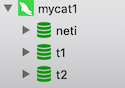

# 启动 MyCat

启动时，是否成功启动，可以查看 MyCat 日志文件。

## Mycat 日志文件

主要有:

- console.log
- mycat.log

存放路径在：`logs` 目录，该目录默认不存在，需要先创建。

```bash
# 进入 mycat 容器
[root@study conf]# docker exec -it mycat1 bash
# 在新版本的 mycat 中，已经默认存在了 logs 目录了
root@study:~# cd /root/server/mycat

# 为 mycat/bin 目录中所有 sh 命令设置最高权限
root@study:~/server/mycat# chmod -R 777 ./bin/*.sh

# 如果报如下错误，应该是发行包有问题，使用命令转下换行符就可以了
root@study:~/server/mycat/bin# ./startup_nowrap.sh
bash: ./startup_nowrap.sh: /bin/sh^M: bad interpreter: No such file or directory
# 在宿主机上使用 dos2unix 命令转换
[root@study bin]# dos2unix ./startup_nowrap.sh

# 启动 mycat
root@study:~/server/mycat/bin# ./startup_nowrap.sh
...
>> "/root/server/mycat/logs/console.log" 2>&1 &
# 也可以看到日志文件的路径的确是 logs 目录

# 查看是否有 mycat 的进程，这里发现没有
root@study:~/server/mycat/bin# ps -a
  PID TTY          TIME CMD
  138 ?        00:00:00 ps
  
## 在 console.log 中发现如下的日志
Exception in thread "main" java.lang.ExceptionInInitializerError
	at io.mycat.MycatStartup.main(MycatStartup.java:53)
Caused by: io.mycat.config.util.ConfigException: schema t1 didn't config tables,so you must set dataNode property!
```

在 schema 中，至少要配置一张表才行。这里我们补全前面的，配置来满足这个要求，修改 schema.xml

```xml
<!-- t2 库配置 -->
<schema name="t2" checkSQLschema="false" sqlMaxLimit="100">
  <table name="teacher" type="global" dataNode="tdn3,tdn4"></table>
  <table name="student" rule="mod-long" dataNode="tdn3,tdn4"></table>
</schema>
<!-- t1 库配置，表也暂时不配置 -->
<schema name="t1" checkSQLschema="false" sqlMaxLimit="100">
   <table name="teacher" type="global" dataNode="tdn1,tdn2"></table>
</schema>
<!-- 新零售库配置，表暂时不配置 -->
<schema name="neti" checkSQLschema="false" sqlMaxLimit="100">
   <table name="teacher" type="global" dataNode="dn1,dn2"></table>
</schema>
```

需要注意的是：dataNode 中配置的 database 库也需要在对应的物理集群上存在，不然也不会启动成功。

再次启动后，还是一样的需要确认：

1. mycat 进程运行一分钟后，不消失

2. console.log 日志没有报错

   并出现该日志信息：`MyCAT Server startup successfully. see logs in logs/mycat.log`

3. mycat.log 日志中也没有 error 相关的错误信息

   如果 dataNode 中的 database 不在物理集群中存在，在在 console.log 中不会出现 successfully 启动成功的信息。

   而是会在 mycat.log 日志中出现以下的错误信息

   ```
   2020-06-16 04:54:35.108  WARN [$_NIOREACTOR-0-RW] (io.mycat.backend.mysql.nio.handler.GetConnectionHandler.connectionError(GetConnectionHandler.java:74)) - connect error MySQLConnection [id=59, lastTime=1592283208708, user=root, schema=t1, old shema=t1, borrowed=false, fromSlaveDB=false, threadId=26, charset=latin1, txIsolation=3, autocommit=true, attachment=null, respHandler=null, host=192.168.56.107, port=9002, statusSync=null, writeQueue=0, modifiedSQLExecuted=false]ConnectionException [code=1049, msg=Unknown database 't1']
   ```

   告知说，在对应的 mysql 节点上，找不到 t1 这个库。

   那么需要将他们创建出来，就可以了

## 使用 navicat 连接 Mycat

启动成功之后，使用 Navicat 链接 MyCat

```
ip：192.168.56.105
端口：8066
用户：admin
密码：123456
```

用户名和密码是我们在 server.xml 中配置的



可以看到出现了 3 个库了。 但是里面还没有数据表，我们通过 SQL 语句来创建，记住，只能通过 SQL 语句

```sql
-- 在 t2 库中创建以下两张表
create table teacher(
	id int unsigned primary key,
  name varchar(200) not null
);

create table student(
	id int unsigned primary key,
  name varchar(200) not null
);
```

根据我们的配置，这两张表会在 Replication 两个集群中的  t2 库中存在，可以去检查下是否真的存在；

Mycat 会把以上两个 SQL 语句，路由到两个分片节点上去执行，于是就出现在了两个集群中

## 测试表分片

t2 库中的两个表

```xml
<schema name="t2" checkSQLschema="false" sqlMaxLimit="100">
  <table name="teacher" type="global" dataNode="tdn3,tdn4"></table>
  <table name="student" rule="mod-long" dataNode="tdn3,tdn4"></table>
</schema>
```

- teacher：是 global 类型，在 两个分片中的数据是一样的

  测试方式：在 mycat 中往这张表中添加数据，然后去原来的节点上查看 **是否有一样的数据**

  ```sql
  INSERT INTO `t2`.`teacher`(`id`, `name`) VALUES (1, '小强老师');
  INSERT INTO `t2`.`teacher`(`id`, `name`) VALUES (2, '张老师');
  ```
	
	在 tdn3、tdn3 上两条数据都存在；
	
	对于路由到哪些分片上了，还可以通过执行计划来查看
	
	```sql
	EXPLAIN INSERT INTO `t2`.`teacher`(`id`, `name`) VALUES (1, '小强老师');
	```
	
	| DATA_NODE | SQL                                                          |
	| --------- | ------------------------------------------------------------ |
	| tdn3      | INSERT INTO `t2`.`teacher`(`id`, `name`) VALUES (1, '小强老师') |
	| tdn4      | INSERT INTO `t2`.`teacher`(`id`, `name`) VALUES (1, '小强老师') |
	
	可以看到，的确是被路由到两个分片中去了
	
- student：按主键 ID 取模，路由到两个分片中

  测试方式：在 mycat 中往这张表中插入数据，然后去原来的节点上查看数据 **是否被分片存储了**

  ```sql
  INSERT INTO `t2`.`student`(`id`, `name`) VALUES (1, '张三');
  INSERT INTO `t2`.`student`(`id`, `name`) VALUES (2, '王五');
  INSERT INTO `t2`.`student`(`id`, `name`) VALUES (3, '李四');
  ```

  这里插入的数据，id 为 2 的数据被路由到了 tdn4 分片中，其他两条被路由到了 tdn3 分片中
  
  ```sql
  EXPLAIN INSERT INTO `t2`.`student`(`id`, `name`) VALUES (1, '张三');
  -- tdn3 tdn3	INSERT INTO `t2`.`student` (`id`, `name`) VALUES ('2', '王五')
  ```
  
  同样的也能看到，的确如我们说的那样。