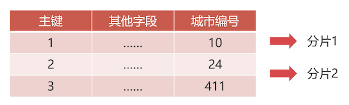

# MyCat 路由规则

## 水平切分规则：主键求模

功能：可以把数据均匀的切分到分片中。

适合场景：适合初始数据量很大，但是数据增幅不大的场合；

比如百度地图数据。

### 主键求模切分的缺点

数据不分类直接存储，以后维护的成本比较高，例如增加新分片。

就算使用数据归档功能，新增数据大于归档速度的时候，就必须添加新分片了。新增分片主要的工作是：数据迁移，之前我们修改过该分片算法的节点数量。新增分片就相当于需要这个数量，该数量改变之后，所有的数据都必须重新路由，否则之前的数据就可能查询不到。因为新路由不一定还会路由到之前的节点上去。

### 底层实现

规则的配置在 rule.xml 中

```xml
  <tableRule name="mod-long">
    <rule>
      <columns>id</columns>
      <algorithm>mod-long</algorithm>
    </rule>
  </tableRule>
  <function name="mod-long" class="io.mycat.route.function.PartitionByMod">
    <!-- how many data nodes -->
    <property name="count">2</property>
  </function>
```

function 中的 class 指向了该分片算法的实现类。在 tableRule 中定义是使用表中的哪一列、用什么分片算法，作为分片。

那么对数据的查询，想要精准的在对应的路由节点上查询数据，就需要出现这个主键 id 的值，比如如下的语句：

```sql
-- 出现了主键 id 的值，就可以通过分片算法算出来路由到哪一个分片上执行
INSERT INTO `t2`.`student`(`id`, `name`) VALUES (1, '张三');
-- 这里没有，你通过 explain 查看的话，就会发现，会路由到所有分配上
select id,name from studentl
-- 出现了主键 id，会被精准路由到分片上
select id,name from studentl where id = 1
-- 这也没有，也会路由到所有分片上执行
delete from student where name='A'
```

## 水平切分规则：枚举值

枚举值切分是根据固定字段的枚举值来切分数据。枚举值要提前规定好，而且必须是整数类型。

适合场景：比如 58 同城的业务，基于城市提供的服务，将不同城市的数据分到一个分片上，也不用跨分片查询数据



比如按城市编号，这里可以设置电话号码的区号，也正好是数值类型的。

### 枚举值文件

枚举值文件的需要从 0 开始，0 代表第一个分片，然后依次类推；

创建一个 `mycat/conf/city.txt` 文件，内容为

```
10=0
22=0
24=1
411=1
```

那么就表示，当城市编号为 10 的时候切分到第一个分片。

### 定义算法 function

使用枚举值文件，需要我们自己创建函数来声明使用我们自己的枚举值文件。

在 rule.xml 文件中来声明

```xml
<function name="partition-by-city" class="io.mycat.route.function.PartitionByFileMap">
  <property name="mapFile">city.txt</property>
</function>
```

### 定义数据表规则 tableRule

```xml
<tableRule name="partition-by-city">
  <rule>
    <columns>city_id</columns>
    <algorithm>partition-by-city</algorithm>
  </rule>
</tableRule>
```

- tableRule.name：该 name 可以用在虚拟表上的 rule 属性中
- rule.columns：定义表中的哪一个字段，使用下面的算法
- rule.algorithm：定义使用哪一个 function，这里是用 function 名称关联的

### 引用切分规则

需要声明哪一张表需要使用这个切分规则。

在 schema.xml 中的 t2 这个 schema 中增加如下配置

```xml
<table name="company" dataNode="tdn3,tdn4" rule="partition-by-city" />
```

### 使配置生效：热加载

要让刚才的配置生效，除了重启 Mycat 之外，还可以使用它的配置文件热加载功能。

需要连接上：9066 这个管理端口，就像之前使用 Navicat 连接 mycat 那样连接，只是端口不一样。

执行以下语句，重新加载配置文件

```sql
reload @@config_all;
-- 执行之后，一定要看返回结果；如果失败，那么就是配置可能写错了，需要去查询问题
-- 但是通过这种方式加载配置文件，貌似看不到错误信息。只能重启，在日志中查看了
```

::: tip

一定要注意的是，Mycat 中的配置文件，里面标签的顺序，他不能乱，

rule.xml 中的 tableRule 标签一定要在最前面，左右的 function 标签在最后面，否则就会解析出错

:::

### 规则测试

先创建表

```sql
create table company(
	id int unsigned primary key,
  name varchar(200) not null,
  city_id smallint not null
)
```

插入数据

```sql
INSERT INTO `t2`.`company`(`id`, `name`, `city_id`) VALUES (1, 'IBM', 10);
INSERT INTO `t2`.`company`(`id`, `name`, `city_id`) VALUES (2, 'DELL', 22);
INSERT INTO `t2`.`company`(`id`, `name`, `city_id`) VALUES (3, 'HP', 24);
INSERT INTO `t2`.`company`(`id`, `name`, `city_id`) VALUES (4, 'Oracle', 24);
```

然后去具体的数据节点查看这里是否有按照我们规则文件里面配置的进行切分。

验证之后，还可以使用 explain 去验证增删改查是否路由正确。

