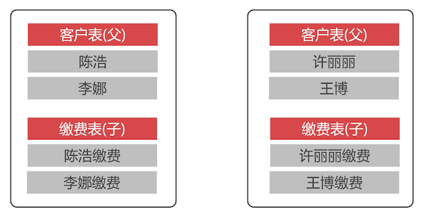

# 避免跨分配表连接：父子表

全局表可以与任何分片表做连接。

##  跨分片的表连接

跨分片的表连接需要在网络中传输大量的数据，所以 **MyCat 不支持跨分片表连接**。

要实现跨分片表，需要把分片的数据收集到一个分片中执行，传输数据大，也不好实现。

mycat 通过父子表解决一定场景下的分片表查询

## 父子表机制

两张都是用了水平气氛的数据表，要实现表连接查询，需要定义负责表关系。**父表数据切分到什么分片，子表的数据会切分到同样的分片。**



比如：客户表和缴费表，在业务上是先有客户，再有缴费。所以需要把客户和缴费，同一个人的路由到相同的分片中，就可以做表连接查询了。

##  配置父子表

父表可以有切分规则，但是子表不能配置切分规则。

```xml
<table name="customer" primaryKey="ID" dataNode="tdn1,tdn2" rule="sharding-by-city">
  	<childTable name="payment" primaryKey="ID" joinKey="customer_id" parentKey="id"/>
  ...
</table>
```

table 属性

- primaryKey：表主键列名称；是否被缓存的标志

  使用了 primaryKey，会被 mycat 缓存数据，缓存值就是这个 key
  
- rule：使用的数据切分规则

childTable 属性：

- primaryKey：和上面的是一样的

- joinKey：规定的是子表中的字段
- parentKey：规定的是父表中的字段

joinKey 和 parentKey 定义了父子表用什么字段进行连接查询；类似于外键约束。在数据插入的时候，插入子表数据时，mycat 会去检查父表中是否有对应的 customer_id ，如果没有则会插入出错

这里在 t1 中增加这个父子表的定义

```xml
 <schema name="t1" checkSQLschema="false" sqlMaxLimit="100">
    <table name="teacher" type="global" dataNode="tdn1,tdn2"></table>
    <table name="customer" dataNode="tdn1,tdn2" rule="partition-by-city">
  		<childTable name="payment" joinKey="customer_id" parentKey="id"/>
    </table>
 </schema>
```

## 父子表测试

配置文件完成之后，通过 9066 管理端口热加载配置文件

```sql
reload @@config_all;
```

在 t1 中创建数据表

```sql
-- 客户表
create table customer(
	id int unsigned primary key,
  name varchar(200) not null,
  city_id int unsigned not null
)default charset=utf8;

-- 缴费表
create table payment(
	id int unsigned primary key,
 	customer_id int unsigned not null,
  pay decimal(10,2) unsigned not null,
  create_time timestamp not null
)default charset=utf8;
```

插入测试数据

```sql
-- 往两个分片中各插入了一条客户数据
INSERT INTO `t1`.`customer`(`id`, `name`, `city_id`) VALUES (1, 'Scott', 10);
INSERT INTO `t1`.`customer`(`id`, `name`, `city_id`) VALUES (2, 'Jack', 24);

-- 往 payment 中插入了 3 条数据
-- 客户 1 有两条缴费记录
-- 客户 2 有一条缴费记录
INSERT INTO `t1`.`payment`(`id`, `customer_id`, `pay`, `create_time`) VALUES (1, 1, 50.00, '2020-06-21 07:59:55');
INSERT INTO `t1`.`payment`(`id`, `customer_id`, `pay`, `create_time`) VALUES (2, 1, 99.00, '2020-06-21 07:59:39');
INSERT INTO `t1`.`payment`(`id`, `customer_id`, `pay`, `create_time`) VALUES (3, 2, 100.00, '2020-06-21 08:00:06');
```

那么现在去验证下，在第一个分片中是否存在一条客户为 Scott 的数据，和两条缴费数据。