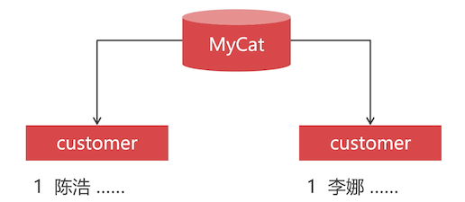
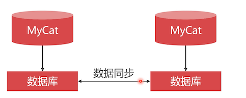

# 全局主键

在数据库集群的场景下，使用数据库主键自增长，会产生重复主键记录。



在数据库集群环境中，应该使用中间件来生成主键值。

Mycat 支持多种 **全局主键** 生成方式，其中最好的是 Zookeeper 方式。

## 本地文件方式

Mycat 按照计数器的放生成自增长的主键值，计数器的参数被保存在文本文件中。

最大的缺点就是：无法与其他 Mycat 通信。比如你部署了主备，其中一个挂掉的时候，另外一个启动起来，无法获取到之前的主键参数。


这种方式只适合测试中使用；

## 数据库方式

和文件方式类似，只是把计数器的参数保存到数据库中。



缺点：

- 如果是 pxc 集群：可能会产生一定的性能影响，因为是同步复制
- 如果是 Replication 集群：如果没有同步成功，第一个 mycat 挂掉了，第二个立即启用，会造成主键重复。

## 本地时间戳方式

MyCat 根据本地时间戳和机器 ID ，生成一个 18 位的主键值。

缺点：因为生成的主键值都是偶数，所以无法用在主键求模切分规则上

## Zookeeper 时间戳方式

利用 Zookeeper 生成时间戳主键值（64 位整数），主键字段必须使用 bigint 类型。

可以使用 Zookeeper 集群来保证高可用性。

但是如果使用时间戳，本地为什么做不到有奇数和偶数？

## 安装 Zookeeper

下载安装 Zookeeper 官方镜像

```bash
docker pull zookeeper
```

启动 Zookeeper

```bash
docker run -d --name z1 
-p 2181:2181
-p 3888:3888
-p 2888:2888 
--net=swarm_mysql
zookeeper
```

实践练习

```bash
[root@study ~]# docker run -d --name z1 -p 2181:2181 -p 3888:3888 -p 2888:2888 --net=swarm_mysql zookeeper
bab947328f72d32f95728bf99ab02e2f47dd91f93360512316901283df52676a
```

### 配置 Zookeeper 时间戳主键

编辑 `server.xml` 文件

```xml
<property name="sequnceHandlerType">3</property>
```

修改 `myid.properties` 文件

```bash
loadZk=true
zkURL=192.168.56.105:2181
clusterId=mycat-cluster-1
myid=mycat_fz_01
clusterSize=1
clusterNodes=mycat_fz_01
#server  booster  ;   booster install on db same server,will reset all minCon to 2
type=server
# boosterDataHosts=dataHost1
```

- clusterId：集群名称，可以自己规定
- myid：mycat 主机名，也可以自己定义
- clusterNodes：mycat 集群有几个节点组成，这里对应的是 myid 的值，多个用逗号分隔

这里配置 mycat 集群信息。我们这里只有一个 mycat，设置为一个。

### 测试全局主键

可以通过管理端口，热加载配置文件

```bash
reload @@config_all;
```

由于访问的是本机的 zk，所以不需要放开防火墙。

获取全局主键的 sql 语句为

```sql
SELECT next value for MYCATSEQ_GLOBAL;
-- 比如返回的主键 ID 是 7326346979595812993
```

## 把全局主键应用到插入语句中

由于主键要求类型为 bigint，这里把  t2 中的 company 表的主键 ID 修改为 bigint 类型；

使用主键的插入语句如下

```sql
INSERT INTO company ( id, name, city_id )
VALUES
	(next VALUE FOR MYCATSEQ_GLOBAL, "test", 411 );
```


