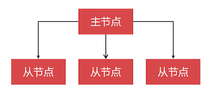
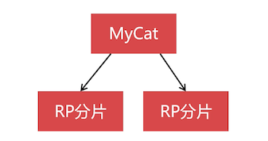

# 集群环境下的新零售数据库与总结

本章也探讨下如何将新零售数据库迁移到集群环境中。

## 迁移新零售数据库到集群环境

如果是 **小型的新零售业务**，可以只 **选择水平切分**。如果是 **大中型的新零售业务**，可以兼顾 **垂直切分和水平切分**

本课是按照大型系统进行数据库设计的方案，**先按照业务划分出若干的子系统**，再去设计这些 **子系统应该使用什么样的数据库集群**

### 垂直切分方案


拆分成 5 个子系统：

- 企业系统：企业管理系统，

  管理员工、部门、角色、权限、财务等

- 销售系统：线上线下的销售

  商品表、订单表等

- 售后系统：

  购物评价、退换货等

- 仓库系统：管理进销存的信息

- 物流系统：快递信息跟踪由该系统支持

对于垂直切分，没有固定的答案，和业务规模、团队技术等相关，每个人的理解都不太一样。

### 创建逻辑库

以售后系统举例：由于售后系统的数据价值不是很高，使用 Replication 集群来保存数据。


### 映射逻辑库分片关系

```xml
 <dataNode name="iass1" dataHost="rep1" database="iass"></dataNode>
 <dataNode name="iass2" dataHost="rep2" database="iass"></dataNode>
```

使用两个集群分片来存储。

### 数据库集群方案

什么样的子系统适合用什么样的方案，可以参考下下面的表格

| 序号 | 系统名称 | 集群方案         |
| :--: | :------: | ---------------- |
|  1   | 企业系统 | Replication      |
|  2   | 销售系统 | PXC、Replication |
|  3   | 售后系统 | Replication      |
|  4   | 仓库系统 | Replication      |
|  5   | 物流系统 | Replication      |

- 企业系统的数据库集群配置

  企业系统的 **数据量和访问量并不是很大**，用一个 Replication 分片，然后 **都设置成全局表** 即可

  

  最好配置两个主节点，这个知识点在后续的升级中讲解
  
- 销售系统的数据库集群配置

  销售系统中 **重要的数据 **需要切分存 **储到 PXC 分片**，非重要的切分存储在 Replication 分片。

  

  对于分片的规模，需要看具体的数据规模、还需要做好冷热数据的归档，冷数据抽到 TokuDB 或 MongoDB 中

- 售后系统的数据库集群配置

  大多数的数据是 **数据量大的低价值的** 数据，所以可以采用 Replication 切分存储；

  

- 仓库系统的数据库集群配置

  仓库系统 **数据相对较少**，所以 **可以不使用水平切分**，仅 **使用一个 Replication 分片**，数据表都 **设计成全局表**

  

- 物流系统的数据库集群配置

  数据相对较多，可以采用 Replication 切分存储。

  如快递已发出、到了转运地区，等一个包裹的物流数据就好多条；

  

## 课程总结

拓宽了数据库的技术视野


这里笔者就不记录回顾讲解了哪些细致的知识点了。

对于数据库集群底层的原理，这里没有讲解。可以去搜该老师的 PXC 集群课程观看。这里我们使用了别人/官方封装好的 Docker 镜像快速搭建起数据库集群，对于里面需要修改哪些配置文件之类的，镜像封装了细节。

## 后续课程升级内容

- Docker 图形化界面

- 封装 Replication 镜像

- 分布式事务

- ETL 中间件

  经过垂直切分之后，无法做表连接查询，但是可以通过 ETL 中间件从多个数据源抽取相关数据

  

  写程序时，面对这个结果集查询。

