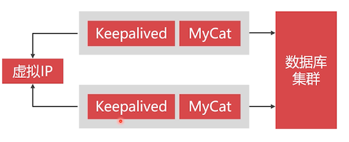
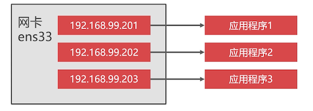

# MyCat 双机热备方案

只有双机热备的 MyCat 方案才具备高可用性。



Keepalived 会去抢占虚拟 IP：

- 抢占到的成为 Master 节点，同时还会发出广播
- Backup 节点接收到广播，表示 Master 还活着
- 当 Backup 节点接收不到广播的时候，表示 Master 宕机了，开始抢占节点

## 配置虚拟 IP 的前提条件

- 虚拟 IP 只支持局域网，不可以在公网设置虚拟 IP

- 云主机无法设置虚拟 IP

- **只有 Linux 才可以设置虚拟 IP**

  windows 和 MacOS 系统无法设置

- 公司网络与移动热点网络环境下，不能设置虚拟 IP

## 正确设置虚拟 IP 的环境

- 在 VM 虚拟机上面设置桥接网络（必须）
- 使用家用路由器的网络环境（链接网线最好，WIFI 其次）

## Keepalived 工作原理

Keepalived 基于 VRRP 协议，可以预防单点故障。

VRRP 协议将多个服务节点组成一个网络，里面有一个 Master 和 若干 Backup 节点。

Master 会发送 VRRP 广播，如果 Backup 节点收不到广播，就认为 Master 节点宕机了。Backup 节点会选举出一个新的 Master 节点，这个选举过程，我们可以进行一定的干预，比如哪些节点优先级高一点，成为 master 的可能性就大一点。

## 让防火墙支持 VRRP 协议

开放防火墙，让 CentOS 支持 VRRP 协议

```bash
firewall-cmd --direct --permanent --add-rule ipv4 filter INPUT 0 
--in-interface ens33				# 网卡名称
--destination 224.0.0.18		# 广播地址，VRRP 协议固定的，不用修改
--protocol vrrp -j ACCEPT
```

实际操作练习：

```bash
[root@study volumes]# firewall-cmd --direct --permanent --add-rule ipv4 filter INPUT 0 --in-interface enp0s8 --destination 224.0.0.18 --protocol vrrp -j ACCEPT
[root@study volumes]# firewall-cmd --reload

# 记得还是需要重启 docker 服务
```

## 虚拟 IP 地址

在 Linux 系统中可以在网卡设备中设置多个 IP 地址，已达到为不同程序分配一个独立的 IP 地址，这种 IP 地址被称作虚拟 IP



## 安装 Keepalived

进入到 MyCat 容器

```bash
# 该容器是基于 乌班图 的，软件管理就是用的 apt-get
# 先更新下
[root@study volumes]# docker exec -it mycat1 bash
root@study:/# apt-get update
root@study:/# apt-get install keepalived
```

##  keepalived 配置文件

keepalived 的配置文件路径是 `/etc/keepalived/keepalived.conf`，配置文件内容为

```bash
vrrp_instance VI_1 {
	state MASTER
	interface docker_gwbridge
	virtual_router_id 51
	priority 100
	advert_int 1
	authentication {
		auth_type PASS
		auth_pass 123456
	}
	virtual_ipaddress {
		172.18.0.201
	}
}
```

- state：Keepalived 的身份

  MASTER 主服务，BACKUP 备服务。主服务要抢占虚拟 IP，备用服务不会抢占 IP。

  所以要在诶个 Keepalived 中设置为 MASTER 他们才会抢占 IP

- interface：网卡设备

  这里绑定的是 **docker 容器里的网卡设备**

- virtual_router_id：虚拟路由 ID 名字

  相同的虚拟路由 ID 才能被编入一组 vrrp 网络中。也就是说类似分组组网的功能。

- priority：权重

  数值越大，越可能被选举为 Master 节点；

  你可以把硬件配置比较好的节点权重设置高一点

- advert_int：心跳时间

  MASTER 与 BACKUP 节点之间同步检查的时间间隔，单位为秒。**主备之间必须一致**

  超过该值，MASTER 还没有发送广播，那么 BACKUP 节点就会重新选举 MASTER 了

- authentication：主从服务器验证方式

  **主备必须使用相同** 的密码才能正常通信

- virtual_ipaddress：虚拟 IP 地址

  容器是运行在 swarm 网络里面的，所以该地址要设置为 swarm 里面的 IP 地址；

  swarm 网段为 172.18.0.x

由于我们直接安装的，该程序并没有安装到我们的数据卷中，所以要先给 docker 容器安装 vim 程序，然后使用 vim 程序来编写配置文件

```bash
root@study:/# apt-get install vim -y
root@study:/# vim /etc/keepalived/keepalived.conf
# 配置内容如下
vrrp_instance VI_1 {
	state MASTER
	interface docker_gwbridge
	virtual_router_id 51
	priority 100
	advert_int 1
	authentication {
		auth_type PASS
		auth_pass 123456
	}
	virtual_ipaddress {
		172.18.0.201
	}
}
```

启动 keepalived

```bash
root@study:/# service keepalived start
 * Starting keepalived keepalived                 [ OK ]
```

检查是否配置成功

```bash
# 回到宿主机中，pin 虚拟 IP
[root@study volumes]# ping 172.18.0.201
PING 172.18.0.201 (172.18.0.201) 56(84) bytes of data.
64 bytes from 172.18.0.201: icmp_seq=1 ttl=64 time=0.045 ms
64 bytes from 172.18.0.201: icmp_seq=2 ttl=64 time=0.041 ms
64 bytes from 172.18.0.201: icmp_seq=3 ttl=64 time=0.045 ms
...
```

## 搭建另外一个 MyCat 容器


双机热备 MyCat 方案由于需要两个 MyCat 容器，所以还需要挑选一台宿主机去安装 MyCat 容器，并且安装好 Keepalived

这里说些安装步骤：

1. 先配置 Keepalived VRRP 防火墙协议
2. 重启 docker 服务
3. 然后创建 MyCat 容器
4. 把第一个 MyCat 容器数据卷中的 MyCat 文件复制一份到第二个 Mycat 容器中

笔者这里使用 192.168.56.107 这台虚拟机实例来安装；

```bash
[root@study ~]# firewall-cmd --direct --permanent --add-rule ipv4 filter INPUT 0 --in-interface enp0s8 --destination 224.0.0.18 --protocol vrrp -j 
[root@study ~]# firewall-cmd --reload

# 重启 docker 服务
[root@study ~]# systemctl restart docker

# 恢复启动原来的数据源集群容器
[root@study ~]# docker start rn5
[root@study ~]# docker start rn2
[root@study ~]# docker start pn5
[root@study ~]# docker start pn2

# 创建 MyCat 容器
[root@study ~]# docker run -d -it --name mycat2 -v mycat2:/root/server --privileged --net=host openjdk8
# 进入到该容器数据卷中
[root@study ~]# docker volume inspect mycat2
[
    {
        "Driver": "local",
        "Labels": null,
        "Mountpoint": "/var/lib/docker/volumes/mycat2/_data",
        "Name": "mycat2",
        "Options": {},
        "Scope": "local"
    }
]
[root@study ~]# cd /var/lib/docker/volumes/mycat2/_data

# 在 mycat1 容器上，通过 ssh 复制 mycat 目录到该数据卷下
[root@study _data]# scp -r mycat/ root@192.168.56.107:/var/lib/docker/volumes/mycat2/_data

# 回到 mycat2 容器上，并进入容器，启动 mycat
[root@study _data]# docker exec -it mycat2 bash
root@study:/# cd /root/server/mycat/bin/
root@study:~/server/mycat/bin# ./startup_nowrap.sh
```

第二个 MyCat 容器也安装好了。需要通过 Navicat 验证下 mycat2 是否可以使用；

安装并配置 Keepalived

```bash
root@study:/# apt-get update
root@study:/# apt-get install keepalived -y
root@study:/# apt-get install vim -y
root@study:/# vim /etc/keepalived/keepalived.conf
# 配置内容如下
vrrp_instance VI_1 {
	state MASTER
	interface docker_gwbridge
	virtual_router_id 51
	priority 100
	advert_int 1
	authentication {
		auth_type PASS
		auth_pass 123456
	}
	virtual_ipaddress {
		172.18.0.201
	}
}
root@study:/# service keepalived start
 * Starting keepalived keepalived                 [ OK ]
```

## 测试双机热备

两个 MyCat 容器和 Keepalived 都安装配置启动后，可以使用如下的方式来测试，是否有效

1. 随意停掉一个 mycat 容器
2. 再 `ping 172.18.0.201` 是否能 ping 通
3. 再停掉一个 mycat 容器
4. 再 `ping 172.18.0.201` 是否能 ping 通

尴尬的是，笔者这里关完都能访问.

## 如何访问虚拟 IP

现在在宿主机上可以访问虚拟 IP（因为有 docker_gwbridge 的原因），在非虚拟机上如何访问到虚拟机中的虚拟 IP？

Swarm 网络内的虚拟 IP 无法被外网访问，所以需要把虚拟 IP 映射到外网：


原理就如上：要在宿主机中安装 Keepalived，也可以把 2 台宿主机做成一个主备 Keepalived 方案，达成宿主机的高可用

### 第一个虚拟机 Keepalived 安装配置

```bash
[root@study ~]# yum install keepalived -y

# 该文件中有一些默认内容，可以全部删除
[root@study ~]# vim /etc/keepalived/keepalived.conf
# 配置内容如下
vrrp_instance VI_1 {
	state MASTER
	interface enp0s8			# 宿主机的网卡
	virtual_router_id 61
	priority 100
	advert_int 1
	authentication {
		auth_type PASS
		auth_pass 1111
	}
	virtual_ipaddress {
		192.168.56.200		# 局域网中一个没有被使用的 IP 作为虚拟 IP
	}
}

virtual_server 192.168.56.105 8066{
	delay_loop 3
	lb_algo rr
	lb_kind NAT
	persistence timeout 50
	protocol TCP
	real_server 172.18.0.201 8066{
	  weight 1
	}
}

virtual_server 192.168.56.105 9066{
	delay_loop 3
	lb_algo rr
	lb_kind NAT
	persistence timeout 50
	protocol TCP
	real_server 172.18.0.201 9066{
	  weight 1
	}
}
```

- delay_loop：心跳检测，单位秒
- lb_algo： rr 为轮询模式
- lb_kind： NAT 为 NAT 模式
- persistence timeout：超时
- real_server：虚拟 IP 接收到请求之后，转发的 IP；该参数很重要

启动 Keepalived

```bash
[root@study mycat]# service keepalived start
Redirecting to /bin/systemctl start keepalived.service

# pin 这个虚拟 IP 是否可用
[root@study mycat]# ping 192.168.56.200
PING 192.168.56.200 (192.168.56.200) 56(84) bytes of data.
64 bytes from 192.168.56.200: icmp_seq=1 ttl=64 time=0.051 ms
64 bytes from 192.168.56.200: icmp_seq=2 ttl=64 time=0.044 ms
64 bytes from 192.168.56.200: icmp_seq=3 ttl=64 time=0.044 ms
64 bytes from 192.168.56.200: icmp_seq=4 ttl=64 time=0.059 ms
...
```

通过 Navicat 链接：

- ip：192.168.56.200
- 端口：8066

前面说到 mycat 容器都关掉了，虚拟 IP 还是可以 ping  通，但是访问不到 mycat 服务。笔者重启了 mycat1 容器包括里面的 mycat 和 Keepalived 服务后，就可以通过 Navicat 链接到虚拟机宿主机上的虚拟 IP 了；

### 第二个虚拟机 Keepalived 安装配置

那么还需要配置第二个虚拟机宿主机上的 Keepalived 程序。配置文件和上面的一样。有一点点不一样， 这里转发的 IP 是自己的 docker 容器上的 IP

```bash
vrrp_instance VI_1 {
	state MASTER
	interface enp0s8			# 宿主机的网卡
	virtual_router_id 61
	priority 100
	advert_int 1
	authentication {
		auth_type PASS
		auth_pass 1111
	}
	virtual_ipaddress {
		192.168.56.200		# 局域网中一个没有被使用的 IP 作为虚拟 IP
	}
}
# 这里转发的 IP 是自己的 docker 容器上的 IP
virtual_server 192.168.56.107 8066{
	delay_loop 3
	lb_algo rr
	lb_kind NAT
	persistence timeout 50
	protocol TCP
	real_server 172.18.0.201 8066{
	  weight 1
	}
}

virtual_server 192.168.56.107 9066{
	delay_loop 3
	lb_algo rr
	lb_kind NAT
	persistence timeout 50
	protocol TCP
	real_server 172.18.0.201 9066{
	  weight 1
	}
}
```

测试方案，和第一个里面的类似。把 Mycat1 容器关掉，看看还能不能访问到 mycat 呢？笔者测试是可以的