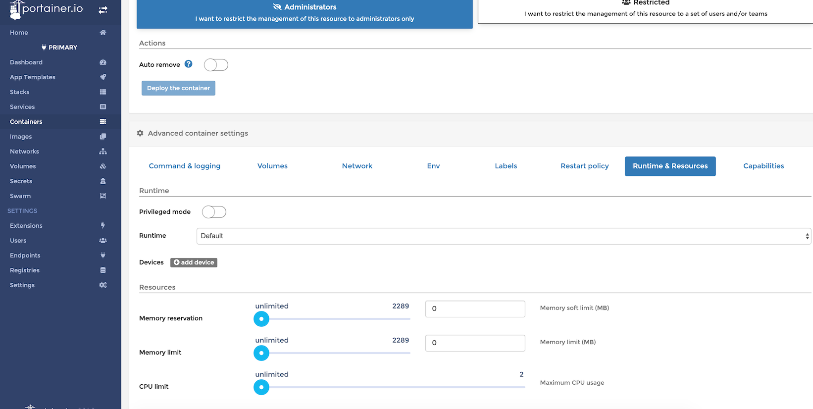

# 使用 Portainer 管理 Docker

Docker 的管理界面有很多，这里推荐 Portainer，下面是他的管理界面


## 开放 Dcoker 网络管理端口

Portainer 之所以能管理 docker ，是因为它访问的是 Docker 网络管理端口，所以我们先放开。

```bash
[root@study ~]# vi /etc/sysconfig/docker
# 在配置文件末尾增加以下配置
# 重要的就是这个端口，默认就是  2375
OPTIONS='-Htcp://0.0.0.0:2375 -H unix:///var/run/docker.sock'
# 配置之后，需要重新启动 docker 服务

firewall-cmd --zone=public --add-port=2375/tcp --permanent
firewall-cmd --reload

[root@study ~]# systemctl restart docker
```

## 安装 Portainer

```bash
[root@study ~]# docker pull portainer/portainer
# -H 参数：写的是宿主机上的 IP 和端口
[root@study ~]# docker run -d -p 9000:9000 --name portainer portainer/portainer -H tcp://192.168.56.105:2375
```

容器启动后，访问：http://192.168.56.105:9000/ 就能进入到管理界面了

进入到管理界面之后，里面的内容和前面学到的 images、volumes、containers 等是对应的，只要前面认真学过了，这里的图形界面实现我们之前的操作，基本上都没有问题了。

创建容器时分配硬件资源，在前面没有学习过，如下图，可以分配使用的内存、CPU 等

