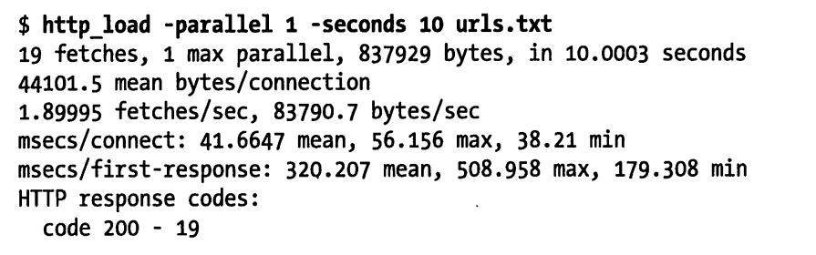
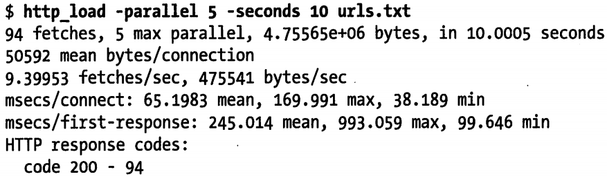
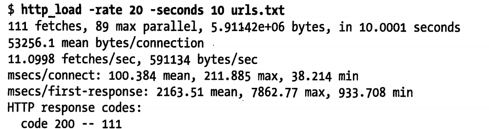
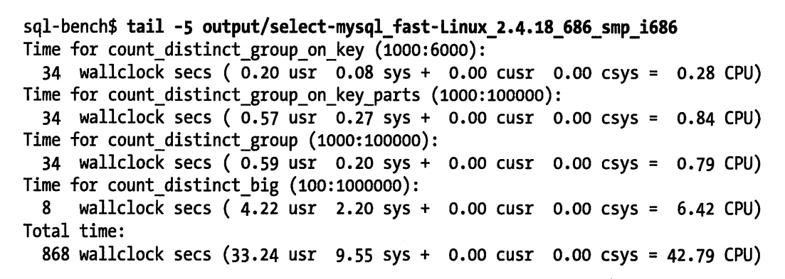
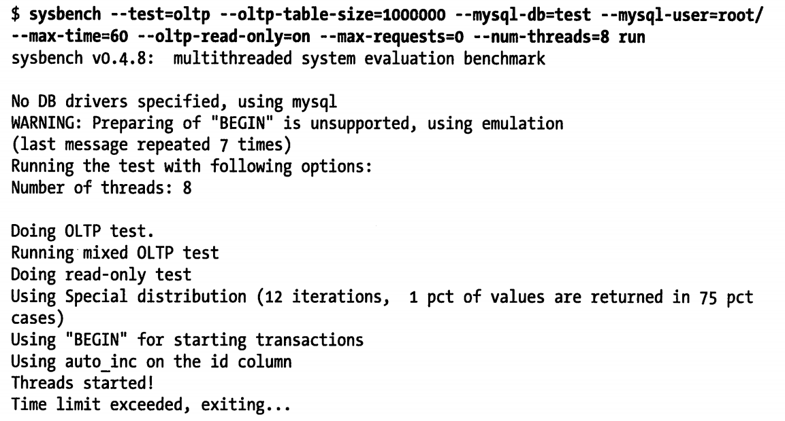

# 基准测试案例

本章使用上面提到的部分共计进行测试，告诉你怎么入门

## http_load

首先创建一个 urls.txt 文件，输入如下的 RUL

```
http://www.mysqlperformanceblog.com/
http://www.mysqlperformanceblog.com/page/2/
http://www.mysqlperformanceblog.com/mysql-patches/
http://www.mysqlperformanceblog.com/mysql-performance-presentations/
http://www.mysqlperformanceblog.com/2006/09/06/slow-query-log-analyzes-tools/
```

最简单的用法，就是循环请求给定的 URL 列表。测试程序将以最快的速度请求这些 URL



测试的结果很容易理解，只是简单的输出了请求的统计信息。下面是一个稍微复杂的测试，模拟同时有 5 个用户在进行请求



另外，除了测试最快的速度，有可以根据预估的访问请求率（比如每秒 5 次）来做压力模拟测试


最后，还可以模拟更大的负载，可以将访问请求率提高到每秒 20 次请求。请注意，连接和请求响应时间都会随着负载的提高而增加



## MySQL 基准测试套件

MySQL Benchmark Suite 由一组基于 Perl 开发的基准测试工具组成。在 MySQl 安装目录下的 sql-bench 子目录中包含了该工具。Linux 系统上，默认的路径是 `/usr/share/mysql/sql-bench`

笔者装的 MySQL  8.0 ，没有找到该工具。下面截图

可以阅读该工具的 README 文件，了解使用方法和命令行参数说明。如果要运行全部测试，可以使用如下的命令


执行时间很正常，可能会超过一小时。如果指定了 `--log` 命令行，则可以监控到测试的进度。测试的结果都保存在 output 子目录中，每项测试的结果文件都会包含一系列的操作计时信息。下面是一个具体的例子



如上所示： `count_distinct_group_one_key(1000:6000)` 测试花费了 34 秒（wallclock secs），这是客户端运行测试花费的总时间，其他值（usr、sys、cursr、csys）则占了测试的 0.28 秒的开销，这是运行客户端测试代码所花费的时间，而不是等待 MySQL 服务器响应的时间。而测试者正在需要关心的测试结果，是除去客户端控制的部分，即实际运行时间应该是 33.72 秒

还可以选择单独执行其中的部分测试项，例如可以选择只执行 insert 测试


## sysbench

sysbench ky 可以执行多种类型的基准测试，不仅用来测试数据库的性能，也可以测试运行数据库的服务器性能。 实际上，peter 和 vadim 最初设计这个工具是用来执行 MySQL 性能测试的（尽管并不能完成所有的 MySQL 基准测试）。下面先演示一些非 MySQL 的测试场景，来测试各个子系统的性能，这些测试可以用来评估系统的整体性能瓶颈。后面在演示如何测试数据库的性能

建议大家都熟悉该工具，在 MySQL 用户的工具包中，这一个是最有用的工具之一。有替代他的某些功能，但是那些工具并不靠谱，获得的结果也不一定和 MySQL 性能相关。例如  I/O 性能测试可以用 iozone、bonnie++ 等工具，但需要注意设计场景，以便可以模拟 InnoDB 的磁盘 I/O 模式。 而 sysbench 的 I/O 测试和 InnoDB 的 I/O 模式非常类似，所以 fileio 选项是非常好用的

```bash
# centos 7 下安装该软件
yum -y install  make automake libtool pkgconfig libaio-devel vim-common

# 安装方式来自 https://github.com/akopytov/sysbench#installing-from-binary-packages
curl -s https://packagecloud.io/install/repositories/akopytov/sysbench/script.rpm.sh | sudo bash
sudo yum -y install sysbench
```

###  sysbench 的 CPU 基准测试

```bash
[root@study yum.repos.d]# sysbench --test=cpu --cpu-max-prime=20000 run
WARNING: the --test option is deprecated. You can pass a script name or path on the command line without any options.
sysbench 1.0.20 (using bundled LuaJIT 2.1.0-beta2)

Running the test with following options:
Number of threads: 1
Initializing random number generator from current time


Prime numbers limit: 20000

Initializing worker threads...

Threads started!

CPU speed:
    events per second:   534.88

General statistics:
    total time:                          10.0011s	# 这里是计算的总时间数
    total number of events:              5350

Latency (ms):
         min:                                    1.81
         avg:                                    1.87
         max:                                   32.18
         95th percentile:                        1.93
         sum:                                 9996.15

Threads fairness:
    events (avg/stddev):           5350.0000/0.00
    execution time (avg/stddev):   9.9961/0.00

```

可以通过这个去测试多台不同的计算机的性能。

### sysbench 的文件 I/O 基准测试

文件 I/O（fileio）基准测试可以测试系统在不同 I/O 负载下的性能。这对于比较不同的硬盘驱动器、不同的 RAID卡、不同的 RAID 模式，都很有帮助。可以根据测试结果来调整 I/O 子系统。文件 I/O 基准测试模拟了很多 InnoDB 的 I/O 特性。

测试的第一步是准备（prepare）阶段，生成测试用到的数据文件，文件只要要比内存大。否则全部可以放入内存中，则无法体现 I/O 密集型的工作负载。通过下面的命令创建一个数据集

```bash
sysbench --test=fileio --file-total-size=20G prepare
WARNING: the --test option is deprecated. You can pass a script name or path on the command line without any options.
sysbench 1.0.20 (using bundled LuaJIT 2.1.0-beta2)

128 files, 163840Kb each, 20480Mb total
Creating files for the test...
Extra file open flags: (none)
...
Creating file test_file.47
Creating file test_file.48
Creating file test_file.49
...
# 会生成很多小文件。
```

该命令会在当前工作目录下创建测试文件，后续的运行（run）阶段将通过读写这些文件进行测试。针对不同的 I/O 类型有不同的测试选项：

- seqwr：顺序写入
- seqrewr：顺序重写
- seqrd：顺序读取
- rndrd：随机读取
- rndwr：随机写入
- rdnrw：混合随机读/写

下面的命令运行文件 I/O 混合随机读写基准测试

```bash
# 总时间是测试 300 秒
$ sysbench --test=fileio --file-total-size=20G --file-test-mode=rndrw --max-time=300 --max-requests=0 run
WARNING: the --test option is deprecated. You can pass a script name or path on the command line without any options.
WARNING: --max-time is deprecated, use --time instead
sysbench 1.0.20 (using bundled LuaJIT 2.1.0-beta2)

Running the test with following options:
Number of threads: 1
Initializing random number generator from current time


Extra file open flags: (none)
128 files, 160MiB each
20GiB total file size
Block size 16KiB
Number of IO requests: 0
Read/Write ratio for combined random IO test: 1.50
Periodic FSYNC enabled, calling fsync() each 100 requests.
Calling fsync() at the end of test, Enabled.
Using synchronous I/O mode
Doing random r/w test
Initializing worker threads...

Threads started!
File operations: # 文件操作
    reads/s:                      660.30	# 每秒读取 660.30 次
    writes/s:                     440.20
    fsyncs/s:                     1408.95

Throughput: # 吞吐量
    read, MiB/s:                  10.32 	# 每秒 10.32 Mb
    written, MiB/s:               6.88

General statistics:
    total time:                          300.0432s	 # 总测试时间
    total number of events:              752818

Latency (ms):
         min:                                    0.00
         avg:                                    0.40
         max:                                  841.22
         95th percentile:                        0.84		# 95% 的时间分布
         sum:                               299415.63

Threads fairness:
    events (avg/stddev):           752818.0000/0.00
    execution time (avg/stddev):   299.4156/0.00

```

测试完成后，运行清除（cleanup）操作删除第一步生成的测试文件

```bash
[root@study test]# sysbench --test=fileio --file-total-size=20G cleanup
WARNING: the --test option is deprecated. You can pass a script name or path on the command line without any options.
sysbench 1.0.20 (using bundled LuaJIT 2.1.0-beta2)

Removing test files...

```

### sysbench 的 OLTP 基准测试

OLTP 基准测试模拟了一个简单的事物处理系统的工作负载。下面的例子使用的是一张超过百万行记录的表，第一步是先生成这张表

```bash
[root@study test]# sysbench --test=oltp --oltp-table-size=1000000 --mysql-db=test --mysql-user=root prepare
WARNING: the --test option is deprecated. You can pass a script name or path on the command line without any options.
sysbench 1.0.20 (using bundled LuaJIT 2.1.0-beta2)

FATAL: Cannot find benchmark 'oltp': no such built-in test, file or module

# 笔者执行后报错，应该是 sysbench 版本的太高的问题。下面还是截图
# 后补：该软件不能和 mysql8 安装在一台机器上，会有冲突
```


下列例子采用了 8 个并发线程，只读模式，测试时间为 60 秒




如上所示，结果中包含了相当多的信息，其中最有价值的信息如下：

- 总的事物数
- 每秒事物数
- 时间统计信息（最小、平均、最大响应时间，以及 95% 百分比响应时间）
- 线程公平性统计信息（thread-fairness）,用于标识模拟负载的公平性

### sysbench 的其他特性

还有一些其他的基准测试，但和数据库性能没有直接关系

- 内存（memory）：测试内存的连续读写性能

- 线程（thread）：测试线程调度器的性能。对于高负载情况下测试线程调度器的行为非常有用。

- 互斥锁（mutex）

  测试互斥锁的性能，方式是模拟所有线程在同一时刻并发运行，并都短暂请求互斥锁（互斥锁 mutex 是一种数据结构，用来对某些资源进行排他性访问控制，防止因并发访问导致问题。）

- 顺序写（seqwr）

  测试顺序写的性能。这对于测试系统的实际性能瓶颈很重要。可以用来测试 RAID 控制器的高速缓存的性能状况，如果测试结果异常则需要引起重视。例如，如果 RAID 控制器写缓存没有电池保护，而磁盘的压力达到了 3000 次请求/秒，就是一个问题，数据可能是不安全的

另外，除了制定测试模式参数（`--test`）外，还有其他很多参数，比如 `--num、--threads、--max-requests、--max-time` 参数，更多信息请查阅官网文档。

## 数据库测试套件中的 dbt2 TPC-C 测试

数据库测试套件（Database Test Suite）中的 dbt2 是一款免费的 TPC-C 测试工具。 TPC-C 是 TPC 组织发布的一个测试规范，用于模拟测试复杂的在线事物处理系统（OLTP）。它的测试结果包括每分钟事物数（tpmC），以及每事物的成本（Price/tpmC）。这种测试的结果非常依赖硬件环境，所以公开发布的 TPC-C 测试结果都会包含具体的系统硬件配置信息。

笔者不想看这个了，看了前面的都是一头雾水

## Percona 的 TPCC-MySQL 测试工具

笔者不想阅读这个了。并且这个本书用的工具都太老的，对于笔者 2020 年才阅读的这书籍

