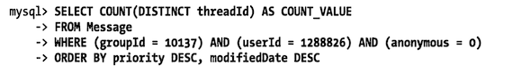
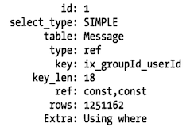
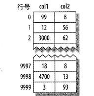
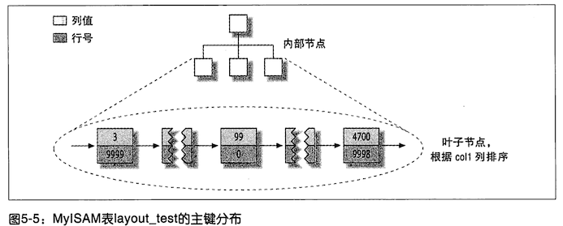
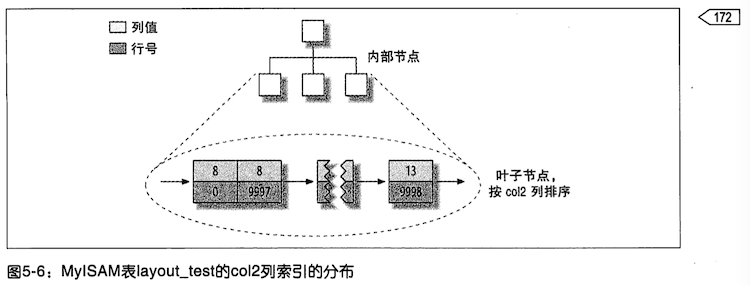
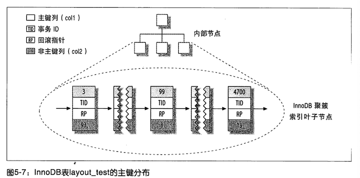
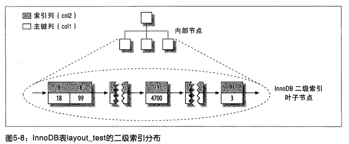
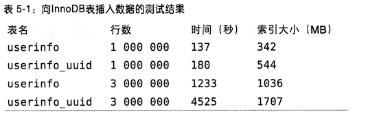
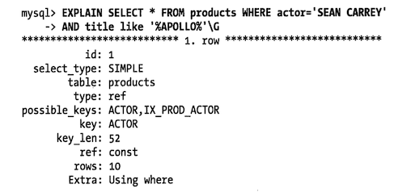

# 高性能索引策略

正确创建和使用索引是实现高性能查询的基础。前面讲解了各种各类型的索引及其优缺点，现在来看看如何真正发挥这些索引的优势。

高效选择和使用索引的方式有很多种，其中有些是针对特殊案例的优化，有些是针对特定行为的优化。使用哪个索引，以及如何评估选择不同索引的性能影响的技巧，则需要持续不断的学习。本章将帮助读者理解如何高效使用索引。

## 独立的列

独立的列是指 **索引列不能是表达式的一部分，也不能是函数的参数**

例如，下面这个查询无法使用 actor_id 列的索引

```sql
select actor_id from sakila.actor where actor_id + 1 = 5
```

`actor_id + 1 = 5` 那么 actor_id 等于 4，但是 MySQL 无法自动解析这个方程式。这完全是用户行为，我们应该养成 **简化 where 条件** 的习惯，**始终将索引列单独放在比较符号的一侧**

下面是另一个常见的错误：

```sql
select ... where to_days(current_date) - to_days(date_col) <= 10;
```

## 前缀索引和索引选择性

有时候需要索引很长的字符列，这会让索引变得大且慢。一个策略是前面提到过的模拟哈希索引。但是有时候这样做还不够。

通常可以 **索引开始的部分字符**，这样可以大大 **节约索引空间，从而提高索引效率**。但这也会**降低索引的选择性**。

::: tip 索引的选择性

不重复的索引值（也称为基数（cardinality）） 和数据表记录总数（`#T` ）的比值，范围从 `1/#T` 到 1 之间。 

:::

**索引的选择性越高则查询效率越高**，因为选择性高的索引可以让 MySQL 在查找时过滤掉更多的行，唯一索引的选择性是 1，这是最好的索引选择性，性能也是最好的。

一般情况下某个列前缀的选择性也是足够高的，足以满足查询性能。对于 BLOB、TEXT 或则很长的 varchar 类型的列，必须使用前缀索引，因为 MySQL 不允许索引这些列的完整长度。

诀窍在于要 **选择足够长的前缀以保证较高的选择性，同时又不能太长（节约空间）**。

为了决定前缀的合适长度，需要找到最常见的值的列表，然后和最常见的前缀列表进行比较。

下面是一个例子，在这之前我们[下载 MySQL 官网的 sakila 数据库表结构和数据导入到我们的数据库中进行练习](http://downloads.mysql.com/docs/sakila-db.zip)

由于 city 表中没有合适的数据，下面生成一张表用于演示

```sql
create table sakila.city_demo
(
    city varchar(50) not null
);

-- 下面的语句最终结果是：从 city 表中随机获取数据插入到 city_demo 表中
-- 前面两条 sql 是插入了 1200 行的数据
-- 后面一条是随机获取数据更新这 1200 行
insert into sakila.city_demo(city)
select city
from sakila.city;
insert into sakila.city_demo(city)
select city
from sakila.city_demo;
update sakila.city_demo
set city = (select city from sakila.city order by RAND() limit 1);
```

```sql
select count(*) as cnt, city
from sakila.city_demo
group by city
order by cnt desc
limit 10;
```

| cnt | city |
| :--- | :--- |
| 8 | Mwene-Ditu |
| 8 | Jamalpur |
| 7 | Shimonoseki |
| 6 | Greensboro |
| 6 | Firozabad |
| 6 | Dadu |
| 6 | Teboksary |
| 6 | Citt del Vaticano |
| 6 | Kakamigahara |
| 6 | Cuernavaca |

上面的词每个词都出现了 6~8 次。现在查找到最频繁出现的城市前缀，先从 3 个前缀字母开始：

```sql
select count(*) as cnt, left(city,3)
from sakila.city_demo
group by city
order by cnt desc
limit 10;
```

| cnt | left\(city,3\) |
| :--- | :--- |
| 8 | Mwe |
| 8 | Jam |
| 7 | Shi |
| 6 | Cue |
| 6 | Gre |
| 6 | Fir |
| 6 | Dad |
| 6 | Teb |
| 6 | Cit |
| 6 | Kak |

其实这里看到，3 个字母前缀的时候，就已经接近了完整列的选择性。如果数量不和原始列接近的话，就尝试继续增加字母前缀数量，找到一个接近的长度。

### 如何计算完整列的选择性

计算合适的前缀长度的另外一个办法就是计算完整列的选择性，并使用前缀的选择性接近于完整列的选择性。显示显示如何计算完整列的选择性：

```sql
select count(distinct city) / count(*)
from sakila.city_demo;
-- 结果为 0.4375
```

在这个例子中，如果前缀的选择性能够接近 0.437 基本上就可用了。下面演示了如何一次性得到合适的前缀长度

```sql
select count(distinct left(city, 1)) / count(*)  as sel1,
       count(distinct left(city, 2)) / count(*)  as sel2,
       count(distinct left(city, 3)) / count(*)  as sel3,
       count(distinct left(city, 4)) / count(*)  as sel4,
       count(distinct left(city, 5)) / count(*)  as sel5,
       count(distinct left(city, 6)) / count(*)  as sel6,
       count(distinct left(city, 7)) / count(*)  as sel7,
       count(distinct left(city, 8)) / count(*)  as sel8,
       count(distinct left(city, 9)) / count(*)  as sel9,
       count(distinct left(city, 10)) / count(*) as sel10,
       count(distinct left(city, 12)) / count(*) as sel12,
       count(distinct left(city, 15)) / count(*) as sel15
from sakila.city_demo;
```

| sel1 | sel2 | sel3 | sel4 | sel5 | sel6 | sel7 | sel8 | sel9 | sel10 | sel12 | sel15 |
| :--- | :--- | :--- | :--- | :--- | :--- | :--- | :--- | :--- | :--- | :--- | :--- |
| 0.0217 | 0.1475 | 0.3433 | 0.4125 | 0.4267 | 0.4333 | 0.4350 | 0.4350 | 0.4350 | 0.4358 | 0.4358 | 0.4375 |

可以看到当前缀长度达到 7 的时候，再增加前缀长度，选择性提升的幅度已经很小了。

只看平均选择性是不够的，也有例外的情况，需要考虑最坏情况下的选择性。平均选择性会让你认为前缀长度为 4 的索引就已经足够了，但是如果数据分布很不均匀，可能就会有陷阱。如果观察前缀为 4 的最常出现城市的次数

```sql
select count(*) as cnt, left(city, 4) as pref
from sakila.city_demo
group by pref
order by cnt desc
limit 10;
```

| cnt | pref |
| :--- | :--- |
| 11 | Sant |
| 10 | Shim |
| 10 | Sout |
| 8 | San  |
| 8 | Cuau |
| 8 | Mwen |
| 8 | Jama |
| 7 | Sala |
| 6 | Gree |
| 6 | Dadu |

可以看到，最高的出现了 11 次，最低的出现了 6 次，差不多相差一倍；以 S 开头的城市数量较多，选择性较低。

所以可以看看索引前缀为 7 的，经过查看之后，相差不怎么大。这就找到了合适的索引前缀数量。

### 创建前缀索引

```sql
alter table sakila.city_demo
    add key (city(7));
```

前缀索引式一种能使索引更小、更快的有效办法。缺点就是：

- 无法用来做 order by 和 group by
- 无法做覆盖扫描

## 多列索引

很多人对多列索引的理解都不够。一个常见的错误是，为每个列创建独立的索引，或则按照错误的 **顺序** 创建多列索引

为每个列创建单独的索引，如下

```sql
create table t(
  c1 int,
  c2 int,
  c3 int,
  key(c1),
  key(c2),
  key(c3)
)
```

这种索引策略一般是看到这个模糊的建议导致的：把 where 条件里面的列都建上索引。

实际上这个建议是非常错误的，这样一来最好的情况下也只能是「一星」索引，其性能比起真正最优的索引可能差几个数量级。**有时候如果无法设计一个 [三星索引](./02.md#三星系统)**，那么不如忽略掉 where 子句，集中精力优化索引的顺序，或则创建一个全覆盖索引。

### 索引合并

**在多个列上建立独立的单列索引大部分情况下并不能提高 MySQL 的查询性能**。 MySQL 5+ 出现了一种叫 「索引合并（index merge）」 的策略，一定程度上可以使用表上多个单列索引来定位指定的行。

更早的版本智只能使用其中某一个单列索引，如下查询

```sql
select film_id, actor_id
from sakila.film_actor
where actor_id = 1
   OR film_id = 1;
```

在老版本中，MySQL 会对这个查询使用全表扫描。除非改写成两个查询 union 方式

```sql
select film_id, actor_id
from sakila.film_actor
where actor_id = 1
union
select film_id, actor_id
from sakila.film_actor
where film_id = 1;
```

在 MySQL 5+ 版本中，查询能同时使用者两个单列索引进行扫描，并将结果进行合并

```sql
explain
select film_id, actor_id
from sakila.film_actor
where actor_id = 1
   OR film_id = 1;
```

| id | select\_type | table | partitions | type | possible\_keys | key | key\_len | ref | rows | filtered | Extra |
| :--- | :--- | :--- | :--- | :--- | :--- | :--- | :--- | :--- | :--- | :--- | :--- |
| 1 | SIMPLE | film\_actor | NULL | index\_merge | PRIMARY,idx\_fk\_film\_id | PRIMARY,idx\_fk\_film\_id | 2,2 | NULL | 29 | 100 | Using union\(PRIMARY,idx\_fk\_film\_id\); Using where |

该表的 `actor_id` 是主键，`film_id` 是一个单列索引。可以看到是 type 是  index_merge 类型的；

MySQL 会使用这类技术优化复杂查询，所以还会在某些语句的 Extra 列表中看到嵌套操作。

索引合并策略有时候是一种优化的结果，但实际上更多时候说明了表上的索引建的很糟糕

- 当出现服务器对 **多个索引做相交操作时（通常有多个 AND 条件）**

  通常意味着需要一个包含所有相关列的 **多列索引**，而不是多个独立的单列索引

- 当服务器需要对 **多个索引做联合操作时（通常有多个 OR 条件）**

  通常需要耗费大量 CPU 和内存资源在算法的缓排序、和合并操作上。特别是当其中有些 **索引的选择性不高**，需要合并扫描返回的大量数据的时候。

- 更重要的是：**优化器不会把这些计算到「查询成本（cost）」中**

  优化器值关心随机页面读取，这会使得查询的成本被「低估」，导致该执行计划还不如直接走全表扫描。这样做不但会消耗更多的 CPU 和内存资源，还可能会影响查询的并发性。通常来说，还不如将查询改写成 union 的方式往往更好。

如果看到有索引合并，应该好好检查下查询和表的结构，看是不是最优的。也可以通过参数 `optimizer_switch` 来关闭索引合并功能。也可以使用 ignore index 提示让优化器忽略掉某些索引

## 选择合适的索引列顺序

最容易引起困惑的问题就是索引列的顺序。**正确的顺序依赖于使用该索引的查询**，并且同时时需 **考虑如何更好的满足排序和分组的需要**（本节内容适用于 B-Tree 索引，其他类型的索引并不会像 B-Tree 索引一样按顺序存储数据）

**在一个多列 B-Tree 索引中，索引列的顺序意味着索引首先按照最左列进行排序**，其次是第二列，等等。所以，索引可以按照升序或降序进行扫描，以满足精确符合列顺序的 order by、group by 和 distinct 等子句的查询需求。

**所以多列索引的顺序至关重要**。在 [三星索引](./02.md#三星系统) 中，列的属性也决定了一个索引是否能够成为一个真正的三星索引。

如何选择索引的列顺序有一个经验法则：**将选择性最高的列放到索引最前列**。在某些场景可能有帮助，但通常不如避免随机 I/O 和排序那么重要，考虑问题需要更全面（**场景不同则选择不同**）

**当不需要考虑排序和分组时，将选择性最高的列放在前面通常是很好的**。这时候索引的作用只是用于优化 where 条件的查找。然而，**性能不只是依赖于所有索引列的选择性（整体基数）**，也和查询条件的具体值有关，也就是 **和值的的分布有关**，和前面介绍选择前缀的长度思路一样，可能需要根据那些运行频率最高的查询来调整索引列的顺序，让这种情况下索引的选择性最高。

以下面的查询为例；

```sql
select *
from payment
where staff_id = 2
  and customer_id = 584;
```

这个语句是应该将哪个字段放在索引的最左边？我们可以使用下面的语句来预测下

```sql
select sum(staff_id = 2), sum(customer_id = 584)
from payment;
```

| sum\(staff\_id = 2\) | sum\(customer\_id = 584\) |
| :--- | :--- |
| 7992 | 30 |

根据前面的 **经验法则**，将 customer\_id 列放在最前面（数量更少，选择性高）。来看看这个列对应的 staff_id 的选择性如何

```sql
select sum(staff_id = 2)
from payment
where customer_id = 584;
-- 查询结果为 17 
```

选择性更高，过滤掉更多的数据，提高了性能，但是这样做有一个需要注意的地方：查询结果非常依赖于选定的具体值。如果按照上述办法优化，可能对其他一些条件值的查询不公平，服务器的整体性能可能变得更糟糕，或则其他某些查询的运行变得不如预期。

如果是从 pt-query-digest 这样的工具报告中提取「最差」查询，再使用上面的办法来选择索引顺序往往是非常高效的。如果没有类似的具体查询来运行，那么最好还是按照前面讲解的基于选择性平均值估算来确定索引列的顺序。

```sql
select count(distinct staff_id) / count(*)    as staff_id_selectivity,
       count(distinct customer_id) / count(*) as customer_id_selectivity
from payment
```

| staff\_id\_selectivity | customer\_id\_selectivity |
| :--- | :--- |
| 0.0001 | 0.0373 |

customer\_id 列的选择性更高，所以将其作为索引列的第一列：

```sql
alter table payment
    add key (customer_id, staff_id);
```

**使用前缀索引的时候，在某些条件值的基数比正常值高的时候，问题就来了**。

比如：一个应用中，对于没登录的用户，都将其用户名记录为「guset」，在记录用户活动的其他表中 guset 就成为了一个特殊的用户 ID。一旦查询涉及整个用户，那么对于正常用户的查询就大不相同了。系统账户也会导致类似的问题，一个系统通常有一个特殊的账户，和普通账户不同，系统中所有账户都是这个账户的好友，发送通知信息都通过该账户的好友列表发送通知信息。这个账户的巨大好友列表很容易导致网站出现服务器性能问题。

这实际上是一个非常典型的问题，任何的异常用户，不仅仅是那些勇于管理应用的设计糟糕的账户会有同样的问题。那些拥有大量好友、图片、状态、搜藏的用户，也会有前面提到的系统账户的问题。

下面是一个我们遇到过的真实案例：在一个用户分享购买商品和购买经验的轮替上，这个特殊表上的查询运行得非常慢：



这个查询看似没有建立合适的索引，explain 的结果如下



MySQL 为这个查询选择了索引 `groupId,userId`，如果 **不考虑列的基数**，这看起来是一个非常合理的选择。如果考虑下 userId 和 groupId 条件匹配的行数，可能就会有不同的想法了：


可以看到符合 groupId 条件几乎满足表中的所有行，符合 userId 条件的有 130 万条记录，也就是说索引基本上没有什么用。

这些数据是从其他应用中迁移过来的，迁移的时候把所有的消息都赋予了管理员组的用户。这个案例的解决办法是修改应用代码，区分这类特殊用户和组，禁止针对这类用户和组执行这个查询。

从这个小案例可以看到 **经验法则和推论在多数情况下是有用的 **，但要注意 **不要假设平均情况下的性能也能代表特殊情况下的性能**，特殊情况可能会摧毁整个应用的性能。

还要记住：where 子句中的排序、分组和范围条件等其他因素，可能也对查询的性能造成非常大的影响。

## 聚簇索引

聚簇索引并 **不是一种单独的索引类型**，而是 **一种数据存储方式**。具体细节依赖于实现方式，但 InnoDB 的聚簇索引实际上在 **同一个结构中保存了 B-Tree 索引和数据行**

::: tip 

聚簇索引并 **不是一种单独的索引类型**，而是 **一种数据存储方式**。

这句话很重要，聚簇索引式数据存储方式。

::::

当表有聚簇索引时，它的 **数据行实际存放在索引的叶子页（leaf page）中**。

聚簇：**表示数据行和相邻的键值紧凑的存储在一起**。因为无法同时把数据行存放在两个不同的地方，所以一个表只能有一个聚簇索引（不过，覆盖索引可以模拟多个聚簇索引的情况，后面详细讲解）

因为是存储引擎负责实现索引，索引不是所有存储引擎都支持，本节只关注 InnoDB，但是这里的讨论的原理对于任何支持聚簇索引的存储引擎都是使用的。

下图展示了聚簇索引中的记录是如何存放的。注意到：**叶子页包含了行的全部数据，但是节点页只包含了索引列**。在该案例中，索引列包含的是整数值。


笔者并没有看出来上图的索引列和数据怎么存储的。

一些数据库服务器允许选择哪个索引作为聚簇索引，但是本书写作时，没有任何一个 MySQL 内置的存储引擎支持这一点。**InnoDB 将通过主键聚集数据**，也就是说上图「被索引的列」就是主键列。

**如果没有定义主键，InnoDB 会选择一个唯一的非空索引代替**，如果没有这样的索引，InnoDB 会隐式定义一个主键来作为聚簇索引。InnoDB 只聚集在同一个页面中的记录。包含相邻键值的页面可能会相聚甚远。

聚簇索引可能对性能有帮助，但也可能导致严重的性能问题。所以需要仔细考虑聚簇索引。

### 聚集数据重要优点

- 可以把相关数据保存在一起

  例如：实现电子邮箱时，可以根据用户 ID 来聚集数据，这样值需要从磁盘读取少数的数据页就能获取某个用户的全部邮件。**如果没有使用聚簇索引，则每封邮件都可能导致一次磁盘 I/O**

- 数据访问更快

  聚簇索引将索引和数据保存在同一个 B-Tree 中，因此从聚簇索引中获取数据通常比在非聚簇索引中查找要快。

- 使用覆盖索引扫描的查询可以直接使用页节点中的主键值

如果在设计表和查询时能充分利用上面的优点，那就能极大地提升性能。同时，聚簇索引也有一些缺点：

### 聚簇索引的缺点

- 聚簇数据最大限度 **提高了 I/O 密集型应用的性能**，但如何数据全部都放在内存中，则访问的顺序就没那么重要了，聚簇索引也就没有什么优势了

- 插入速度严重依赖于插入顺序

  按照主键的顺序插入是加载数据到 InnoDB 表中速度最快的方式。但如果不是按照主键顺序加载数据，那么在加载完成后最好使用 optimize table 命令重新组织一下表。

- 更新聚簇索引列的代价很高

  因为会强制 InnoDB 将每个被更新的行移动到新的位置

- 给予聚簇索引的表在插入新行，或则主键被更新导致需要移动行的时候，可能面临「页分裂（page split）」的问题。

  当行的主键值要求必须将这一行插入到某个已满的页中时，存储引擎会将该页分裂成两个页面来容纳该行，这就是一次页分裂操作，会导致表占用更多的磁盘空间

- 聚簇索引可能导致全表扫描变慢

  尤其是行比较稀疏，或则由于页分裂导致数据存储不连续的时候

- 二级索引（非聚簇索引）可能比想象的要更大

  因为在二级索引的叶子节点包含了引用行的主键列

- 二级索引访问需要两次索引查找，而不是一次

为什么二级索引需要两次索引操作？**二级索引中保存的「行指针」**，要记住：二级索引叶子节点保存的 **不是指向行的物理位置的指针，而是行的主键值**

这意味着通过二级索引查找行，存储引擎需要找到二级索引的叶子节点获得对应的主键值，然后根据这个值去聚簇索引中查找对应的行。这里做了重复的工作：两次 B-tree 查找而不是一次（并不是所有的非聚簇索引都能做到一次索引查询就找到行。当行更新的时候可能无法存储在原来的位置，这会导致表中出现行的碎片化或则移动行并在原位置保存「向前指针」，这两种情况都会导致在查找行时需要更多的工作） 。

对于 InnoDB，自适应哈希索引能够减少这样的重复工作。

### InnoDB  和 MyISAM 的数据分布对比

聚簇索引和非聚簇索引的数据分布有区别，以及对应的主键索引和二级索引的数据分布也有区别，通常会让人感到困扰和意外。来看看 InnoDB 和 MyISAM 是如何存储下面这个表的

```
create table layout_test(
	col1 int not null,
	col2 int not null,
	primary key(col1),
	key(col2)
)
```

假设该表的主键取值为 1~10000，按照随机顺序插入并使用 optmize table 命令做了优化。换句话说，数据在磁盘上的存储方式移交最优，但行的顺序是随机的。列 col2 的值是从 1~100 之间随机赋值，所以有很多重复的值的。

#### MyISAM 的数据分布

MyISAM 的数据分布：非常简单。按照数据插入的顺序存储在磁盘上



行号从 0 递增，因为行是定长的，所以 MyISAM 可以直接从表的开头跳过所需的字节找到需要的行（MyISAM 并不总是使用上图中的行号，而是根据定长还是变长的行使用不同策略）

这种分布方式很容易创建索引。下图隐藏了页的物理细节，只显示索引中的「节点」，索引中的每个叶子节点包含行号



这里忽略了一些细节，比如前一个 B-Tree 节点有多少内部节点，不过这并不影响对非聚簇索引存储引擎的基本数据分布的理解。

cole2 列上的索引和其他索引没有什么区别，如下图



事实上，MyISAM 中主键索引和其他索引在结构上没有什么不同。主键索引就是一个名为 primary 的唯一非空索引。

#### InnoDB 的数据分布

因为InnoDB 支持聚簇索引，所以使用非常不同的方式存储同样的数据。



第一眼看上去和图 5-5 没有什么不同，仔细看，会注意到该图显示了 **整个表**，而 **不是只有索引**。因为在 InnoDB 中，聚簇索引「就是」表，所以不像 MyISAM 那样需要独立的行存储。

**聚簇索引的每一个叶子节点都包含了主键值、事务 ID、用于事务和 MVCC 的回滚指针以及所有剩余的列（在该例中是 col2）**。**如果主键是一个列前缀索引，InnoDB 也会包含完整的主键列和剩下其他列**。

还有一点和 MyISAM 不同的是，InnoDB 的二级索引和聚簇索引很不相同。InnoDB 二级索引的叶子节点中存储的不是「行指针」，而是主键值，并以此作为指向行的「指针」。这样的策略减少了当出现行移动或则数据页分裂时二级索引的维护工作。使用主键值当做指针会让二级索引占用更多的空间，换来的好处是，**InnoDB 在移动行时无须更新二级索引中的这个「指针」**。

下图展示了 B-Tree 的叶子节点结构，但我们故意省略了非叶子节点这样的细节。InnoDB 的非叶子节点包含了索引列和一个向下级节点的指针（下一级可以是非叶子节点，也可以是叶子节点），这对聚簇索引和二级索引都适用



下图是描述 InnoDB 和 MyISAM 如何存放表的抽象图。可以很容易看出来 InnoDB 和 MyISAM 保存数据和索引的区别


如果还没有理解聚簇索引和非聚簇索引的有什么区别、为何有这些区别以及这些区别的重要性，不用担心，随着学习的深入会慢慢理解，当学完本书或则下一章，这些问题就会变得越来越清楚。这些概念有些复杂，需要一些时间才能完全理解。

### 在 InnoDB 表中按主键顺序插入行

如果正在使用 InnoDB 表并且没有什么数据需要聚集，可以定义一个代理键（surrogate key）作为主键，这种主键的数据应该和应用无关，最简单的方法是使用 auto_increment 的自增列。这样可以 **保证数据行是按顺序写入，对于根据主键做关联操作的性能也会更好**

最好避免随机的（不连续且值的分布范围非常大）的聚簇索引，特别是对于 I/O 密集型的应用。

例如从性能的角度考虑，使用 **UUID 来作为聚簇索引则会很糟糕**：它使得聚簇索引的插入变得完全随机，这是最坏的情况，**使得数据没有任何聚集特性**。

为了演示这一点，做如下两个基准测试。第一个使用整数 ID 插入 userinfo 表：


第二个例子是使用 userinfo_uuid 表，除了主键改为 UUID 外，其他的都一样。

首先，在一个有足够内存容纳索引的服务器上向这两个表个插入 100 万条记录。然后继续插入 300 万条记录，使索引的大小超过服务器的内存容量。



注意到 UUID 主键插入行不仅花费的时间更长，占用空间也更大。一方面是由于主键字段更长，另一方面毫无疑问是由于页分裂和碎片导致的。

为了明白为什么这样，来看看网第一个表中插入数据时，索引发生了什么变化。下图显示了插满一个页面后继续插入相邻的下一个页面的场景


因为主键值是顺序的，所以 InnoDB 把每一条记录都存储在上一条记录的后面。当达到页 **最大填充因子时**时（InnoDB 默认的最大填充因子是页大小的 15/16 ，留出部分空间用于以后修改），下一条记录就会写入新的页中。一旦数据按照这种顺序的方式加载，主键页就会近似于被顺序的记录填满，这也正是所期望的结果（然而二级索引页可能不一样）。

下图是使用 UUID 聚簇索引的表插入数据


因为新行的主键值不一定比之前插入的大，所以 InnoDB 无法简单的总是把新行插入到索引的最后，而是需要为新的行寻找合适的位置：通常是已有数据的中间位置，并且分配空间。这会增加很多额外的工作，并导致数据分布不够优化。下面是一些缺点：

- 导致大量的随机 I/O	

  写入的目标页可能已经刷到磁盘上并从缓存中移除，或则是还没有被加载到缓存中，InnoDB 在插入之前不得不先找到并从磁盘读取目标页到内存中。这将导致大量的随机 I/O

- 移动大量数据，频繁做页分裂操作

  因为写入是乱序的，InnoDB 不得不频繁的做页分裂操作，以便为新的行分配空间。这会导致移动大量数据，一次插入最少需要修改三个而不是一个页

- 数据碎片

  由于频繁的页分裂，页会变得稀疏并被不规则填充，所以最终数据会有碎片。

在把这些随机值载入到聚簇索引以后，也许需要做一次 optimize table 来重建表并优化页的填充。

### 顺序的主键什么时候回造成更坏的结果？

对于高并发工作负载，在 InnoDB 中按主键顺序插入可能会造成明显的争用。

主键的上界会成为「热点」。并发插入可能导致间隙锁竞争。

另一个热点可能是 auto_increment 锁机制，如果遇到这个问题，则可能需要考虑重新设计表或则应用，或则更改 Innodb_autoinc_lock_mode 配置

## 覆盖索引

设计优秀的索引应该考虑到整个查询，而不单单是 where 条件部分。索引确实是一种查找数据的高效方式，但是 MySQL 也 **可以使用索引来直接获取列的数据，这样就不再需要读取数据行**。如果一个索引包含（或者说覆盖）所有需要查询的字段的值，我们就称之为**「覆盖索引」** 

覆盖索引能够极大的提高性能。考虑下如果查找值需要扫描索引而无需回表，会带来多少好处：

### 覆盖索引好处

- 减少数据读取

  索引条目通常远小于数据行大小，所以如果只需要读取索引，会极大减少数据访问量。这对缓存的负载非常重要，因为这种情况下响应时间大部分会花费在数据拷贝上。覆盖索引对于 I/O 密集型的应用也有帮助，因为索引比数据更小，更容易全部放入内存中（MyISAM 能压缩索引以变得更小）

- 范围查询排序也能用上

  因为索引式按照列值顺序存储的（至少在单个页内是如此），所以对于 I/O 密集型的范围查询会比随机从磁盘读取每一行数据的 I/O 要少得多。对于某些存储引擎，例如 MyISAM 和 Percona XtraDB，甚至可以通过 optimize 命令使得索引完全顺序排列，这让简单的范围查询能使用完全顺序的索引访问

- 访问数据更快

  一些存储引擎如 MyISAM 在内存中只缓存索引，数据则依赖于操作系统来缓存，因为要访问数据库需要一次系统调用。这可能会导致严重的性能问题，尤其是那些系统调用占了数据访问中的最大开销场景

- 避免对主键索引的二次查询

  由于 InnoDB 的聚簇索引，覆盖索引对 InnoDB 表特别有用。InnoDB 的二级索引在叶子节点中保存了行的主键值，所以如果二级主键能够覆盖查询，则可以避免对主键索引的二次查询。

在所有这些场景中，在索引中满足查询的成本一般比查询行要小得多。

不是所有类型的索引都可以成为覆盖索引。**覆盖索引必须要存储索引列的值**，而哈希索引、空间索引和全文索引等都不存储索引列的值，所以 MySQL 只能使用 B-Tree 索引做覆盖索引。而且不是所有的存储引擎都支持覆盖索引，在本书写作时， Memory 存储引擎就不支持覆盖索引。

**当发起一个被索引覆盖的查询**（也叫做索引覆盖查询）时，在 explain 的 **Extra 列可以看到**  **「using index」** 的信息（type 列的 index 和 Extra 的 Using index 是完全不同的两个东西。type 列和覆盖索引毫无关系，它只是表示这个查询访问数据的方式，或则说是 MySQL 查找行的方式，MySQL 手册中称之为连接方式 join type）。

例如 sakila.inventory 表有一个多列索引 `(store_id,film_id)`，如果只需要访问这两列，就可以使用这个索引做覆盖索引

```sql
explain
select store_id, film_id
from sakila.inventory;
```

| id | select\_type | table | partitions | type | possible\_keys | key | key\_len | ref | rows | filtered | Extra |
| :--- | :--- | :--- | :--- | :--- | :--- | :--- | :--- | :--- | :--- | :--- | :--- |
| 1 | SIMPLE | inventory | NULL | index | NULL | idx\_store\_id\_film\_id | 3 | NULL | 4581 | 100 | Using index |

索引覆盖查询还有很多陷阱可能会导致无法实现优化。查询优化器会在执行查询前判断是否有一个索引能进行覆盖。假设 **索引覆盖了 where 条件中的字段，但是不是整个查询涉及的字段**，如果条件为假（false）， MySQL 5.5- 也总是会回表获取数据行，尽管并不需要这一行且最终会被过滤掉。

下面看看为什么会发生这样的情况，以及如何重写查询以解决该问题



这里索引无法覆盖查询，有两个原因：

1. 查询列表中选择了所有的列。

   没有任何索引能够覆盖整个查询。不过，理论上可以利用：where 条件中的列是有索引覆盖的，因此 MySQL 可以使用该索引找到对应的 actor 并检查 title 是否匹配，过滤之后再读取需要的数据行。

2. MySQL 不能再索引中执行 like 操作

   这是底层存储引擎 API 的限制。MySQL 5.5- 值允许在索引中做简单的操作（例如等于、不等于、以及大于）。能在索引中做最左前缀匹配的 like 比较，因为该操作可以转换为简单的比较操作，但是如果是通配符开头的 like 查询，存储引擎就无法做比较匹配。这种情况下，MySQL 服务器只能提取数据行的值而不是索引值来做比较

以上两个问题，需要重新查询并巧妙的设计索引，来解决；先将索引扩展至覆盖三个数据列`（artist,title,prod_id）`,然后按如下方式重写查询


我们把这种方式叫做 **延迟关联（deferred join）**，因为延迟了对列的访问。在查询的第一阶段 MySQL 可以使用覆盖索引，在 FROM 子句的子查询中找到匹配 prod_id ，然后根据这些 prod_id 值在外层查询匹配获取需要的所有列值。虽然无法使用索引覆盖整个查询，但总算比完全无法利用索引覆盖好。

笔者这里，看不明白，不是说不能使用 `like %xx%` 吗，咋这里又可以了

## 使用索引扫描来做排序

MySQL 有两种方式可以生成有序的结果：

- 通过排序操作
- 按索引顺序扫描

MySQL 有两种排序算法，更多的细节可以阅读第 7 章。

如果 explain 出来的 **type 列为 「index」**，则说明 MySQL 使用了 **索引扫描来做排序**；

扫描索引本身是很快的，因为只需要从一条索引记录移动到紧接着下一条记录。但是如果索引不能覆盖查询所需的全部列，那就不得不每扫描一条索引记录就都回表查询一次对应的行。这基本上都是随机 I/O，因此按索引顺序读取数据的速度通常要比顺序地全表扫描慢，尤其是在 I/O 密集型的工作负载时。

**MySQL 可以使用同一个索引既满足排序，又用于查找行**。因此，如果可能，设计索引时应该尽可能的同事满足这两种任务，这样是最好的。

- 只有当索引的 **列顺序和 order by 子句的顺序完全一致**，并且所有 **列的排序方向（倒序或则正序）都一样时**，才能使用索引来对结果做排序。

- 如果查询需要关联多张表，则只有当 order by 子句引用的 **字段全部为第一个表时**，才能使用索引做排序

order by 子句和查找型查询的限制是一样的：需要满足索引的最左前缀的要求。

有一种情况下 order by 子句可以不满足索引的最左前缀的要求，就是当导列为常量的时候。如果 where 子句或则 join 子句中对这些列指定了常量，就可以弥补索引的不足。

例如：saklia 的 rental 在列 `rental_date,inventory_id,customer_id` 上有名为 rental_date 的索引

```sql
create table if not exists sakila.rental
(
	rental_id int auto_increment
		primary key,
	rental_date datetime not null,
	inventory_id mediumint unsigned not null,
	customer_id smallint unsigned not null,
	return_date datetime null,
	staff_id tinyint unsigned not null,
	last_update timestamp default CURRENT_TIMESTAMP not null on update CURRENT_TIMESTAMP,
	constraint rental_date
		unique (rental_date, inventory_id, customer_id),
  ....
```

MySQL 可以使用 rental_date 索引为下面的查询做排序，从 explan 中可以看到没有出现文件排序（filesort）的操作（说文件排序，其实并不一定使用磁盘文件）

```sql
explain
select rental_id, staff_id
from sakila.rental
where rental_date = '2015-05-25'
order by inventory_id, customer_id;
```

| id | select\_type | table | partitions | type | possible\_keys | key | key\_len | ref | rows | filtered | Extra |
| :--- | :--- | :--- | :--- | :--- | :--- | :--- | :--- | :--- | :--- | :--- | :--- |
| 1 | SIMPLE | rental | NULL | ref | rental\_date | rental\_date | 5 | const | 1 | 100 | NULL |

即使 order by 子句不满足索引的最左前缀的要求，也可以用于查询排序，这是因为索引的第一列被指定为一个常数。（因为查询出来的数据在索引列里面的顺序是一致的，相当于使用到了最左前缀）

下面这个查询也没有问题，因为 order by 使用两列就是索引的最左前缀

```sql
... where rental_date > '2015-05-25' order by rental_date,inventory_id;
```

下面是不能使用索引做排序的查询

- 使用了两种不同的排序方向，虽然索引列都是正序排序的

  ```sql
  ... where rental_date = '2015-05-25' order by inventory_id desc, customer_id asc;
  ```

- order by 子句中引用了一个不在索引中的列

  ```sql
  ... where rental_date = '2015-05-25' order by inventory_id, staff_id;
  ```

- where 和 order by 中的列无法组合成索引的最左前缀

  ```sql
  ... where rental_date = '2015-05-25' order by customer_id;
  ```

- 在索引列的第一列上是范围条件，所以无法使用索引的其余列

  ```sql
  ... where rental_date > '2015-05-25' order by inventory_id, customer_id;
  ```

  这会触发 `Using filesort`

- 在 inventory_id 列上有多个等于条件。**对于排序来说，这也是一种范围查询**

  ```sql
  ... where rental_date = '2015-05-25' and inventory in(1,2) order by customer_id;
  ```

下面这个例子理论上是可以使用索引进行关联排序的，但是由于优化器在优化时将 film_actory 表当做关联的第二张表，所以实际上无法使用索引

```sql
explain
select actor_id, title
from sakila.film_actor
         inner join sakila.film using (film_id)
order by actor_id;
```

| id | select\_type | table | partitions | type | possible\_keys | key | key\_len | ref | rows | filtered | Extra |
| :--- | :--- | :--- | :--- | :--- | :--- | :--- | :--- | :--- | :--- | :--- | :--- |
| 1 | SIMPLE | film | NULL | index | PRIMARY | idx\_title | 514 | NULL | 1000 | 100 | Using index; Using temporary; Using filesort |
| 1 | SIMPLE | film\_actor | NULL | ref | idx\_fk\_film\_id | idx\_fk\_film\_id | 2 | sakila.film.film\_id | 5 | 100 | Using index |

## 压缩（前缀压缩）索引

MyISAM 使用 **前缀压缩来减少索引的大小**，**让更多的索引可以放入内存中**，这在某些情况下能极大的提高性能。默认值压缩字符串，但通过参数设置也可以对整数做压缩。

压缩每个索引块的方法是：

1. 先完全保存索引块中的第一个值
2. 然后将其他值和第一个值进行比较得到相同前缀的字节数和剩余的不同后缀部分
3. 把这部分存储起来

例如，索引块中第一个值是 「perform」，第二个值是「performance」，那么第二个值的前缀压缩后存储的是类似 `7,ance` 这样的形式。MyISAM 对行指针也采用类似的前缀压缩方式。

**压缩块使用更少的空间**，代价是某些操作可能更慢。因为每个值的压缩前缀都依赖前面的值，所以 MyISAM 查找时无法在索引块使用二分查找而只能从头开始扫描。正序的扫描速度还不错，但是如果是倒序扫描，例如 order by desc，就不是很好了。所有在块中查找某一行的操作平均都需要扫描半个索引块。

测试表明，对于 CPU 密集型应用，因为扫描需要随机查找，压缩索引使得 MyISAM 在索引查找上要慢好几倍。压缩索引的倒序扫描就更慢了。**压缩索引需要在 CPU 内存资源与磁盘直接做权衡**

可以在 create table 语句中指定 pack_keys 参数来控制索引压缩的方式。

## 冗余和重复索引

**重复索引是指**：在相同的列行按照 **相同的顺序**创建的 **相同类型** 的索引

MySQL 允许在相同列上创建多个索引。**需要单独维护重复的索引**，并且在优化器在优化查询的时候也需要逐个进行考虑，这会影响性能。

有时候会在不经意间创建了重复索引，比如下面的代码

```sql
create table test(
	id int not null primary key,
  a int not null ,
  b int not null ,
  unique(id)
  index(id)
)engine=InnoDB；
```

可能是想创建一个主键，先加上唯一限制，然后再加上索引以供查询使用。事实上，**MySQL 的唯一限制和主键限制都是通过索引实现的**。因此上述是在相同的列上创建了三个重复的索引。

冗余索引和重复索引有一些不同。如果创建了索引 `(A,B)`，再创建索引  `(A)`就是冗余索引，因为这只是前一个索引的前缀索引（针对 B-Tree 索引来说的）。但是创建  `(B,A)` ，则不是冗余索引，索引  `(B)` 也不是，因为 B 不是索引  `(A,B)`的最左前缀列。

还有一种情况是将一个索引扩展为  `(A,ID)`，其中 ID 是主键，对于 InnoDB 来说主键列已经包含在二级索引中了，所以这也是冗余的。

大多数情况下都 **不需要冗余索引**，应该尽量扩展已有的索引而不是创建新索引。但是也有出于性能方面的考虑需要冗余索引，因为扩展已有的索引会导致其变得太大，从而影响其他使用该索引的查询性能。

解决冗余索引和重复索引的方法很简单，删除这些索引就可以了，但首先要找出这样的索引。可以通过写一些负载的访问 information_schema 表的查询来找，不过还有两个更简单的方法。

- common_schema

   shlomi Noach 的 common_schema 中的一些视图来定位，common_schema 是一系列可以安装到服务器上的常用存储和视图。

- pt-duplicate-key-checker

  该工具通过分析表结构来找出冗余和重复的索引。

在决定哪些索引可以被删除的时候要非常小心。比如：因为在二级索引的叶子节点包含了主键值，所以在列 `(A)`上的索引相当于 `(A,ID)` ，如果有 `where a = 5 order by id` 这样的查询，这个索引就非常有用。如果扩展为 `(A,B)`，就相当于 `(A,B,ID)`，那么这个查询 order by 子句就无法使用该索引做排序，而只能使用文件排序了（不满足最左前缀了）。建议使用 Percona 工具箱中的 pt-upgrade 工具来自行检查计划中的索引变更。

## 未使用的索引

可能会有一些服务器永远不用的索引，这些索引完全是累赘，建议考虑删除（有些索引的功能相当于唯一约束，虽然没有被查询使用，却可能是用于避免产生重复数据的）。可通过如下可用来定位：

- userstates 变量

  在 Percona Server 或则 MariaDB 中先打开 userstates 服务器变量（默认是关闭的），服务器允许一段时间后，通过查询 `information_schema.index_statistics` 就能查询到每个索引的使用频率

- pt-index-usage

  该工具可以读取查询日志，并对日志中的每条查询进行 explain 操作，然后打印出关于索引和查询的报告。

  不仅可以找到那些索引式未使用的，还可以了解查询的执行计划，例如在某些情况有些类似的查询的执行方式不一样，这也可以帮助你定位到那些偶尔服务质量差的查询

  该工具还可以将结果写入到 MySQL 的表中，方便查询结果

## 索引和锁

索引可以让查询锁定更少的行。如果你的查询从不访问那些不需要的行，那么就会锁定更少的行，从两个方面来看着对性能都有好处：

1. 虽然 InnoDB 的行锁效率很高，内存使用页很少，但是锁定行仍会带来额外的开销
2. 锁定超过需要的行会增加锁争用并减少并发性

InnoDB 只有在 **访问行** 的时候才会 **对其加锁**，而索引能够减少访问的行数，从而减少所的数量。但这只有 **当 InnoDB 在存储引擎层能够过滤掉所有不需要的行时才有效**。如果索引无法过滤掉无效的行，那么在 InnoDB 检索到数据并返回给服务器层以后，MySQL 服务器才能应用 where 子句。这时已经无法避免锁定行了：InnoDB 已经锁住了这些行，到适当的时候才会释放。在 MySQL 5.1+ 中，InnoDB 可以在服务器端过滤掉行后就释放锁，但在早期版本中，只有在事务提交后才能释放所。

通过下面的例子很好解释了这些情况

```sql
set autocommit = 0;
begin;
select actor_id
from sakila.actor
where actor_id < 5
  and actor_id <> 1 for
update;
-- for update 是手动加锁
```

| actor\_id |
| :--- |
| 2 |
| 3 |
| 4 |

这条数据仅仅会返回 2~4 之间的行，但是实际上获取了 1~4 之间的行的排它锁。

InnoDB 会锁住第 1 行，这是因为 MySQL 为该查询选择的执行计划是索引范围扫描

```sql
explain
select actor_id
from sakila.actor
where actor_id < 5
  and actor_id <> 1 for
update;
```

| id | select\_type | table | partitions | type | possible\_keys | key | key\_len | ref | rows | filtered | Extra |
| :--- | :--- | :--- | :--- | :--- | :--- | :--- | :--- | :--- | :--- | :--- | :--- |
| 1 | SIMPLE | actor | NULL | range | PRIMARY | PRIMARY | 2 | NULL | 4 | 100 | Using where; Using index |

换句话说，底层存储引擎的操作是：从索引的开头开始获取满足条件 `actor_id < 5` 的记录，服务器并没有高数 InnoDB 可以过滤掉第一行的 where 条件。注意到  Extra 出现了 `Using where`，这表示 MySQL 服务器将存储引擎返回行以后再应用 where 过滤条件。

新打开一个 session 查询下面的语句，就能看到被阻塞了，说明第一行被锁住了

```sql
set autocommit = 0;
begin;
select actor_id
from sakila.actor
where actor_id = 1 for update
```

就像这个列子一样，即使使用了索引，InnoDB 也可能锁住一些不需要的数据。如果不能使用索引查找和锁定行的话问题可能会更糟糕，MySQL 会做全表扫描并锁住所有的行，而不管是不是需要。

关于 InnoDB、索引和所有一些很少人知道的细节：InnoDB 在二级索引上使用共享（读）锁，但访问主键索引需要排它（写）锁。这消除了使用覆盖索引的可能性，并且使得 `select for update ` 比 `lock in share mode` 或非锁定查询要慢很多。