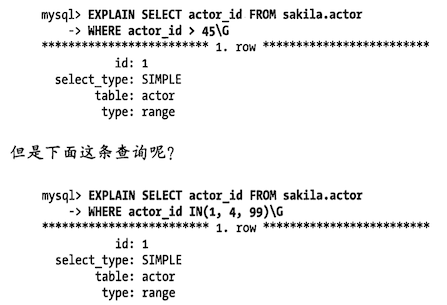

# 索引案例学习

理解索引最好的办法是结合示例，这里准备了一个。

假设要设计一个在线约会网站，用户信息表有很多列，包括国家、地区、城市、性别、眼睛颜色等等。

- 必须支持上面这些特征的各种组合来搜索用户
- 还必须允许根据用户的最后在线时间、其他会员对用户的评分等对用户进行排序并对结果进行限制

如何设计索引满足上面复杂需求呢？

第一件需要考虑的事情是：需要使用索引来排序，还是先检索数据再排序。**使用索引排序会严格限制索引和查询的设计**。例如：希望使用索引根据其他会员对用户的评分排序，则 where 条件中的 `age between 18 and 25` 就无法使用索引。如果 MySQL 使用某个索引进行范围查询，也就无法再使用另一个索引（或则是该索引的后续字段）进行排序了。如果这是很常见的 where 条件，那么我们当然就会认为很多查询需要做排序操作（例如文件排序 filesort）

## 支持多种过滤条件

现在需要看看那些列拥有很多不同的取值，哪些列在 where 子句中出现得最频繁。因为可以让 MySQL 更有效的过滤掉不需要的行。

country 列的选择性通常不高，但可能很多查询都会用到。sex 列的选择性肯定很低，但也会在很多查询中用到。所以考虑到使用的频率，还是建议在创建不同组合索引的时候将 `(sex,country)` 列作为前缀。

但是根据传统的经验不建议在选着性低的列上创建索引，这里选择了两个选着性很低的字段作为索引的前缀列，原因有两点：

1. 几乎所有的查询都会用到 sex 列，甚至会把网站设计成每次都只能按某一种性别搜索用户
2. 索引中加上这一列也没有坏处，即使查询没有使用 sex 列，也可以通过下面的诀窍绕过

诀窍是：如果某个查询不限制性别 ，那么可以通过在查询条件中 **新增 `and sex in('m','f')` 来让 MySQL 选择该索引**。如果在某些场景中，列有太多不同的值，就会让 in 列表太长，就不适合这种方法。

这个案例显示了一个基本原则：**考虑表上所有的选项**。当设计索引时，不要只为现有的查询考虑需要哪些索引，还需要考虑对查询进行优化。如果发现某些查询需要创建新索引，但是这个索引又会降低另一些查询的效率，那么应该想一下是否能优化原来的查询。**应该同时优化查询和索引找到最佳的平衡**，而不是闭门造车去设计最完美的索引。

接下来，需要考虑其他常见 where 条件的组合，并需要了解哪些组合在没有合适索引的情况下回很慢。`(sex,country,age)` 上的索引就是一个很明显的选择，另外很有可能还需要 `(sex,country,region,age)` 和 `(sex,country,region,city,age)` 这样的组合索引。

这样就会需要大量的索引。如果想尽可能 **重用索引** 而不是建立大量的组合索引，可以使用前面提到的 `in()` 技巧来避免同时需要 `(sex,country,age)` 和 `(sex,country,region,age)` 的索引。如果没有指定这个字段搜索，就需要定义一个全部国家列表，或则国家全部地区列表，来确保索引前缀有同样的约束（组合所有国家、地区、性别将会是一个非常大的条件）。

这些索引将满足大部分最常见的搜索，但是如何为一些生僻的搜索条件（比如 has_pictures、eye_color、hair_color 和 education）来设计索引呢？这些 **列的选择性高、使用也不频繁** 可以选择忽略他们。让 MySQL 多扫描一些额外的行即可。另外一个可选的方法是在 age 列的前面加上这些列，在查询的时候使用 `in` 来处理。

你可能已经注意到，我们一直 **将 age 列放在索引的最后面**，是因为我们总是尽可能让 MySQL 使用更多的索引列，**因为查询只能使用索引的最左前缀**，直到遇到第一个范围条件列。前面提到的列在 where 子句中都是等于条件，但是 age 列多半是范围查询（例如查找年龄在 18~25 岁之间的人）

当然，也可以使用 in 来代替范围查询，例如将条件改写为 `in(18,19,20,21,22...)`，但不是所有的查询都可以转换。这里描述的基本原则是：**尽可能将需要做范围查询的列放到索引的后面**，以便优化器能使用尽可能多的索引列。

前面提到可以用 in 的方式覆盖那些不在 where 子句中的列。但是这种技巧不能滥用，否则可能会带来麻烦。因为 **每额外增加一个 in() 条件，优化器需要做的组合都将以指数形式增加**，最终可能会极大的降低查询的性能。考虑下面的 where 子句

```sql
where eye_color  in('brown','blue','hazel')
	and hair_color in('black','red','blonde','brown')
	and sex				 in('M','F')
```

优化器则会转化成 `4x3x2 =24` 种组合，执行计划需要检查 where 子句中偶有的 24 种组合。对于 MySQL 来说 24 种不是很夸张，但如果组合数达上千则需要特别小心。老版本查询优化需要花很多时间，并消耗大量内存。新版本在组合数超过一定数量后就不再执行计划评估了，这 **可能会导致 MySQL 不能很好的利用索引**。

## 避免多个范围条件

假设有一个 last_online 列并希望通过下面的查询显示过期几周上线过的用户

```sql
where eye_color  in('brown','blue','hazel')
	and hair_color in('black','red','blonde','brown')
	and sex				 in('M','F')
	and last_online > date_sub(now(), interval 7 day)
	and age				 between 18 and 25
```

什么是范围条件？从 explain 的输出很难区分 MySQL 是要查询范围值还是查询列表值。explain 使用同样的词 `range` 来描述这两种情况。



可以看到从 explain 无法区分这两者的。但是可以从值的范围和多个等于条件来得出不同。在我们看到，第二个查询就是多个等值条件查询。

**这两种访问效率是不同的**：

- 对于范围条件查询：MySQL 无法再使用范围列后面的其他索引列了
- 对于多个等值条件查询：则没有这个限制

这个查询有一个问题：它有两个范围条件，last_online 和 age 列。**MySQL 可以使用其中一个，但无法同时使用**。

对于上述两个范围查询没有一个直接的办法能够解决，但是可以 **将其中一个范围查询转换为简单的等值比较**：last_online 列就是需要 7 天内登陆过的，可以新增一个 active 列，该字段有定时任务来维护，当用户每次登陆时，将对应值设置为 1，并且将过去连续 7 天未登陆的用户值设置为 0。

这个方法可以让 MySQL 使用 `(active,sex,country,age)` 索引。active 列并不是完全精确的，但是对于这类查询来说，对精度要求不是那么高。如果需要精确数据，可以把 last_online 列放到 where 子句中，但不加入到索引中。这和前面计算 URL 哈希值来实现 URL 的快速查找类似。

到目前为止，我们可以看到：如果用户希望同时看到活跃和不活跃的用户，可以在查询中使用 `in()` 列表。我们已经加入了很多这样的列表，但另外一个可选的方案就只能是为不同的组合列创建单独的索引。只要需要建立如下的索引：

- `(active,sex,country,age)`
- `(active,country,age)`
- `(sex,country,age)`
- `(country,age)`

这些索引对某个具体的查询来说可能都是更优化的，但是考虑到索引的维护和额外的空间占用的代价，这个可选方案就不是一个好策略了。

在这个案例中，**优化器的特性是影响索引策略的一个很重要的因素**。如果未来版本的 MySQL 能够实现松散索引扫描，就能在一个索引上使用多个范围条件，那也就不需要为上面考虑这类查询使用 `int()` 列表了。

## 优化排序

使用文件排序对数据集是很快的，但如果一个查询匹配的结果有上百万行的话会怎样？例如如果 where 子句只有 sex 列，如何排序？

对于 **那些选择性非常低的列，可以增加一些特殊的索引来做排序**。例如：可以创建 `(sex,rating)` 索引用于下面的查询：

```sql
select <cols> from profiles where sex='M' order by rating limit 10;
```

这个查询同时使用了 order by 和 limit，如果没有索引的话会很慢。

即使有索引，如果用户界面上需要翻页，并且翻页到比较靠后时查询也可能非常慢。下面这个查询就通过 order by 和 limit 偏移量的组合翻页到很后面的时候

```sql
select <cols> from profiles where sex='M' order by rating limit 100000,10;
```

**无论如何创建索引，这种查询都是个严重的问题**。因为：随着偏移量的增加，MySQL **需要花费大量的时间来扫描需要丢弃的数据**。反范式化、预先计算和缓存可能是解决这类查询的 **仅有策略**。一个更好的办法是限制用户能够翻页的数量，实际上这对用户体验影响不大，因为很少有用户会在乎搜索结果的第 10 万页。

### 延迟关联

优化这类索引的另一个比较好的策略是使用 **延迟关联**：

1. 通过使用覆盖索引查询返回需要的主键
2. 再跟进这些主键关联原表获得需要的行

这可以减少 MySQL 扫描那些需要丢弃的行数。下面这个查询显示了如何高效使用 `(sex,rating)` 索引进行排序和分页：

```sql
select <cols> from profiles inner join(
	select <primary key cols> from profiles
  where x.sex='M' order by rating limit 100000,10
)as x using(<primary key cols>)

-- using 和 on 类似，只是使用两个列名相同的进行关联
```

这里的延迟关联为什么能解决减少需要丢弃的行？（前面有一个专门利用 [覆盖索引使用解延迟关联](03.md#覆盖索引好处) 的小节）。 这里利用了 **覆盖索引，不用回表**，性能高了很多，只返回了 10 条数据的 ID，再回表去查询数据。就快了很多了

