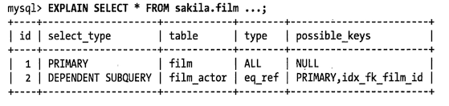
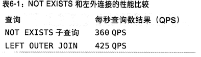
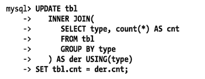

# MySQL 查询优化器的局限性

MySQL 的万能「嵌套循环」并不是对每种查询都是最优的。不过还好，只对少部分查询不适用，我们往往可以通过改写查询让 MySQL 高效的完成工作。

在 MySQL 5.6+ 后，会消除很多 MySQL 原本的限制，让更多的查询能够以尽可能的效率完成。

## 关联子查询

MySQL 的子查询实现非常糟糕。**最糟糕的一类查询** 是 where 条件中包含 ** `in()` 的子查询语句**。

比如：希望找到演员 Penelope Guiness（actor_id =1） 参演过的所有影片信息，我们会按照下面的方式用子查询实现：

```sql
select *
from sakila.film
where film_id in (select film_id from sakila.film_actor where actor_id = 1);
```

因为 MySQL 对 in 列表中的选项有专门的优化策略，一般会认为 MySQL 会先执行子查询返回所有包含 actor_id 为 1 的 film_id。 一般来说，in 列表查询速度很快，所以我们会认为上面的查询会这样执行：

```sql
-- select film_id from sakila.film_actor where actor_id = 1
-- 1,23...
select *
from sakila.film
where film_id in (1,23...);
```

很不辛 MySQL 不是这样做。会将相关的外层表压到子查询中，它认为这样可以更高效率找到数据行。也就是说，会改写成下面的样子

```sql
select * from sakila.film
where exists(
  select film_id from sakila.film_actor where actor_id = 1
  and film_acrot.film_id = film.film_id;
)
```

这时，子查询需要根据 film_id 来关联外部表 film，因为需要 film_id 字段，所以 MySQL 认为无法执行这个子查询。可以看到计划如下（Mysql 8 中已经按照上面所想的思路执行了）



可以看到先对 film 表全表扫描，然后根据 film_id 逐个执行子查询。可以改写成下面的语句来 更改这种行为

```sql
select film.*
from sakila.film
         inner join sakila.film_actor using (film_id)
where actor_id = 1;
```

另一个优化的办法使用函数 `group_concat()` 在 `in()` 中构造一个由逗号分隔的列表。有时这比上面的使用关联改写更快。因为使用 `in()` 加子查询，性能经常会非常糟糕。所以通常建议使用 `exists()` 等效的改写查询来获取更好的效率。如下面的改写

```sql
select *
from sakila.film
where exists(
              select * from sakila.film_actor where actor_id = 1 and film_actor.film_id = film.film_id
          )
```

### 如何用好关联子查询

**并不是所有关联子查询的性能都会很差**。先测试，然后做出自己的判断。很多时候，关联子查询时一种非常合理、自然、甚至是性能最好的写法。我们看看下面的例子

```sql
explain
select film_id, language_id
from sakila.film
where not exists(
        select * from sakila.film_actor where film_actor.film_id = film.film_id
    )
```

| id | select\_type | table | partitions | type | possible\_keys | key | key\_len | ref | rows | filtered | Extra |
| :--- | :--- | :--- | :--- | :--- | :--- | :--- | :--- | :--- | :--- | :--- | :--- |
| 1 | PRIMARY | film | NULL | index | NULL | idx\_fk\_language\_id | 1 | NULL | 1000 | 100 | Using where; Using index |
| 2 | DEPENDENT SUBQUERY | film\_actor | NULL | ref | idx\_fk\_film\_id | idx\_fk\_film\_id | 2 | sakila.film.film\_id | 5 | 100 | Using index |

一般使用左外连接改写该查询，以代替子查询。理论上，执行计划不会改变：

```sql
explain
select film_id, language_id
from sakila.film
         left outer join sakila.film_actor using (film_id)
where film_actor.film_id is null;
```

| id | select\_type | table | partitions | type | possible\_keys | key | key\_len | ref | rows | filtered | Extra |
| :--- | :--- | :--- | :--- | :--- | :--- | :--- | :--- | :--- | :--- | :--- | :--- |
| 1 | SIMPLE | film | NULL | index | NULL | idx\_fk\_language\_id | 1 | NULL | 1000 | 100 | Using index |
| 1 | SIMPLE | film\_actor | NULL | ref | idx\_fk\_film\_id | idx\_fk\_film\_id | 2 | sakila.film.film\_id | 5 | 100 | Using where; Not exists; Using index |

可以看到，这里的执行计划基本一样，下面是一些微小的的区别：

- 表 film_actor 访问类型

  - dependent subquery：子查询
  - simple：普通查询

  是由于语句的解法导致的，这对底层存储引擎接口来说，没有任何不同。

- 对 film 表

  第 2 个差 Extra 没有 `Using where`，但这部重要，第二个查询的 Using 子句和第个查询的 where 子句实际上是完全一样的。

- 在第二个表 film_actor 的执行计划的  Extra 有 `Not exists`

  这是前面提到过的 **提前终止算法** , MySQL 通过使用提前终止算法来避免在 film_actor 的索引中读取任何额外的行。这完全等效于直接编写 `not exists` 子查询，这个执行计划中也是一样，一旦匹配到一行数据，就立刻停止扫描

所以，从理论上将，MySQL 将使用完全相同的执行计划来完成这个查询。现实世界中，我们建议通过一些测试来判断使用哪种写法会更快。



  我们测试使用子查询要慢一点。不过不是绝对的，每个具体的案例各有不同。例如：当返回结果中只有一个表中的某些列的时候。听起来，这种情况对于关联查询效率也会很好。具体情况具体分析。

例如：希望返回所有包含同一个演员参演的电影，因为一个电影会有很多演员参演，所以可能会有一些重复记录

```sql
select film.film_id
from sakila.film
         inner join sakila.film_actor using (film_id)
```

我们需要使用 distinct 或 group by 来移除重复的记录

```sql
select distinct film.film_id
from sakila.film
         inner join sakila.film_actor using (film_id)
```

但是，回头来看看，这个查询返回的结果集意义是什么？至少这样写会让 SQL 的意义很不明显。如果使用  exists 则很容易表达「包含同一个参演演员」的逻辑，而不需要使用 distinct 和 group by，也不会产生重复的结果集。我们知道，一旦使用了 distinct 和 group by，那么在查询的执行过程中，通常需要产生临时中间表。下面，我们用子查询的写法替换上面的

```sql
select film.film_id
from sakila.film
where exists(
              select * from sakila.film_actor where film.film_id = film_actor.film_id
);
```


在这个案例中，我们看到子查询速度要快一些。

通过上面这个案例，主要想说明两点：

1. 不需要听取那些关于子查询的「绝对真理」
2. 应该用测试来验证对子查询的执行计划和响应时间的假设。

最后关于子查询需要提到的是一个 MySQL 的  bug，在 5.1.48 之前版本中，下面的写法会锁住 table2 中的一条记录

```sql
select ... from table1 where col = (select ... from table2 where ...);
```

如果遇到该 bug，子查询在高并发情况下的性能，就会和在单线程测试时的性能相差甚远。

虽然该问题已经修复了，我们任然要记住：不要主观猜测，应该通过测试来验证猜想

## union 的限制

有时候，**MySQL 无法将限制条件从外层「下推」到内存**，这使得原本能够限制部分返回结果的条件无法应用到内层查询的优化上。

如果希望 union 的各个子句能够 **根据 limit 值只取部分结果集**，或则希望 **能先排好序再合并结果集**的话，就需要在 union 的各个子句中分别使用这些子句。

例如：将两个子查询结果联合起来，然后再取前 20 条记录，那么 MySQL 会将两个表都存放到同一个临时表中，然后在取出 20 行记录

```sql
(
    select first_name, last_name
    from sakila.actor
    order by last_name
)
union all
(
    select first_name, last_name
    from sakila.customer
    order by last_name
)
limit 20;
```

这条查询会把 actor 中的 200 条记录和 customer 表中的 599 条记录存放在一个临时表中，然后再从临时表中取出钱 20 条。可以通过在 union 的两个子查询中分别加上一个 limit 20 来减少临时表中的数据

```sql
(
    select first_name, last_name
    from sakila.actor
    order by last_name
  	limit 20
)
union all
(
    select first_name, last_name
    from sakila.customer
    order by last_name
  	limit 20
)
limit 20;
```

现在临时表中只包含 40 条记录了，除了性能考虑之外，在这里还需要注意一点：从临时表中取出数据的顺序并不是一定的，所以如果想获得正确的顺序，还需要加上一个全局的 order by 和 limit 的操作。

## 索引合并优化

在前面讨论过了，在 5.+ 版本，**当 where 子句中包含多个复杂条件的时候**，MySQL 能够访问单个表的多个索引以合并和交叉过滤的方式来定位需要查找的行。

## 等值传递

某些时候，等值传递会带来一些意想不到的的额外消耗。

例如：有一个非常大的 `in()` 列表，而 MySQL 优化器发现存在 where、on 或 using 子句，将整个列表的值和另一个列表的某个列相关联。

那么优化器会 **将 `in()` 列表都复制应用到关联的各个表中**。通常，因为各个表新增了过滤条件，优化器可以更高效的从存储引擎过滤记录。但是如果这个列表非常大，则会导致优化和执行都会变慢。

在写作本书的时候，除了修改 MySQL 源码，还没有办法能绕过这个问题（不过这个问题很少遇到）

## 并行执行

**MySQL 无法利用多核特性来并行执行查询**。很多其他的关系型数据库能够提供这个特性，但是 MySQL 做不到。这里特别指出是想告诉读者不要花时间去尝试寻找并执行查询的方法。

## 哈希关联

在本书写作的时候，MySQL 并不支持哈希关联，MySQL 的所有关联都是嵌套循环关联。不过，可以通过建立一个哈希索引来曲线实现哈希关联。**如果使用的是 Memory 存储引擎，则索引都是哈希索引**，所以关联的时候也类似与哈希关联。可以参考 [第 5 章的创建自定义哈希索引部分](../05/01.md#哈希索引的限制)。另外，MariaDB 已经实现了真正的哈希关联。

### 松散索引扫描

松散索引扫描：相当于 Oracle 中的跳跃索引扫描（skip index scan）

由于历史原因，**MySQL 并不支持松散索引扫描**，也就 **无法按照不连续的方式扫描一个索引**。通常，MySQL 的 **索引扫描需要先定义一个起点和终点**，即使需要的数据只是这段索引中很少数的几个，MySQL 仍需要扫描这段索引中每一个条目。

下面通过一个示例说明这点，假设我们有如下的索引 `(a,b)`，有下面的查询

```sql
select ... from tb1 where b between 2 and 3;
```

因为索引前导字段是列 a，但是在查询中只指定了字段 b，MySQL 无法使用这个索引，从而只能通过全表扫描找到匹配的行。如下图所示：


**了解索引的物理结构的话**，不难发现还可以有一个更快的方法执行上面的查询。**索引的物理结构（不是存储引擎的 API）** 使得可以先扫描 a 列第一个值对应的 b 列的范围，然后再跳到 a 列第二个不同值扫描对应 b 列的范围。下面图展示了如果由 MySQL 来实现这个过程会怎样


注意到，这时候就无需再使用 where 子句过滤，因为松散索引扫描已经跳过了所有不需要的记录。

笔者没有看懂上面的例子。

上面是一个简单的例子，除了松散索引，新增一个合适的索引当然也可以优化上述查询。但对于某些场景，增加索引是没用的，例如：对于第一个索引列是范围条件，第二个索引列是等值的查询，靠增加索引就无法解决问题。

**MySQL 5+ 在某些特殊场景下是可以使用松散索引的。** 例如，在一个分组查询中需要找到分组的最大值和最小值

```
explain
select actor_id, max(film_id)
from sakila.film_actor
group by actor_id
```

| id | select\_type | table | partitions | type | possible\_keys | key | key\_len | ref | rows | filtered | Extra |
| :--- | :--- | :--- | :--- | :--- | :--- | :--- | :--- | :--- | :--- | :--- | :--- |
| 1 | SIMPLE | film\_actor | NULL | range | PRIMARY,idx\_fk\_film\_id | PRIMARY | 2 | NULL | 201 | 100 | Using index for group-by |

`Using index for group-by` 表示使用松散索引扫描，不过如果 MySQL 能写上 `loose index probe` ，相信会更好理解。

在 MySQL 很好的支持松散索引扫描之前，一个简单的 **绕过问题的办法就是给前面的列加上可能的常数值**。

在 MySQL 5.6 之后，关于松散索引扫描的一些限制将会通过「索引条件下推（index condition pushdown）」的方式解决

## 最大值和最小值

对于 `min() 和 max()` 查询，MySQL 优化做的并不好。这里有一个例子

```sql
select min(actor_id)
from sakila.actor
where first_name = 'PENELOPE';
```

因为 fist_name 字段上没有索引，因此 MySQL 将会进行一次全表扫描。如果 MySQL 能够进行主键扫描，那么理论上，当 MySQL 读到第一个满足条件的记录的时候，就是我们需要找到的最小值了，因为主键是严格按照 actor_id 字段的大小顺序排列的。但是 MySQL 这时只会做全表扫描，我们可以通过  `show status` 的全表扫描计数器来验证这一点。一个曲线优化方法是移除 `min()`，然后使用 limit 来重新查询

```sql

select actor_id
from sakila.actor use index (`PRIMARY`)
where first_name = 'PENELOPE'
limit 1;
```

## 在同一个表上查询和更新

**MySQL 不允许对同一张表同时进行查询和更新**、 这其实并不是优化器的限制，如果清楚 MySQL 是如何执行查询的，就可以避免这种情况。

下面是一个无法运行的 SQL，虽然这是一个符合标准的 sql 语句。这个 sql 语句尝试将两个表中相似行的数据记录到字段 cnt 中


可以通过使用生成表的形式来绕过上面的限制，因为 MYSQL 只会把这个表当做一个临时表来处理。实际上，这执行了两个查询：

- 子查询中的 select 语句
- 多表关联 update 只是关联的表示一个临时表

子查询会在 update 语句打开表之前就完成，所以下面的查询将会正常执行



