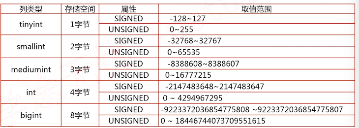

# 数据库设计

先是「业务分析」，然后进行「逻辑表设计」，再为字段选择合适的「数据类型」和一个良好的「对象命名」，最后在数据库中「建立库表」

本章以慕课网「免费课程」来进行实战的对象（不一定是慕课现在使用的方案）

## 实战项目需求分析


以下信息请自己打开对应的页面，或对应上述的截图进行对应查看。

进入上面的页面，可以分析出：

1. 条件筛选：方向、分类、难度

2. 课程信息：

   列表页中：主标题、副标题、图标、学习的人数。

   进入详情页后：学习难度、时长、学习人数、综合评分、讲师等信息。

   章节列表：名称、说明、小节名称、小节时长

3. 讲师信息：点击讲师信息后的页面

    性别、省份、职业、描述、经验、积分、关注、粉丝。还有讲师所讲课程列表

4. 问答评论

   评论类型：评论、问答，未解决、精华标识信息；问答标题、浏览数量、关联的章节信息等。

5. 同学笔记

   昵称（用户信息）、关联的章节、内容、发布时间等信息

6. 用户信息：点击用户的头像，查看有哪些信息

   可以看到与讲师信息类似

7. 用户评价

   对课程的评分、评价、评论内容、评论时间等信息

## 实战项目需求总结

业务分析总结，有上述观察总结出入下信息：

某课网免费课程前端项目：

- 课程的属性：`{主标题、副标题、方向、分类、难度、最新、最热、时长、简介、人数、需知、收获、讲师名、讲师职位、课程图片、综合评分、内容实用、简洁易懂、逻辑清晰}`
- 课程列表属性：`{章节名、小节名、说明、小节时长、章节 URL、视频格式}`
- 讲师属性：`{讲师昵称、密码、性别、省、市、职位、说明、经验、积分、关注人数、粉丝人数}`
- 问答评论属性：`{类型、标题、内容、关联章节、浏览量、发布时间、用户昵称}`
- 同学笔记：`{用户昵称、关联章节、笔记标题、笔记内容、发布时间}`
- 用户属性：`{用户昵称、密码、说明、性别、省、市、职位、说明、经验、积分、关注人数、粉丝人数}`
- 评价属性：`{用户、课程主标题、内容、综合评分、内容实用、简洁易懂、逻辑清晰、发布时间}`

以上是项目的所有涉及到的对象属性，下面开始表逻辑设计

## 宽表模式

宽表模式：字面意思上来讲，一行数据的列比较多，则为宽表；（实际是把不同的内容放到同一张表中）

以「课程属性」来看，至少有 19 个左右的属性，把这些属性都放在「课程表」中，那么这就是一个宽表了。那么这就要考虑这样存储是否会有一些问题了？

| 主标题         | 副标题                               | 方向   | 分类  | 难度 | 讲师名   | 讲师职位 | 综合评分 | ...  |
| -------------- | ------------------------------------ | ------ | ----- | ---- | -------- | -------- | -------- | ---- |
| MySQL 面试指南 | 中高级 IT 开发人员晋升加薪的必备佳品 | 数据库 | MySQL | 中级 | sqlsercn | 高级 DBA | 10       |      |
| MyCat + MyCat  | MyCat 高可用数据库架构               | 数据库 | MySQL | 中级 | sqlsercn | 高级 DBA | 10       |      |
| MySQL 架构设计 | 高性能可扩展 MySQL 架构设计与优化    | 数据库 | MySQL | 中级 | sqlsercn | 高级 DBA | 9.15     |      |


### 宽表模式存在的问题

- 数据冗余：相同的数据在一个表中出现了多次

  比如：可以看到上表中有很多重复的数据，比如：讲师名、职位。

  缺点：占用更多的存储空间、数据维护时需要维护多次

- 数据更新异常：修改一行中某列的值时，同时修改了多行数据

  这个其实还是数据维护时需要维护多次的问题，比如：

  ```sql
  update 课程表 SET 讲师职位 = ‘MySQL 架构师’ where 讲师名 = ‘sqlercn’
  # 上述语句会更新到多行语句，如果把 主标题作为 主键 sql 变为
  update 课程表 SET 讲师职位 = ‘MySQL 架构师’ where 讲师名 = ‘sqlercn’ and 主标题 = ‘MySQL 面试指南’
  # 这就会造成其他数据中的讲师职位数据不一致的问题
  # 同时还会带来其他的问题：如主键不能为 null 的问题
  ```

- 数据插入异常：部分数据由于缺失主键信息而无法写入表中

  比如：方向一列在页面中赛选项时的展示，不止有数据库，如果想要新增一个方向「后端开发」，但是还没有后端的课程，使用如下 sql

  ```sql
  INSERT INTO 课程表(方向) VALUES('后端开发')
  # 由于主键是主标题：这里就无法只插入 方向 数据了
  ```

- 数据删除异常：删除某一数据时不得不删除另一数据

  类似的，要删除一个方向，使用如下语句

  ```sql
  DELETE FROM 课程表 方向 = ‘数据库’
  ```

  这就把其他的数据也删除了

宽表有这么多的异常，其实只是宽表不适合我们这里的业务场景

### 宽表模式的应用场景

配合列存储的数据报表应用：不同的内容冗余在每行数据中，不需要关联多表查询，性能上有一定的优势

那么这里我们的业务需求不适合使用宽表，要怎么来设计呢？其实数据库的设计有一定的规则来参考的

## 数据库设计范式

一般来说只要符合前 3 个范式，一般就足够了

### 第一范式

表中的所有字段都是不可再分的

比如用户表中的联系方式

```sql
姓名 |  性别	|							联系方式
						 | 手机		| 固话		| 邮箱
张三 |	男		 | 123		| 456		 | 789@qq.com			
```

联系方式是一个符合属性，这是在数据库中无法创建出来的。可以进行拆分

```
姓名 |  性别	|	 手机		| 固话		| 邮箱
```

每一列都无法再分了，满足了第一范式的要求，通常来说：第一范式的表都是标准的「二维表」

那么我们设计的表，在满足第一范式的基础上，还需要满足第二范式，它是在第一范式的基础之上定义的

### 第二范式

表中必须存在业务主键，并且非主键依赖于 **全部** 业务主键

上述定义分成两段：

- 第一段关键词「业务主键」：可以通过该主键定位出唯一的一行数据

- 第二段：如果使用的是「复合组件」，比如使用「姓名、手机号」能定位到唯一一行数据，那么除了这两列以外的数据，都必须要遵守这两列的定义，不能只符合姓名或则手机号。

一个拥有良好逻辑的表，还要符合第三范式，同样是在前两范式基础上定义的

### 第三范式

表中的非主键列之间不能相互依赖

这个这样来理解

| 主标题( PK)    | 副标题                               | 方向   | 分类  | 难度 | 讲师名   | 讲师职位 | 综合评分 | ...  |
| -------------- | ------------------------------------ | ------ | ----- | ---- | -------- | -------- | -------- | ---- |
| MySQL 面试指南 | 中高级 IT 开发人员晋升加薪的必备佳品 | 数据库 | MySQL | 中级 | sqlsercn | 高级 DBA | 10       |      |

如果指定为主标题为主键，每一本书有独一无二的名称，这个是满足第 2 范式的。那么其他的列，比如 讲师职位依赖了讲师名称，毕竟，先由讲师，才能给讲师对应的职位，他们之间有了相互依赖。

要解决这个问题，就是将有冲突的列独立出去，比如这里独立为一个讲师表

```sql
												课程表																						讲师表
主标题(pk) | 副标题	| 方向	|	分类	|	难度	|	讲师名	|	综合评分				讲师名（PK） | 讲师职位
```

## 面向对象设计

那么根据数据库三范式，来对我们的项目属性进行建模

::: tip
特别注意：这里是一个过程，并不是最终的表结构，还会不断的优化
:::

### 课程对象逻辑建模

课程的属性：`{主标题、副标题、方向、分类、难度、最新、最热、时长、简介、人数、需知、收获、讲师名、讲师职位、课程图片、综合评分、内容实用、简洁易懂、逻辑清晰}`

由我们在页面上看到的字段进行三范式的分析，得到一个合理的表结构

- 课程表：`{主标题（pk）、副标题、方向、分类、难度、上线时间、学习人数、时长、简介、人数、需知、收获、讲师昵称、课程图片、综合评分、内容实用、简洁易懂、逻辑清晰}`
  - 最新 ：上线时间，可通过排序计算得到
  - 最热 ：学习人数，可通过排序计算得到
  - 讲师信息：通过讲师昵称关联讲师表

- 讲师表：`{讲师昵称（pk）、讲师职位}`

- 课程方向表：`{课程方向名称（pk），添加时间}`

- 课程分类表：`{分类名称（pk）、添加时间}`

  记录课程分类表

- 课程难度表：`{课程难度（pk），添加时间}`

  维护课程难易程度分级

### 课程列表对象逻辑建模

课程列表属性：`{章节名、小节名、说明、小节时长、章节 URL、视频格式}`

先来分析，如果使用一张表来装下以上属性，要选一个主键的话，需要选择「章节名、小节名」作为复合组件，那么

- 说明属性：只与章节名有关系
- 小节时长、章节 URL、视频格式：只与小节名有关系

显然是不满足第二范式的（其他非业务组件必须与其都有关系），那么如下分裂：

- 课程章节表：`{课程章节名（pk）、说明、章节编号}`
- 课程同章节的关系表：`{课程名称、课程章节名称}`
- 课程小节表：`{小节名称（pk）、小节视频 URL、视频格式、小节时长、小节编号}`
- 课程章节同课程小节表的关系表：`{课程主标题、课程章节名、小节名}`

### 讲师对象逻辑建模

讲师属性：`{讲师昵称、密码、性别、省、市、职位、说明、经验、积分、关注人数、粉丝人数}`

这里选择「讲师昵称」作为主键，然后再分析下其他属性是否有相互依赖的关系。结果发现没有：

讲师表：`{讲师昵称（pk）、密码、性别、省、市、职位、说明、经验、积分、关注人数、粉丝人数}`

在课程对象中已经分出来一个讲师表，只有两个字段，也都包含在此表中了，另外，用户信息对象和讲师表类似，先来分析下用户信息对象

### 用户对象逻辑建模

用户属性：`{用户昵称、密码、说明、性别、省、市、职位、说明、经验、积分、关注人数、粉丝人数}`

与讲师基本类似，且讲师为一个特殊的用户，所以可以合并为一个用户表：

用户表：`{用户昵称（pk）、密码、说明、性别、省、市、职位、说明、经验、积分、关注人数、粉丝人数，讲师标识}`

### 问答评论对象逻辑建模

问答评论属性：`{类型、标题、内容、关联章节、浏览量、发布时间、用户昵称}`

从以上属性选择一项作为唯一标识比较合适？最优可能是就是标题了，但是无法保证没有重复的标题。需要使用 `{标题、用户昵称、关联章节}` 来作为一个复合组件，但是 「关联章节」需要使用 `课程主标题、课程章节名、小节名` 来描，形成如下的表结构：

问答评论表：`{（标题、用户昵称、课程主标题、课程章节名、小节名）（pk）类型、内容、浏览量、发布时间，父评论}`

上表很怪异，且有很多数据冗余，如用户信息、课程信息、章节信息；新增的父评论：因为评论是可以被回复的；

同样与上表结构类似的有同学笔记

### 同学笔记对象逻辑建模

同学笔记：`{用户昵称、关联章节、笔记标题、笔记内容、发布时间}`

同学笔记表：`{（标题、用户昵称、课程主标题、课程章节名、小节名）（pk）内容、发布时间}`

### 评价对象逻辑建模

评价属性：`{用户、课程主标题、内容、综合评分、内容实用、简洁易懂、逻辑清晰、发布时间}`

课程评分通过三个维度：简洁易懂、逻辑清晰、发布时间 评分，最后可以的得到一个综合评分，评价是针对课程来进行的，所以可以选用 「用户、课程主标题」作为主键，标识出一个用户对一个课程的评价数据，其他属性也是与之进行关联的。那么评价表的结构如下

评价表：`{(用户、课程主标题)(pk)、内容、综合评分、内容实用、简洁易懂、逻辑清晰、发布时间}`

发现一个问题：只有用户选择了这门课程，才能进行评价。因此还需要一个用户与课程的关联关系表

用户选课表：`（用户昵称、课程主标题）（pk）、选课时间、累积听课时长`

### 逻辑设计总结

到这里对本章的所有涉及到的属性需求进行数据库三范式进行了拆分涉及，总结如下

与课程相关的表：

- 课程表（课程主表）：`{主标题（pk）、副标题、方向、分类、难度、上线时间、学习人数、时长、简介、人数、需知、收获、讲师昵称、课程图片、综合评分、内容实用、简洁易懂、逻辑清晰}`

- 课程章节表：`{课程章节名（pk）、说明、章节编号}`
- 课程同章节的关系表：`{课程名称、课程章节名称}`
- 课程小节表：`{小节名称（pk）、小节视频 URL、视频格式、小节时长、小节编号}`
- 课程章节同课程小节表的关系表：`{课程主标题、课程章节名、小节名}`

另外为课程新增了字典数据表：

- 课程方向表：`{课程方向名称（pk），添加时间}`

- 课程分类表：`{分类名称（pk）、添加时间}`

- 课程难度表：`{课程难度（pk），添加时间}`

与用户有关的表：

- 用户表：`{用户昵称（pk）、密码、说明、性别、省、市、职位、说明、经验、积分、关注人数、粉丝人数，讲师标识}`
- 问答评论表：`{（标题、用户昵称、课程主标题、课程章节名、小节名）（pk）类型、内容、浏览量、发布时间，父评论}`
- 同学笔记表：`{用户昵称、关联章节、笔记标题、笔记内容、发布时间}`
- 评价表：`{(用户、课程主标题)(pk)、内容、综合评分、内容实用、简洁易懂、逻辑清晰、发布时间}`
- 用户选课表：`（用户昵称、课程主标题）（pk）、选课时间、累积听课时长`

## 范式化设计结果思考

以上根据数据库的三范式设计出来了 13 张表。这样是否合理了？这就需要来思考一些场景使用（这里可以套用一些在页面上展示出来的功能）：

**如何获取一门课程包括所有章节和小节的信息？**

这里所需要的信息，分别存放在 `课程表、章节表、小节表` 且为还需要使用 `课程章节表关联关系表、章节表与小节表关联关系表`，一共需要关联 5 张表。

对于数据库性能来说，关联越多的表，性能越差，而且在使用场景上来看，每个用户要学习课程，点击进入的课程信息页面，就需要获取一次，这个场景应该是比较频繁的。

虽然我们按照范式化完成了对表结构的设计，但是出于对业务查询性能的考虑，还需要范式化设计的表进行优化，通常优化后的表或多或少的会违反一些范式化的规定和冗余一些信息，这种方式叫做 **反范式化设计**

在进行反范式化设计时，多数是使用以 **空间换时间**

## 反范式化设计

### 课程章节表的反范式化设计

课程表 与 章节表的关系：`课程表 1 ----> N 章节表`，一个课程有多个章节。

- 课程章节表：`{课程章节名（pk）、说明、章节编号}`
- 课程同章节的关系表：`{课程名称、课程章节名称}`

可将上面两张表合并为一个表：

课程章节表：`{（课程章节名、课程章节名称）（pk）、说明、章节编号}`

虽然看似违反了 _第三范式_，但是在一个 **频繁查询的表** 上使用反范式设计，能让我们少关联一张表，提高了查询性能，还是很划算的

###  课程小节表反范式化设计

同样类似的：`课程章节表 1 ------> N 课程小节表`，一个章节表可以有多个课程小节。

- 课程小节表：`{小节名称（pk）、小节视频 URL、视频格式、小节时长、小节编号}`
- 课程章节同课程小节表的关系表：`{课程主标题、课程章节名、小节名}`

合并之后的表为：

课程小节表：`{（课程主标题、课程章节名、小节名称）（pk）、小节视频 URL、视频格式、小节时长、小节编号}`

### 反范式化设计总结

现在再来看：**如何获取一门课程包括所有章节和小节的信息？**

现在只需要关联：课程表、课程章节表、课程小结表 ，使用三张表就可以了

以上举例，如何从一个范式化设计中进行反范式化设计优化，**目的是为了减少查询时关联表的数量，提高查询性能**

就是说不能过度范式化和反范式化设计，那么如何度量呢？**取决于我们关联表的数量**

由于只对课程相关表进行了反范式化设计，课程相关表由 5 个变成了 3 个：

- 课程表（课程主表）：`{主标题（pk）、副标题、方向、分类、难度、上线时间、学习人数、时长、简介、人数、需知、收获、讲师昵称、课程图片、综合评分、内容实用、简洁易懂、逻辑清晰}`
- 课程章节表：`{（课程章节名、课程章节名称）（pk）、说明、章节编号}`
- 课程小节表：`{（课程主标题、课程章节名、小节名称）（pk）、小节视频 URL、视频格式、小节时长、小节编号}`

其他表暂未发生任何变化

到目前为止，我们完成了数据库逻辑的设计，还需要对数据库进行 **物理设计**，也就是要设计表的存储结构，包括：

- 每一列所使用的列类型
- 如何对库表进行命名
- 选择表的存储引擎（对于 MySQL 来说）

## 物理设计

### MySQL 常见的存储引擎

| 引擎名称 | 事物 | 说明                                               |
| :------: | :--: | -------------------------------------------------- |
|  MyIsam  |  N   | MySQL 5.6 之前的默认引擎，最常用的非事务型存储引擎 |
|   CSV    |  N   | 以 CSV格式存储的非事务型存储引擎                   |
| Archive  |  N   | 只允许查询和新增数据而不允许修改的非事务型存储引擎 |
|  Memory  |  N   | 是一种易失性非事务型存储引擎                       |
|  InnoDB  |  Y   | 最常用的事务型存储引擎                             |

还有其他的等等不常用的存储引擎

### InnoBD 存储引擎的特点

- 事务型存储引擎支持 ACID

  不要混合使用事物和非事务型的表，否则会导致事务不完整

- 数据按主键聚集存储

  那么在选择什么数据作为主键就显得至关重要了。

  非主键的叶子节点所指向的都是物理行的主键而不是位置（这个是聚簇索引的特点），因此主键的大小就影响到索引查找数据的性能。

  数据是按主键的逻辑顺序进行存储的，因此建议使用自增 ID 作为主键。

  对于之前设计的业务主键，可以在这些列上新增唯一索引，来保证它的查询效率
  
- 支持行级锁及 MVCC

  非常适合在高并发的读写混合场景下使用

- 支持 Btree 和自适应 Hash 索引
	

自适应 Hash 索引：由 InnoDb 根据数据的统计信息，自动建立的 hash 索引，只适合等值查找

- 支持全文和空间索引（MySQL 5.7 之后）

  

根据 InnoDB 的特点，我们需要对我们的项目表进行优化，如，由于自增列的主键比实际的业务主键小很多，性能上有一定的优势，主键使用自增列，业务关联关系也使用自增列的主键

### 根据 InnoDB 特性优化表逻辑结构

- 课程表（课程主表）：`{课程 ID（PK 自增 ID）、主标题（唯一索引）、副标题、方向 ID、分类 ID、难度 ID、上线时间、学习人数、时长、简介、人数、需知、收获、讲师 ID、课程图片、综合评分、内容实用、简洁易懂、逻辑清晰}`

  将表中属性关联其他表都改成了对于表的自增列 ID，并按原来的业务主键，主标题建立唯一索引；

  同样的没有一种方案是完美的，这里使用了 ID 关联，有点和缺点显而易见，需要关联表查询得到关联信息，同时也是缺点，需要关联；那么是需要冗余字段还是关联查询呢？是需要根据具体的业务场景和需求进行

- 课程章节表：`{章节 ID（PK）、课程 ID、课程章节名、说明、章节编号}`

- 课程小节表：`{小节 ID（PK）、课程 ID、章节 ID、小节名称、小节视频 URL、视频格式、小节时长、小节编号}`

- 课程方向表：`{课程 ID（PK）、课程方向名称、添加时间}`

- 课程分类表：`{分类 ID（PK）、分类名称、添加时间}`

- 课程难度表：`{课程难度 ID（PK）、课程难度、添加时间}`

- 用户表：`{用户 ID（PK）、用户昵称（非空唯一索引）、密码、说明、性别、省、市、职位、说明、经验、积分、关注人数、粉丝人数，讲师标识}`

- 问答评论表：`{评论 ID（PK）、父评论 ID、课程 ID、小节 ID、评论标题、用户 ID、类型、内容、浏览量、发布时间，父评论}`

- 同学笔记表：`{笔记 ID（PK）、课程 ID、章节 ID、小节 ID、用户 ID、笔记标题、笔记内容、发布时间}`

- 评价表：`{评价 ID（PK）、用户 ID、课程 ID、内容、综合评分、内容实用、简洁易懂、逻辑清晰、发布时间}`

- 用户选课表：`{选课 ID（PK）、用户 ID、课程 ID、选课时间、累积听课时长}`

  
  
### MySQL 数据类型

流程：业务需求调研   → 面向对象设计 →  范式化设计 → 反范式化设计 → 物理设计 → 数据类型选择

要选择合适的数据类型，就需要学习 MySQL 的数据类型有哪些？

#### 常用的整数类型



注意：使用 `int(n)` 并不会降低该类型的占用空间

#### 实数类型（浮点数）

可以存储小数的类型称为实数类型

| 列类型  | 存储空间                                 | 是否精确类型 |
| :-----: | ---------------------------------------- | :----------: |
|  fload  | 4 个字节                                 |      否      |
| double  | 8 个字节                                 |      否      |
| decimal | 每 4 个字节存 9 个数字，小数点占一个字节 |      是      |

精确：存在小数部分的数值经过计算之后，是不精确的，与我们所认为的正确的值存在一定的偏差

 decimal 举例： 123456789.987654321 = decimal(18,9) 占用 9 字节

下面对是否精确来进行一个演示说明

```sql
-- 首先先创建一个测试库，和创建一个 t 的测试表
USE test；
CREATE TABLE t(d1 DOUBLE, d2 DECIMAL(10,3));

-- 两列插入相同的两个数值，共插入 4 行数据
INSERT INTO t VALUES(11.2,11.2),(2.56,2.56),(9.01,9.01),(132.33,132.33)

-- 进行计算，查看结果
SELECT SUM(d1),SUM(d2) FROM t

SUM(d1)							SUM(d2)
155.10000000000002	155.100
-- 可以看到两列结果并不一样
```

#### 常用的时间类型

|   类型    | 存储空间 | 格式                         | 范围                                                   |
| :-------: | -------- | ---------------------------- | ------------------------------------------------------ |
|   DATA    | 3 字节   | YYYY-MM-DD                   | 从 ‘1000-01-01’ 到 ‘9999-012-31’                       |
|   TIME    | 3~6 字节 | HH:MM:SS[.微秒值]            | 从 ‘-838:59:59’ 到 ‘838:59:59’                         |
|   YEAR    | 1 字节   | YYYY                         | 从 1901 到 2155                                        |
| DATETIME  | 5~8 字节 | YYYY-MM-DD HH:MM:SS[.微秒值] | 从 ‘1000-01-01 00:00:00’ 到 ‘9999-02-31 23:59:59’      |
| TIMESTAMP | 4~7 字节 | YYYY-MM-DD HH:MM:SS[.微秒值] | 从 ‘1970-01-01 00:00:00’ 到 ‘2038-01-19 03:14:07’  UTC |

TIME 类型：可以存储 1 月 2 号 到 1 月 3 号之间的时间，这就大于了一天的 24 小时

| 微妙 | 存储空间 |
| ---- | -------- |
| 0    | 0 byte   |
| 1,2  | 1 byte   |
| 3,4  | 2 byte   |
| 5,6  | 3 byte   |

每 2 位数，占用 1 字节。如下所示

| 数据行 | 保留毫秒位数 | 数据值          |
| ------ | ------------ | --------------- |
| d0     | time         | 16:18:29        |
| d2     | time(2)      | 16:18:29.72     |
| d4     | time(4)      | 16:18:29.7182   |
| d6     | time(6)      | 16:18:29.718216 |

关于 TIMESTAMP 的时区信息演示

```sql
-- 创建一张表
CREATE TABLE t_timestamp(dt TIMESTAMP);
INSERT INTO t_timestamp SELECT NOW();

-- 查看数据
SELECT * FROM t_timestamp;

dt
2020-04-19 14:43:31

-- 修改时区信息
SET time_zone = '+10:00';
SELECT * FROM t_timestamp;
dt
2020-04-19 16:43:31
-- 可以看到修完时区之后，看到的时间就变了
```

#### 常用的字符串类型

| 类型         | 范围                                                         | 说明                    |
| ------------ | ------------------------------------------------------------ | ----------------------- |
| `Char(M)`    | M=1~255 个字符                                               | 固定长度                |
| `VarChar(M)` | 一行中所有 varchar 类型的列所占用的字节数不能超过 65535 个字节；比如 UTF8mb4 一个字符占用 4 个字节，那么 varchar(10) = 40 字节 | 存储可变长度的 M 个字符 |
| TinyText     | 最大长度 255 个字节                                          | 可变长度                |
| Text         | 最大长度 65535 个字节                                        | 可变长度                |
| MediumText   | 最大长度 16777215 个字节                                     | 可变长度                |
| LongText     | 最大长度 42949667295 个字节                                  | 可变长度                |
| Enum         | 集合最大数目为 65535                                         | 只能插入列表中的值      |

### 如何为数据选择合适的数据类型

- 优先选择符合存储数据需求的最小数据类型

  - 如：将一个 BigInt 的数据，存储在一个 int 的无符号类型中（当然你的需求是在该范围内）

  - 如：将 IP 字符串转换成 int 类型

    ```sql
    INET_ATON('255.255.255.255') = 4294967295
    INET_NATON(4294967295) = '255.255.255.255'
    ```

    如果使用字符串来保存，需要 15 字节左右，而使用 int 则只需要 4 字节（注意使用无符号的 int）。

- 谨慎使用 ENUM、TEXT 字符串类型

  一定要根据你当前的业务需求，与当前表编码来换算实际存储字节，来细致选择某一种数据类型。

  这与 mysql 一些实现有关系，如内存临时表不支持 text 类型，在排序等场景下，就无法使用内存临时表，性能降低

  索引方面是有长度的，使用 TEXT 只能索引一部分；

- 同财务相关的数值型数据，必须使用 decimal 类型

#### 为课程表选择合理的数据类型

课程表（课程主表）：`{课程 ID（PK 自增 ID）、主标题（唯一索引）、副标题、方向 ID、分类 ID、难度 ID、上线时间、学习人数、时长、简介、人数、需知、收获、讲师 ID、课程图片、综合评分、内容实用、简洁易懂、逻辑清晰}`

| 列名          | 数据类型          | 设计考虑 |
| ------------- | ----------------- | ------------- |
| 课程 ID（PK） | int unsigned      |  |
| 主标题（UK）  | varchar(20)       | 唯一索引，并限制长度 |
| 副标题        | varchar(50)       |  |
| 课程方向 ID   | smallint unsigned | 数据字典类类容不会很多，选择较小的范围类型 |
| 课程分类 ID   | smallint unsigned | 这些依赖属性与对应的表主键 ID 类型保持 |
| 课程难度 ID   | smallint unsigned |  |
| 上线时间      | datetime          |  |
| 学习人数      | Int unsigned      |  |
| 课程时长      | time              | 是所有小节内容总时长 |
| 课程简介      | varchar(200)      |  |
| 学习需知      | varchar(200)      |  |
| 课程收获      | varchar(200)      |  |
| 讲师 ID       | Int unsigned      |  |
| 课程主图片		 |	varchar(200)			|  |
| 内容评分      | decimal(3,1) |  |
| 简单易懂      | decimal(3,1) |  |
| 逻辑清晰      | decimal(3,1) |  |
| 综合评分      | decimal(3,1) |  |

#### 课程章节表选择合理的数据类型

课程章节表：`{章节 ID（PK）、课程 ID、课程章节名、说明、章节编号}`

| 列名           | 数据类型                     | 设计考虑                                                     |
| -------------- | ---------------------------- | ------------------------------------------------------------ |
| 章节 ID（PK）  | int unsigned                 |                                                              |
| 课程 ID（UK）  | int unsigned                 |                                                              |
| 章节名称（UK） | varchar(50)                  |                                                              |
| 章节说明       | varchar(200)                 |                                                              |
| 课程分类 ID    | tinyint(2) unsigned ZEROFILL | 无符号 1~255，一个章节应该会在该范围内；使用了宽度限制并且使用 0 填充，保证章节编号是 2 位 |

类似的表结构有课程小结表

#### 课程小节表选择合理的数据类型

课程小节表：`{小节 ID（PK）、课程 ID、章节 ID、小节名称、小节视频 URL、视频格式、小节时长、小节编号}`

| 列名           | 数据类型     | 设计考虑 |
| -------------- | ------------ | -------- |
| 小节 ID（PK）  | int unsigned |          |
| 章节 ID (UK)	| int unsigned |  |
| 课程 ID（UK）  | int unsigned |          |
| 小节名称（UK） | varchar(50)  |          |
| 小节 URL       | varchar(200) |          |
| 视频格式       | enum('avi','mp4','mpeg') |          |
| 小节时长       | time |          |
| 小节编号      | tinyint(2) unsigned ZEROFILL |          |

#### 课程分类/方向/难度表选择合适的数据类型

课程方向表：`{课程 ID（PK）、课程方向名称、添加时间}`

| 列名              | 数据类型          | 设计考虑 |
| ----------------- | ----------------- | -------- |
| 课程方向 ID（PK） | smallint unsigned |          |
| 方向名称 (UK)     | varchar(10)       |          |
| 增加时间          | timestamp         |          |

课程分类表：`{分类 ID（PK）、分类名称、添加时间}`

| 列名              | 数据类型          | 设计考虑                                                     |
| ----------------- | ----------------- | ------------------------------------------------------------ |
| 课程分类 ID（PK） | smallint unsigned |                                                              |
| 分类名称 (UK)     | varchar(10)       | 在页面上看的时候，只有入门、中等、高级等分类，或许这里还是有点长的给 10 个长度 |
| 增加时间          | timestamp         |                                                              |

课程难度表：`{课程难度 ID（PK）、课程难度、添加时间}`

| 列名               | 数据类型          | 设计考虑 |
| ------------------ | ----------------- | -------- |
| 课程分难度ID（PK） | smallint unsigned |          |
| 难度名称 (UK)      | varchar(10)       |          |
| 增加时间           | timestamp         |          |

#### 用户相关表选择合适的数据类型

用户表：`{用户 ID（PK）、用户昵称（非空唯一索引）、密码、说明、性别、省、市、职位、说明、经验、积分、关注人数、粉丝人数，讲师标识}`

| 列名          | 数据类型           | 设计考虑                                        |
| ------------- | ------------------ | ----------------------------------------------- |
| 用户 ID（PK） | int unsigned       |                                                 |
| 用户昵称UK)   | varchar(20)        |                                                 |
| 密码          | timestamp          | 密码一般存储为加密，如 md5 这种 32 位固定长度的 |
| 性别          | char(2)            |                                                 |
| 省            | varchar(20)        | 使用的字符串，某些省份名称可能会很长            |
| 市            | varchar(20)        |                                                 |
| 职位          | varchar(10)        |                                                 |
| 说明          | varchar(100)       |                                                 |
| 经验值        | mediumint unsigned | 经验值没有负数                                  |
| 积分          | int unsigned       | 同样积分等信息也没有负数                        |
| 关注人数      | int unsigned       |                                                 |
| 粉丝人数      | int unsigned       |                                                 |
| 讲师标识      | tinyint unsigned   |                                                 |
| 注册时间      | datetime           |                                                 |
| 用户状态      | tinyint unsigned   |                                                 |

问答评论表：`{评论 ID（PK）、父评论 ID、课程 ID、小节 ID、评论标题、用户 ID、类型、内容、浏览量、发布时间，父评论}`

| 列名          | 数据类型            | 设计考虑                    |
| ------------- | ------------------- | --------------------------- |
| 评论 ID（PK） | int unsigned        |                             |
| 用户 ID       | int unsigned        |                             |
| 课程 ID       | int unsigned        |                             |
| 章节 ID       | int unsigned        |                             |
| 小节 ID       | int unsigned        |                             |
| 父评论 ID     | int unsigned        |                             |
| 评论标题      | varchar(50)         |                             |
| 评论内容      | text                | 差不多最多 2 万字左右的评论 |
| 评论类型      | enum('问答','评论') |                             |
| 浏览量        | int unsigned        |                             |
| 发布时间      | datetime            |                             |

同学笔记表：`{笔记 ID（PK）、课程 ID、章节 ID、小节 ID、用户 ID、笔记标题、笔记内容、发布时间}`

| 列名          | 数据类型     | 设计考虑 |
| ------------- | ------------ | -------- |
| 笔记 ID（PK） | int unsigned |          |
| 用户 ID       | int unsigned |          |
| 课程 ID       | int unsigned |          |
| 章节 ID       | int unsigned |          |
| 小节 ID       | int unsigned |          |
| 父评论 ID     | int unsigned |          |
| 笔记标题      | varchar(50)  |          |
| 笔记内容      | text         |          |
| 评论类型      | datetime     |          |

评价表：`{评价 ID（PK）、用户 ID、课程 ID、内容、综合评分、内容实用、简洁易懂、逻辑清晰、发布时间}`

| 列名          | 数据类型     | 设计考虑 |
| ------------- | ------------ | -------- |
| 评价 ID（PK） | int unsigned |          |
| 用户 ID       | int unsigned |          |
| 课程 ID       | int unsigned |          |
| 内容评分      | decimal(3,1) |          |
| 简单易懂      | decimal(3,1) |          |
| 逻辑清晰      | decimal(3,1) |          |
| 综合评分      | decimal(3,1) |          |
| 发布时间      | datetime     |          |

用户选课表：`{选课 ID（PK）、用户 ID、课程 ID、选课时间、累积听课时长}`

| 列名          | 数据类型     | 设计考虑 |
| ------------- | ------------ | -------- |
| 选课 ID（PK） | int unsigned |          |
| 用户 ID       | int unsigned |          |
| 课程 ID       | int unsigned |          |
| 选课时间      | datetime     |          |
| 累积听课时间  | time         |          |

### 如何为表和列选择合适的名字

流程：业务需求调研   → 面向对象设计 →  范式化设计 → 反范式化设计 → 物理设计 → 数据类型选择 → 对象命名

- 所有数据库对象名称必须使用小写字母可选用下划线分割

  和表文件存储有关系，大小写敏感与文件系统有关，此类建议阅读笔者另外的笔记「MySQL 高性能」

- 所欲数据库对象名称定义禁止使用 MySQL 保留关键字

  如果使用关键词，有可能就会导致 MySQL 解析出现问题，关键词可以通过 [官方手册](https://dev.mysql.com/doc/refman/8.0/en/keywords.html)来查阅有哪些

- 数据库对象的命名要能做到见名识义，并且最好不要超过 32 个字

  32 不是 MySQL 的限制，根据经验来制定，如果名称太长，也增加网络传输负担

- 临时库表必须以 tmp 为前缀并以日期为后缀

  临时表使用完成后，往往不能及时清理，导致时间长了之后，不清楚这个表是否是临时表

- 用于备份的库，表必须以 bak 为前缀并以日期为后缀

  与临时表类似

- 所有存储相同数据的列名和列类型必须一致

### 为数据库表起名（最终数据库设计）

