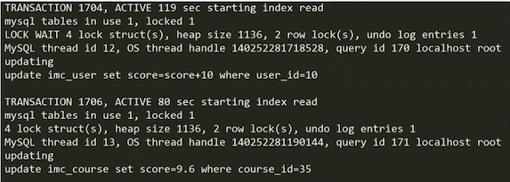

# 事务与并发控制

本章紧扣数据库宕机这一企业痛点问题，讲解“高并发”下数据库企业级解决方案。主要包含四个模块： 

- 【关于问道】事务是什么； 

- 【善于发现】高并发中的隐患； 

- 【不得不知】事务隔离级别； 

- 【解决之道】阻塞与死锁。 

在数据库的数据你绝不会感到孤单，总会有人在同一时间和你操作同一条数据，允许多个人同时操作相同的数据是为了增强并发性，并发能提高吞吐量，但是会带来一些问题。比如：同时操作同一条数据，很容易破坏数据的一致性。

为了解决并发带来的数据争用和数据一致性问题，数据库提供了事物和基于锁的多版本并发机制。

## 什么是事务？

- 事务是数据库执行操作的最小逻辑单元
- 事务可以由一个 SQL 组成也可以由多个 SQL 组成
- 组成事务的 SQL 要么全执行成功要么全执行失败

```sql
START TRANSACTION / BEGIN    -- 开启一个事务
	SELECT...
	UPDATE...
	INSERT...
COMMIT / ROLLBACK  -- 提交或回滚事务
```

在事务中，不能执行 DDL 操作，如修改表结构之类的，因为执行这类型的语句，会自动执行 COMMIT 操作。

## 事务的特性

- 原子性 （A）

  一个事务中的所有操作，要么全部完成，要么全部不完成

- 一致性（C）

  在事务开始之前和事务结束以后，数据库的完整性没有被破坏

- 隔离性（I）

  事务的隔离性要求每个读写事务的对象与其他事务的操作对象能相互分离，即该事务提交前对其他事务都不可见。

- 持久性（D）
  事务一旦提交了，其结果就是永久性的，就算发生了宕机等事故，数据库也能将数据恢复。

## 并发带来的问题

- 脏读

  一个事务读取了另一个事务未提交的数据。

  这里怎么理解一个事务未提交的数据？

  A 读取到 96，B 修改成 97（还未提交），A 再次读取到了 97 分，然而 B 回滚了数据，A 事务读到的是一条脏数据。

- 不可重复读

  一个事务前后两次读取的同一数据不一致。

  A 读到 96，B 修改成 97 并提交了，A 再次读取到了 97，A 事务两次读取到了不一样的数据。

- 幻读

  一个事务两次查询的结果集记录数不一致。

  不可重复读是单条记录，幻读是读取一个范围。两次读到的不一致

## INNODB 的隔离级别

|           隔离级别           | 脏读 | 不可重复读 | 幻读 | 隔离性 | 并发性 |
| :--------------------------: | :--: | :--------: | :--: | :----: | :----: |
|    顺序读（SERIALIZABLE）    |  N   |     N      |  N   |  最高  |  最低  |
| 可重复读（REPEATABLE READ）  |  N   |     N      |  N   |        |        |
|  读以提交（READ COMMITTED）  |  N   |     Y      |  Y   |        |        |
| 读未提交（READ UNCOMMITTED） |  Y   |     Y      |  N   |  最低  |  最高  |

## 设置事务的隔离级别

```sql
SET [PERSIST|GLOBAL|SESSION]
	TRANSACTION ISOLATION LEVEL
	{
		READ UNCOMMITTED
	  | READ COMMITTED
	  | REPEATABLE READ
	  | SERIALIZABLE
	}
```

- PERSIST：对当前的 SESSION 以及后续连接到服务器的连接生效，并且重启服务器后也不会丢失修改
- GLOBAL：对连接到服务器新的连接有效，重启服务器后丢失修改
- SESSION：当前 session 生效，长期后丢失，常用的是该级别

> serializable 级别两个事物并发的情况演示

在一个操作中开启事物

```sql
SET SESSION TRANSACTION ISOLATION LEVEL SERIALIZABLE ;
-- 修改后，可以通过变量来显示当前的隔离级别
-- transaction_isolation,REPEATABLE-READ (这是默认级别)
-- transaction_isolation,SERIALIZABLE
SHOW VARIABLES LIKE '%iso%';

-- session 1 启用事物,并执行一个查询
begin;
select course_id, title
from imc_course
where score > 9.6;

-- session 2 更新一个值以符合 score > 9.6
begin;
update imc_course
set score=9.8
where course_id = 34;
-- 执行完之后就会发现，一直在转圈圈。并没有执行成功
-- 知道 session 1 执行 commit 命令后，这里才会执行成功。
-- 记得 session 2 使用 ROLLBACK 回滚掉。
```

> REPEATABLE READ 可重复读的演示

```sql
-- session 1
SET SESSION TRANSACTION ISOLATION LEVEL REPEATABLE READ ;

SHOW VARIABLES LIKE '%iso%';

begin;
select course_id, title
from imc_course
where score > 9.6;
-- 这里先去执行 session 2 的修改操作
-- 执行完成之后，再来查询下上面的语句，看看能不能查询到 session 2 提交的修改
-- 可以发现，在这个事务中多次读取都没有读取到 session2 提交的修改

-- session 2
begin;
update imc_course
set score=9.8
where course_id = 34;
-- 可以看到直接执行成功了，没有被阻塞。我们直接提交下
commit;
```

后面的可用自己去尝试。文字对于这种并发演示不太好描述

## 事务阻塞的产生

不只是在 顺序读（SERIALIZABLE）下会产生阻塞，REPEATABLE READ 可重复读也会产生阻塞。

```sql
-- session 1
SET SESSION TRANSACTION ISOLATION LEVEL REPEATABLE READ ;

SHOW VARIABLES LIKE '%iso%';

-- session 1 开启一个事务，并把分数 - 0.1 
begin;
update imc_course
set score=score - 0.1
where course_id = 34;
-- 不提交事务，这个时候去 session 2 执行更新语句
commit; 

-- session 2 ，执行相同条件的语句，把分数 + 0.1
begin;
update imc_course
set score=score + 0.1
where course_id = 34;
-- 就会发现，一直转圈圈，被阻塞了。
-- 这个时候只能等待 session 1 的事务提交后，这里才会继续执行下去
```

为什么产生了阻塞？这就关系到 innodb 中的锁机制了

## InnoDB 中的锁

- 查询需要对资源加共享锁（S）

  被加锁的对象只能被持有锁的事务读取，但不能修改。其他事务也不能修改，但是也可以加共享锁进行读取

- 数据修改需要对资源加排它锁（X）

  被加锁的对象只能被持有锁的事务读取/修改，其他事务无法读取和修改。

通过上述说明，锁关系整理如下

|        | 排它锁 | 共享锁 |
| :----: | :----: | :----: |
| 排它锁 | 不兼容 | 不兼容 |
| 共享锁 | 不兼容 |  兼容  |

不兼容就是互斥的意思。

通过锁解决了事务的隔离性问题，但是带来了新的问题，最主要的是带来阻塞和死锁问题。

## 什么是阻塞？

由于不同锁之间的兼容关系，造成一事务需要等待另一个事务释放其所占用的资源的现象

## 如何发现阻塞？

在 MySQL 8 中可以通过如下的 SQL 来查询阻塞，`sys.innodb_lock_waits` 表中记录了 InnoDB 中所有的等待事件

```sql
select waiting_pid             as '被阻塞的线程',
       waiting_query           as '被阻塞的 SQL',
       blocking_pid            as '阻塞的线程',
       blocking_query          as '阻塞的 SQL',
       wait_age                as '阻塞时间',
       sql_kill_blocking_query as '建议操作'
from sys.innodb_lock_waits
where (unix_timestamp() - unix_timestamp(wait_started)) > 30
-- 条件为大于 30 秒的会被查询出来
```

显示这个也很简单，前面有阻塞的例子，可以自行执行。可以通过以下语句拿到当前的 线程 id，方便在上表中查询出来的进行对比

```sql
select connection_id();
```

我这里测试如下

| 被阻塞的线程 | 被阻塞的 SQL | 阻塞的线程 | 阻塞的 SQL | 阻塞时间 | 建议操作 |
| :--- | :--- | :--- | :--- | :--- | :--- |
| 47 | /\* ApplicationName=DataGrip 20 ... ore + 0.1 where course\_id = 34 | 42 | NULL | 00:00:07 | KILL QUERY 42 |

可以看到被阻塞的线程和被阻塞的 SQL。（我这里把条件修改小了的，所以能看到阻塞时间 7 秒也会被查询出来）。

并且给出了建议为杀掉 42 的线程

```sql
kill 42;  -- 杀掉这个线程
```

## 如何处理事务中的阻塞

- 终止占用资源的事务

  使用 `kill` 命令杀掉线程链接。

- 优化占用资源事务的 SQL，使其尽快释放资源。

  正确的方法则是需要优化 SQL，kill 是治标不治本的方法。

## 什么是死锁

并行执行的多个事务相互之间占有了对方所需要的资源。

mysql 内部会自动监控死锁，会回滚影响资源较少的事务，让另外一个事务进行下去。虽然死锁对 mysql 来说，影响不会太大，但是会影响到我们的业务执行时间。就需要监控死锁，然后进行优化。

## 如何发现死锁？

有好几种方法，下面使用 mysql 的错误日志，将死锁记录在错误日志中。

```sql
set global innodb_print_all_deadlocks=on;
```



上图显示了一个死锁的信息（数据人为格式化之后的效果），有两个事物分别是 1704 和 1706，包括他们的活动（active）的秒数。

以上两个事物的 SQL 语句各自更新了一个表，看似乎没有什么关联会导致死锁。貌似没有什么资源竞争，这是因为：**这里记录的并不是这个事务中所有的 SQL，而是产生死锁时正在执行的 SQL**，所以通常来说，我们需要利用这些信息去查阅程序中，定位到产生死锁的事务所有的 sql ，然后解决它

## 如何处理死锁？

数据库自行回滚占用资源少的事务。所以不需要我们再数据库层面做什么操作。

但是需要我们来改变我的程序，让 **并发事务按相同顺序占用资源**。这是什么意思呢？

```sql
-- session 1
begin;
update imc_course set score=9.8 where course_id=35;

-- session 2
begin;
update imc_user set score=score+10 where user_id = 10;

下面继续回去操作第二条语句

-- session 1
update imc_user set score=score+10 where user_id = 10;

-- session 2
update imc_course set score=9.8 where course_id=35;
```

session 1 执行的语句顺序是 A B，session 2 执行的顺序是 B A， 事务开始后，各自占用了对方的锁，所以只要任意一方执行第 2 条语句时，自己就会被阻塞住，并且自己等待对方释放所，但是对方一执行第二条语句也会阻塞。这就造成了死锁。除非一方放弃执行，也就是回滚。

那么 **顺序执行** 是指，session 1 和 session 2 都以 A B 方式执行语句，最多一方被阻塞，只要另一方执行完成，自己就会继续执行下去

## 总结

我们学习了以下知识点：

- 什么是事物以及事物的特征
- 并发带来的数据问题
- INNODB 的四种事物隔离级别
- 事物的阻塞和死锁


